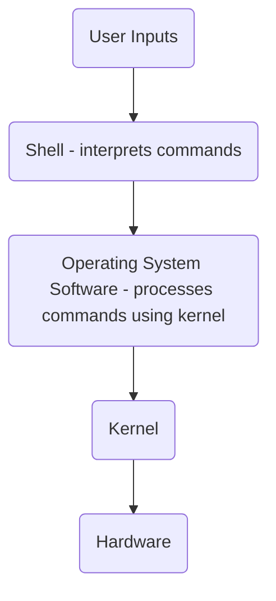

# Infra Tech Notes 

A collection of notes on infrastructure essentials like Linux, Kubernetes, containerization, and networking. 

<details>
<summary><h2>Linux in Action</h2></summary>

<details>
<summary><h3>CH1. Welcome to Linux</h3></summary>

### What makes Linux different from other operating systems 
Linux is free, making it easier to install without worrying about licenses or DRM, ideal for testing various hardware and server setups.

Built on UNIX-like technology, Linux offers stability, security, and reliable package management for thousands of free apps. As open source, it’s customizable, leading to a vast range of specialized distributions (distros) tailored for different needs.

Linux stands out from other operating systems due to its cost-effectiveness, stability, and security. Its open-source nature and robust package management foster a diverse ecosystem of customizable distributions, making it a versatile choice for various applications and user needs.

### The Linux File System 
Since it's commonly believed that <ins>everything in Linux operates through plain text files</ins>, it makes sense to begin by familiarizing yourself with the Linux file system.

To ensure reliable data retrieval, you need an index that consistently directs you to your desired resources. A file system uses this index to create an organized structure of directories and files within a <ins>partition</ins>.

All files in a disk partition are organized in directories under the root directory, represented by the `/` (forward slash). This directory structure follows the UNIX Filesystem Hierarchy Standard (FHS).

Here’s a list of top-level directories in the Linux file system along with brief explanations:

- `/etc`: Contains configuration files for the system and installed applications.
- `/var`: Stores variable data files, such as logs, databases, and spool files.
- `/home`: Contains user home directories, where personal files and settings are stored.
- `/sbin`: Holds system binaries, essential for system administration and maintenance tasks, typically used by the root user.
- `/bin`: Contains essential user binaries (executable programs) required for basic system operation, available to all users.
- `/lib`: Stores shared libraries needed by binaries in `/bin` and `/sbin` for execution.
- `/usr`: Contains user-related programs, libraries, and documentation, often divided into subdirectories like `/usr/bin` (user binaries) and `/usr/lib` (libraries for user applications).

### What is Bash? 

Bash is one of the most popular UNIX shells. A <ins>**shell** is a user interface that interprets commands</ins>, either through a command-line interface (CLI) or a graphical user interface (GUI). It acts as a software layer that executes formatted commands using the system's kernel and hardware resources.

A kernel is the core part of an operating system that manages hardware resources and enables communication between software and hardware, handling processes, memory, and devices.



### Pseudo file systems

A normal file is a stable collection of data that can be accessed repeatedly, even after a reboot. In contrast, Linux pseudo (or virtual) files, found in directories like /sys/ and /proc/, do not exist in the traditional sense; their contents are dynamically generated by the OS to represent specific values.

To check the total space on your hard drive, you can use the cat command to read the size file for the disk, such as `/sys/block/sda/size`:

```bash
$ cat /sys/block/sda/size 
```
> In Linux, storage devices are designated as `/dev/sda`, `/dev/sdb`, `/dev/sdc`, etc., with `/dev/hda` for hard drives, `/dev/sr0` for DVD drives, `/dev/cdrom` for CD-ROMs, and `/dev/fd0` for floppy drives.

### `journalctl`

You can access all system logs using `journalctl`:

```
# journalctl
```

Running `journalctl` without arguments will produce a large amount of data, so you can filter it using `grep`. To exclude lines containing the word "error," use the `-v` option:

```
# journalctl | grep -v error
```

</details>

<details>
<summary><h3>CH2. Linux virtualization: Building a Linux working environment</h3></summary>

### What is Virtualization? 

Virtualization is the creation of virtual versions of physical resources, allowing multiple virtual instances to run on a single physical machine, which improves resource utilization and management.

> Virtual Machines vs. Containers
> 
> Applications have been packaged into individual virtual machines (VMs), <ins>providing isolated operating environments</ins> for dependency management and resource allocation. However, this approach incurs high overhead due to the need to maintain separate operating systems and packages for each application.
>
> Containers offer a more efficient solution by packaging just the application and its dependencies in an isolated environment. Unlike VMs, <ins>containers don't require a separate operating system</ins>, significantly reducing overhead while retaining many of the benefits of virtualization. This makes containers a more practical modern solution.

<ins>**Successful virtualization**</ins> creates an isolated space on a physical computer where <ins>**a guest OS can be installed and convinced that it is the sole occupant of its own machine**</ins>. These guest operating systems can share network connections, allowing administrators to log in remotely.

<ins>**Successful containerization**</ins> creates lightweight, <ins>**isolated environments for applications to run with their dependencies**</ins>, making each container think it has its own OS while sharing the host's kernel. This setup allows multiple containers to coexist efficiently, enabling quick deployment, management, and scaling of applications.

**Hypervisors** are software that manage host system hardware, <ins>allocating necessary resources to guest operating systems</ins>. They run guest machines as system processes with virtualized access to hardware resources. Examples include Xen, KVM, VMware ESXi, and Microsoft Hyper-V, which provide the foundation for many cloud services, such as those offered by AWS.

</details>

<details>
<summary><h3>CH3. Remote connectivity: Safely accessing networked machines</h3></summary>

### Getting Started with OpenSSH

To safeguard data privacy, security software employs an encryption key—a small file with a random character sequence. Secure communications involve quickly encrypting data before transmission and decrypting it upon receipt. The SSH protocol facilitates this process seamlessly, providing secure remote logins for UNIX-like systems since the 1990s. OpenSSH is widely used, and Microsoft now offers it natively on Windows.

The `dpkg` command-line tool manages and queries software packages within the Advanced Package Tool (APT) system.

Run the following commands to inspect the `opeenssh-client` and `opeenssh-server` packages. 

<details><summary><code>$ dpkg -s openssh-client</code><br></summary>
<br>
    
```
Package: openssh-client
Status: install ok installed
Priority: standard
Section: net
Installed-Size: 3536
Maintainer: Ubuntu Developers <ubuntu-devel-discuss@lists.ubuntu.com>
Architecture: amd64
Multi-Arch: foreign
Source: openssh
Version: 1:9.6p1-3ubuntu13.5
Replaces: openssh-sk-helper, ssh, ssh-krb5
Provides: ssh-client
Depends: adduser, passwd, libc6 (>= 2.38), libedit2 (>= 2.11-20080614-0), libfido2-1 (>= 1.8.0), libgssapi-krb5-2 (>= 1.17), libselinux1 (>= 3.1~), libssl3t64 (>= 3.0.13), zlib1g (>= 1:1.1.4)
Recommends: xauth
Suggests: keychain, libpam-ssh, monkeysphere, ssh-askpass
Breaks: openssh-sk-helper
Conflicts: sftp
Conffiles:
 /etc/ssh/ssh_config d11fe67b3cd9180e1c0e888c5e5b93f6
Description: secure shell (SSH) client, for secure access to remote machines
 This is the portable version of OpenSSH, a free implementation of
 the Secure Shell protocol as specified by the IETF secsh working
 group.
 .
 Ssh (Secure Shell) is a program for logging into a remote machine
 and for executing commands on a remote machine.
 It provides secure encrypted communications between two untrusted
 hosts over an insecure network. X11 connections and arbitrary TCP/IP
 ports can also be forwarded over the secure channel.
 It can be used to provide applications with a secure communication
 channel.
 .
 This package provides the ssh, scp and sftp clients, the ssh-agent
 and ssh-add programs to make public key authentication more convenient,
 and the ssh-keygen, ssh-keyscan, ssh-copy-id and ssh-argv0 utilities.
 .
 In some countries it may be illegal to use any encryption at all
 without a special permit.
 .
 ssh replaces the insecure rsh, rcp and rlogin programs, which are
 obsolete for most purposes.
Homepage: https://www.openssh.com/
Original-Maintainer: Debian OpenSSH Maintainers <debian-ssh@lists.debian.org>
```
</details>

<details><summary><code>$ dpkg -s openssh-server</code><br></summary>
<br>
    
```
Package: openssh-server
Status: install ok installed
Priority: optional
Section: net
Installed-Size: 2097
Maintainer: Ubuntu Developers <ubuntu-devel-discuss@lists.ubuntu.com>
Architecture: amd64
Multi-Arch: foreign
Source: openssh
Version: 1:9.6p1-3ubuntu13.5
Replaces: openssh-client (<< 1:7.9p1-8), ssh, ssh-krb5
Provides: ssh-server
Depends: adduser, libpam-modules, libpam-runtime, lsb-base, openssh-client (= 1:9.6p1-3ubuntu13.5), openssh-sftp-server, procps, ucf, debconf (>= 0.5) | debconf-2.0, libaudit1 (>= 1:2.2.1), libc6 (>= 2.38), libcom-err2 (>= 1.43.9), libcrypt1 (>= 1:4.1.0), libgssapi-krb5-2 (>= 1.17), libkrb5-3 (>= 1.13~alpha1+dfsg), libpam0g (>= 0.99.7.1), libselinux1 (>= 3.1~), libssl3t64 (>= 3.0.13), libwrap0 (>= 7.6-4~), zlib1g (>= 1:1.1.4)
Pre-Depends: init-system-helpers (>= 1.54~)
Recommends: default-logind | logind | libpam-systemd, ncurses-term, xauth, ssh-import-id
Suggests: molly-guard, monkeysphere, ssh-askpass, ufw
Conflicts: sftp, ssh-socks, ssh2
Conffiles:
 /etc/default/ssh 500e3cf069fe9a7b9936108eb9d9c035
 /etc/init.d/ssh 3649a6fe8c18ad1d5245fd91737de507
 /etc/pam.d/sshd 8b4c7a12b031424b2a9946881da59812
 /etc/ssh/moduli 366395e79244c54223455e5f83dafba3
 /etc/ufw/applications.d/openssh-server 486b78d54b93cc9fdc950c1d52ff479e
Description: secure shell (SSH) server, for secure access from remote machines
 This is the portable version of OpenSSH, a free implementation of
 the Secure Shell protocol as specified by the IETF secsh working
 group.
 .
 Ssh (Secure Shell) is a program for logging into a remote machine
 and for executing commands on a remote machine.
 It provides secure encrypted communications between two untrusted
 hosts over an insecure network. X11 connections and arbitrary TCP/IP
 ports can also be forwarded over the secure channel.
 It can be used to provide applications with a secure communication
 channel.
 .
 This package provides the sshd server.
 .
 In some countries it may be illegal to use any encryption at all
 without a special permit.
 .
 sshd replaces the insecure rshd program, which is obsolete for most
 purposes.
Homepage: https://www.openssh.com/
Original-Maintainer: Debian OpenSSH Maintainers <debian-ssh@lists.debian.org>
```
</details>

Note that the server version also includes all the tools you’ll find in the client package.

You can check if SSH is running on your machine by using the command `systemctl status`.

<details><summary><code>$ systemctl status ssh</code><br></summary>
<br> 
    
```
● ssh.service - OpenBSD Secure Shell server
     Loaded: loaded (/usr/lib/systemd/system/ssh.service; disabled; preset: enabled)
     Active: active (running) since Wed 2024-10-30 05:45:34 UTC; 2h 10min ago
TriggeredBy: ● ssh.socket
       Docs: man:sshd(8)
             man:sshd_config(5)
    Process: 1145 ExecStartPre=/usr/sbin/sshd -t (code=exited, status=0/SUCCESS)
   Main PID: 1147 (sshd)
      Tasks: 1 (limit: 2276)
     Memory: 3.1M (peak: 4.1M)
        CPU: 91ms
     CGroup: /system.slice/ssh.service
             └─1147 "sshd: /usr/sbin/sshd -D [listener] 0 of 10-100 startups"

Oct 30 05:45:34 Ubuntu-server systemd[1]: Starting ssh.service - OpenBSD Secure Shell server...
Oct 30 05:45:34 Ubuntu-server sshd[1147]: Server listening on :: port 22.
Oct 30 05:45:34 Ubuntu-server systemd[1]: Started ssh.service - OpenBSD Secure Shell server.
Oct 30 05:45:39 Ubuntu-server sshd[1148]: Accepted password for cynicdog from 10.0.2.2 port 64573 ssh2
Oct 30 05:45:39 Ubuntu-server sshd[1148]: pam_unix(sshd:session): session opened for user cynicdog(uid=1000) by cynicdog(uid=0)

```
</details>

### Logging into a remote server with SSH 

Let's simulate a network with two hosts in Docker following the steps below. We will create a Docker network (`ubuntwos`) and there we will run two ubuntu containers, `ubuntu-1` as a server and `ubuntu-2` as a client that connects to the server.   

1. Create a Docker network.
   ```bash
   docker network create ubuntwos 
   ```

2. Start and access two ubuntu containers in interactive terminals.
   ```bash
   docker run -dt -p 8080:80 --name ubuntu-1 --network ubuntwos ubuntu
   docker run -dt -p 8081:80 --name ubuntu-2 --network ubuntwos ubuntu
   docker exec -it ubuntu-1 /bin/bash
   docker exec -it ubuntu-2 /bin/bash
   ```

3. Install common tools for both of the containers.
   ```bash
   apt-get update && apt-get install -y net-tools iproute2 iputils-ping tcpdump vim 
   ```

   You can check the ip address assigned to the container's <ins>**default network interface**</ins>(`eth0`) as below.

   <details><summary>For <code>ubuntu-1</code>, run <code>root@8885b89799a2:/# ip addr</code><br></summary>
   <br>
       
   ```bash
      1: lo: <LOOPBACK,UP,LOWER_UP> mtu 65536 qdisc noqueue state UNKNOWN group default qlen 1000
        link/loopback 00:00:00:00:00:00 brd 00:00:00:00:00:00
        inet 127.0.0.1/8 scope host lo
          valid_lft forever preferred_lft forever
        inet6 ::1/128 scope host
          valid_lft forever preferred_lft forever
      2: tunl0@NONE: <NOARP> mtu 1480 qdisc noop state DOWN group default qlen 1000
        link/ipip 0.0.0.0 brd 0.0.0.0
      21: eth0@if22: <BROADCAST,MULTICAST,UP,LOWER_UP> mtu 1500 qdisc noqueue state UP group default
        link/ether 02:42:ac:13:00:02 brd ff:ff:ff:ff:ff:ff link-netnsid 0
        inet 172.19.0.2/16 brd 172.19.255.255 scope global eth0    [1] 
          valid_lft forever preferred_lft forever
   ```
   > The ip address assigned to the default network interface for `ubuntu-1` container (the server host) is `172.19.0.2`.
   </details>

   <details><summary>For <code>ubuntu-2</code>, run <code>root@8bbdca37e251:/# ip addr</code><br></summary>
   <br>
       
   ```bash
      1: lo: <LOOPBACK,UP,LOWER_UP> mtu 65536 qdisc noqueue state UNKNOWN group default qlen 1000
        link/loopback 00:00:00:00:00:00 brd 00:00:00:00:00:00
        inet 127.0.0.1/8 scope host lo
          valid_lft forever preferred_lft forever
        inet6 ::1/128 scope host
          valid_lft forever preferred_lft forever
      2: tunl0@NONE: <NOARP> mtu 1480 qdisc noop state DOWN group default qlen 1000
        link/ipip 0.0.0.0 brd 0.0.0.0
      23: eth0@if24: <BROADCAST,MULTICAST,UP,LOWER_UP> mtu 1500 qdisc noqueue state UP group default
        link/ether 02:42:ac:13:00:03 brd ff:ff:ff:ff:ff:ff link-netnsid 0
        inet 172.19.0.3/16 brd 172.19.255.255 scope global eth0    [1] 
          valid_lft forever preferred_lft forever
   ```
   > The ip address assigned to the default network interface for `ubuntu-2` container (the client host) is `172.19.0.3`.   
   </details>

   We can also inspect networkings between two containers as below.

   ```bash
   root@8885b89799a2:/# ping 172.19.0.3
   PING 172.19.0.3 (172.19.0.3) 56(84) bytes of data.
   64 bytes from 172.19.0.3: icmp_seq=1 ttl=64 time=0.555 ms
   ```
   > The server container (`172.19.0.2`) pings to the client container (`172.19.0.3`).

   ```bash
   root@8bbdca37e251:/# tcpdump -i eth0 icmp
   tcpdump: verbose output suppressed, use -v[v]... for full protocol decode
   listening on eth0, link-type EN10MB (Ethernet), snapshot length 262144 bytes
   14:59:46.419641 IP ubuntu-1.ubuntwos > 8bbdca37e251: ICMP echo request, id 3, seq 55, length 64
   14:59:46.419655 IP 8bbdca37e251 > ubuntu-1.ubuntwos: ICMP echo reply, id 3, seq 55, length 64
   14:59:47.459640 IP ubuntu-1.ubuntwos > 8bbdca37e251: ICMP echo request, id 3, seq 56, length 64
   ```
   > The client container (`172.19.0.3`) processes incoming ping requests and sends back the corresponding ICMP echo replies.
   
5. Configure the server.

   First, let's install the `openssh-server` on the `ubuntu-1`.
   ```bash
   root@8885b89799a2:/# apt-get install openssh-server -y 
   ```

   Then we need to configure ssh daemon (`sshd_config`) file.
   ```bash
   root@8885b89799a2:/# vim /etc/ssh/sshd_config
   ```
   > Set the `PermitRootLogin` to `yes` and uncomment the line. Save the configuration and exit (`:wq`). 

   Then we set the password as below:
   ```bash
   root@8885b89799a2:/# passwd
   New password: ****
   Retype new password: **** 
   passwd: password updated successfully
   ```

   Now let's start the ssh daemon.
   ```bash
   root@8885b89799a2:/# service ssh start
     * Starting OpenBSD Secure Shell server sshd   
   root@8885b89799a2:/# service ssh status
     * sshd is running
   ```

6. Configure the client.

   Install the `openssh-client` on the `ubuntu-2`.
   ```bash
   root@8bbdca37e251:/# apt-get install openssh-client -y 
   ```

7. Access to the server host from the client.

   ```text
   root@8bbdca37e251:/# ssh root@172.19.0.2
   root@172.19.0.2's password: ****
   Welcome to Ubuntu 24.04.1 LTS (GNU/Linux 5.15.153.1-microsoft-standard-WSL2 x86_64)

    * Documentation:  https://help.ubuntu.com
    * Management:     https://landscape.canonical.com
    * Support:        https://ubuntu.com/pro

   This system has been minimized by removing packages and content that are
   not required on a system that users do not log into.

   To restore this content, you can run the 'unminimize' command.
   Last login: Thu Oct 31 05:10:35 2024 from 172.19.0.3
   root@8885b89799a2:~#
   ```

### Password-free SSH access (SSH key-based authentication)

Instead of using password authentication for SSH, you can create a key pair and copy the public key to the remote host where you want to log in. The implementation steps are as follows.
   
1. Create a key pair in the client host.
   ```bash
   root@8bbdca37e251:/# ssh-keygen
   Generating public/private ed25519 key pair.
   Enter file in which to save the key (/root/.ssh/id_ed25519):
   Enter passphrase (empty for no passphrase):
   Enter same passphrase again:
   Your identification has been saved in /root/.ssh/id_ed25519
   Your public key has been saved in /root/.ssh/id_ed25519.pub
   ... 
   ```

2. Copy the public key from the client to the remote server host.
   ```bash
   root@8bbdca37e251:/# ssh root@172.19.0.2 mkdir -p .ssh
   root@172.19.0.2 password: **** 

   root@1ab415eaeebe:~# scp /root/.ssh/id_ed25519.pub root@172.19.0.2:.ssh/authorized_keys
   root@172.19.0.2 password: ****
   id_ed25519.pub                                    100%   99   213.4KB/s   00:00
   ```

3. Configure ssh daemon on the server host.
   ```bash
   root@8885b89799a2:/# vim /etc/ssh/sshd_config 
   ```
   > Set the `PasswordAuthentication` as `no` to disable the basic authentication. 

4. Connect to the remote server by using the ssh key-based authentication
   ```bash
   root@8bbdca37e251:/# ssh root@172.19.0.2
   Welcome to Ubuntu 24.04.1 LTS (GNU/Linux 5.15.153.1-microsoft-standard-WSL2 x86_64)
   ... 
   root@8885b89799a2:~#
   ```


### Linux process management 

<ins>**Software**</ins> consists of <ins>programming code that instructs computer hardware</ins> on behalf of users. A <ins>**process**</ins> is <ins>an instance of a running software program</ins>. An <ins>**operating system**</ins> <ins>organizes and manages these processes</ins> to optimize the use of hardware resources.

When you run the `ps` command, you'll typically see two results: the `bash` process <ins>representing the Bash command interpreter for your current shell session</ins>, and <ins>the most recent command executed</ins>, which is `ps` itself. If there are background processes or jobs running in your session, those will also appear in the output.

Adding the -e argument to ps retrieves all processes from your current shell and all parent shells up to init.

```bash
root@51c80d3eb605:/# ps -e
    PID TTY          TIME CMD
      1 pts/0    00:00:00 bash
      9 pts/1    00:00:00 bash
   4041 pts/2    00:00:00 bash
   4241 pts/2    00:00:00 ps
```

If you want to visualize the parent and children processes, you can run `pstree` command with `-p` argument, to display the PIDs of each process included. 

<details><summary><code>cynicdog@Ubuntu-server:~$ pstree -p</code><br></summary>
<br>

```bash
systemd(1)─┬─ModemManager(763)─┬─{ModemManager}(788)
           │                   ├─{ModemManager}(792)
           │                   └─{ModemManager}(795)
           ├─cron(828)
           ├─dbus-daemon(635)
           ├─login(875)───bash(1072)
           ├─multipathd(3150)─┬─{multipathd}(3174)
           │                  ├─{multipathd}(3176)
           │                  ├─{multipathd}(3177)
           │                  ├─{multipathd}(3178)
           │                  ├─{multipathd}(3179)
           │                  └─{multipathd}(3180)
           ├─ovs-vswitchd(8901)
           ├─ovsdb-server(8850)
           ├─polkitd(647)─┬─{polkitd}(742)
           │              ├─{polkitd}(743)
           │              └─{polkitd}(744)
           ├─rsyslogd(707)─┬─{rsyslogd}(759)
           │               ├─{rsyslogd}(760)
           │               └─{rsyslogd}(762)
           ├─sshd(1147)───sshd(1767)───sshd(1849)───bash(1850)───pstree(13952)
           ├─systemd(1062)───(sd-pam)(1063)
           ├─systemd-journal(289)
           ├─systemd-logind(666)
           ├─systemd-network(404)
           ├─systemd-resolve(421)
           ├─systemd-timesyn(427)───{systemd-timesyn}(479)
           ├─systemd-udevd(353)
           ├─udisksd(680)─┬─{udisksd}(717)
           │              ├─{udisksd}(718)
           │              ├─{udisksd}(721)
           │              ├─{udisksd}(761)
           │              └─{udisksd}(804)
           ├─unattended-upgr(837)───{unattended-upgr}(870)
           └─upowerd(1489)─┬─{upowerd}(1491)
                           ├─{upowerd}(1492)
                           └─{upowerd}(1493)

```    
</details>

`systemd` manages process lifecycles, including creation and termination, using the `systemctl` command. It also oversees various system services, such as `journald` (logging), `networkd` (network management), and `udevd` (device management). The "d" in systemd stands for daemon, indicating its role as a background process.

</details>

<details>
<summary><h3>CH4. Archive management: Backing up or copying entire file systems</h3></summary>

In Linux, **tar** is commonly used for archiving multiple files into one (`.tar` file), often combined with compression (`.tar.gz`). **dd** creates disk image archives by copying data at the block level, ideal for backing up entire partitions or drives. **rsync** is used for incremental archiving, efficiently syncing files and directories between locations, often for backups or mirroring.

**Compression** reduces file size, commonly using `gzip` or `bzip2`, to save space. Archiving and compression are often used together, like `tar.gz`.

An **image** is a file that represents an exact, byte-for-byte copy of data from a storage device, like a disk, partition, or filesystem. It includes all files, system metadata, and boot information, making it useful for backups, system recovery, or deployment. Images can be created with tools like `dd` or `Clonezilla` for disk cloning and `ISO` files for operating system installations.

A **partition** is a defined section of a storage device, such as a hard drive or SSD, that is treated as a separate logical unit. Each partition can hold a file system, allowing the operating system to manage and organize data independently. Partitions help optimize storage, separate operating systems, and improve data management and security.

### What to archive 

Let's start with the `df` command, which shows all currently mounted partitions on a Linux system, along with their disk usage and file system locations.

```bash
root@1ab415eaeebe:/# df
Filesystem      1K-blocks     Used Available Use% Mounted on
overlay        1055762868 19854556 982204840   2% /
tmpfs               65536        0     65536   0% /dev
tmpfs             4029616        0   4029616   0% /sys/fs/cgroup
shm                 65536        0     65536   0% /dev/shm
/dev/sdc       1055762868 19854556 982204840   2% /etc/hosts
tmpfs             4029616        0   4029616   0% /proc/acpi
tmpfs             4029616        0   4029616   0% /sys/firmware
```

It's essential to differentiate between real and pseudo file systems. If the file system is designated as `tmpfs` and the Used column shows 0 bytes, it indicates that no space is currently in use.

Be sure to follow best practices for backups. Your backups should be:

1. **Reliable**: Use storage media that are likely to maintain integrity for the duration of their intended use.
2. **Tested**: Regularly test the restoration of backups in simulated production environments.
3. **Rotated**: Keep several historical backups that are older than the most recent one to safeguard against potential failures.
4. **Distributed**: Store some backups in a physically remote location to protect against data loss from disasters like fire.
5. **Secure**: Avoid exposing your data to insecure networks or storage sites during the backup process.
6. **Compliant**: Adhere to all relevant regulatory and industry standards at all times.
7. **Up-to-Date**: Ensure your backups reflect the current live version, avoiding outdated archives.
8. **Scripted**: Automate backup processes to eliminate reliance on human memory for ongoing tasks.

### Archiving files and file systems using `tar`

#### Simple archive and compression examples

- Let's create some files to archive by runnning: 
  ```bash
  root@1ab415eaeebe:~# touch file1 file2 file3
  ```
- Now, let's archive these files into a tarball:
  ```bash
  root@1ab415eaeebe:~# tar cvf files.tar *
  file1
  file2
  file3
  ```
- You can also use globbing to archive specific file types:
  ```bash
  root@1ab415eaeebe:~# touch hello.mp4
  root@1ab415eaeebe:~# tar cvf audio.tar *.mp4
  hello.mp4
  ```
- Now, let's create a compressed tarball of the MP4 files:
  ```
  root@1ab415eaeebe:~# tar czvf audio.tar.gz *.mp4
  hello.mp4
  ```
- Since `tar` is aware of its Linux environment, you can use it to select files and directories outside your current working directory. For example, to add all `.mp4` files from the `/home/myuser/Videos/` directory:
  ```bash
  root@1ab415eaeebe:~# tar czvf archivename.tar.gz /home/myuser/Videos/*.mp4
  ```
- You can split a zipped file into parts using `split` with the `-b` argument:
  ```bash
  root@1ab415eaeebe:~# split -b 1G archivename.tar.gz "archivename.tar.gz.part"
  ```
- To combine these parts back into the original file, use:
  ```bash
  root@1ab415eaeebe:~# cat archivename.tar.gz.part* > archivename.tar.gz
  ```

#### Streaming file system archives

An archive is a file that can be copied or moved using standard Bash commands, allowing us to stream it to a remote server. 

One advantage of using the `cat` operation to generate archives is that it eliminates the need for an intermediate step, avoiding temporary storage of the archive on the local machine.

```bash
root@d41115ff5e58:~# tar czvf - audio.mp4 | ssh root@172.19.0.2 "cat > /home/ubuntu/audio.tar.gz"
```

#### Aggregating files with find

We can aggregate files with the help of `find` search command and `tar` with `-r` option to append the found results as below: 
```bash
root@d41115ff5e58:/home/ubuntu# touch word-1.txt
root@d41115ff5e58:/home/ubuntu# echo "Hello," > word-1.txt
root@d41115ff5e58:/home/ubuntu# touch word-2.txt
root@d41115ff5e58:/home/ubuntu# echo " World!" > word-2.txt
root@d41115ff5e58:/home/ubuntu# find . -name "*.txt" -exec tar -rvf archive.tar {} +
./word-1.txt
./word-2.txt
root@d41115ff5e58:/home/ubuntu# cat archive.tar
./word-1.txt0000644000000000000000000000000714711067750011570 0ustar  rootrootHello,
./word-2.txt0000644000000000000000000000001014711067764011570 0ustar  rootroot World!
```

#### Preserving permissions and ownership...and extracting archives

Let's first with checking the permission and ownership information by running: 
```bash
root@d41115ff5e58:/# ls -l /usr/lib/openssh/
total 856
-rwxr-xr-x 1 root root   1190 Apr  4  2024 agent-launch
-rwsr-xr-x 1 root root 342632 Aug  9 11:33 ssh-keysign
-rwxr-xr-x 1 root root 256432 Aug  9 11:33 ssh-pkcs11-helper
-rwxr-xr-x 1 root root 268720 Aug  9 11:33 ssh-sk-helper
```

**Permissions** dictate what actions users can perform on a file or directory, including reading, writing, and executing.

To modify an object's permissions with `chmod` command, you need to input the total score for each user category: owner, group, and others.
```bash
root@d41115ff5e58:/# chmod 771 /usr/lib/openssh/ssh-sk-helper
root@d41115ff5e58:/# ls -l /usr/lib/openssh/
total 856
-rwxr-xr-x 1 root root   1190 Apr  4  2024 agent-launch
-rwsr-xr-x 1 root root 342632 Aug  9 11:33 ssh-keysign
-rwxr-xr-x 1 root root 256432 Aug  9 11:33 ssh-pkcs11-helper
-rwxrwx--x 1 root root 268720 Aug  9 11:33 ssh-sk-helper         [1]
```
> [1] The write permission on `ssh-sk-helper` is newly given to group. 

**Ownership** in a filesystem determines which user and group have control over a file or directory, influencing permissions for reading, writing, and executing.

```bash
root@d41115ff5e58:/home/ubuntu# touch newfile
root@d41115ff5e58:/home/ubuntu# ls -l
total 0
-rw-r--r-- 1 root root 0 Nov  1 15:39 newfile
```

You can change a file's ownership using `chown` as follows:  
```bash
root@d41115ff5e58:/home/ubuntu# chown cynicdog:cynicdog newfile
```
> Ensure the user you want to assign as the owner exists beforehand. If it doesn’t, create it using `adduser USERNAME`.

To extract the archive, use the `tar` command with the `x` argument instead of `c`:  
```bash
root@d41115ff5e58:/home/ubuntu# tar xvf archive.tar
```

### Archiving partitions with `dd`

Previously, you used `tar` to copy files between systems, needing a host OS as a base. In contrast, `dd` creates perfect byte-for-byte images of any digital content.

You can create a file filled with zeros (or any other data) using the `dd` command. For example, to create a 1MB file:
```
root@d41115ff5e58:/home/ubuntu# dd if=/dev/zero of=testfile bs=1M count=1
1+0 records in
1+0 records out
1048576 bytes (1.0 MB, 1.0 MiB) copied, 0.00149206 s, 703 MB/s
```
> The `if=` parameter specifies the source drive, while the `of=` parameter indicates the file or location where you want to save the data.

You can check the content of the copied result:
```bash
root@d41115ff5e58:/home/ubuntu# od -x testfile
0000000 0000 0000 0000 0000 0000 0000 0000 0000
*
4000000
```

You can create a `.img` file using a file within your container.
```bash
root@d41115ff5e58:/home/ubuntu# dd if=/dev/zero of=partition.img bs=1M count=100
100+0 records in
100+0 records out
104857600 bytes (105 MB, 100 MiB) copied, 0.18416 s, 569 MB/s
```
> The `bs` parameter sets the number of bytes to copy at one time.

Restoring is straightforward: you simply swap the values of `if` and `of`. 

By using the /dev/urandom file as the source, you can overwrite a disk with random data.
```bash
root@d41115ff5e58:/home/ubuntu# dd if=/dev/urandom of=/dev/sdXYZ bs=1M status=progress
```
> ⚠️ This command will completely overwrite the specified disk, erasing all existing data on it. Be very careful to specify the correct device.

### Synchronizing archives with `rsync`

`rsync` is a fast, versatile command-line tool for synchronizing files and directories between two locations. It efficiently transfers only the differences between source and destination, minimizing data transfer and making it ideal for backups and remote file syncing.

Let's first install the tool both on the server and client hosts. 
```bash
root@323e5033944b:/# apt-get install rsync -y 
root@56ad7b47a68a:/# apt-get install rsync -y 
```

Then Navigate to the desired directory on the client host and create sample files for transfer. 
```bash
root@56ad7b47a68a:/home/ubuntu/sub_directory# touch file1 file2 file3
```

Now create the destination directory on the remote host and synchronize files to it
```bash
root@56ad7b47a68a:/home/ubuntu/sub_directory# ssh root@172.19.0.2 "mkdir sub_directory"
root@56ad7b47a68a:/home/ubuntu/sub_directory# rsync -av * root@172.19.0.2:sub_directory
sending incremental file list
file1
file2
file3

sent 202 bytes  received 73 bytes  550.00 bytes/sec
total size is 0  speedup is 0.00
```
</details>

<details>
<summary><h3>CH7. Web servers: building a React Web App with Apache Web Server</h3></summary>

### Create a vite-react web app and Serve with Apache 

#### Install necessary packages
```bash
root@c3141d39ae83:~# apt install -y nodejs npm apache2 
```
Installs Node.js, npm (Node Package Manager), and the Apache2 web server.

#### Start the Apache web server
```bash
root@c3141d39ae83:~# service apache2 start
```
Starts the Apache server so it can serve files.

#### Create a new Vite-React application 
```bash
root@c3141d39ae83:~# npx create-vite@latest my-react-app --template react
root@c3141d39ae83:~# cd my-react-app/
```
Uses `npx` to create a new Vite app with a React template and then navigates into the project directory.

#### Install dependencies and build the application 
```bash
root@c3141d39ae83:/my-react-app# npm install 
root@c3141d39ae83:/my-react-app# npm run build 
```
Installs project dependencies and builds the production-ready static files.

#### Copy the build files to Apache’s serving directory and set permissions
```bash
root@c3141d39ae83:/my-react-app# cp -r dist/* /var/www/html
root@c3141d39ae83:/my-react-app# chmod -R 755 /var/www/html/
```
Copies the build output to `/var/www/html` so Apache can serve it, and sets permissions to allow access.

#### Set up Apache Virtual Host
```bash
export APACHE_LOG_DIR="/var/log/apache2"
vim /etc/apache2/sites-available/my-react-app.conf
```
Defines `APACHE_LOG_DIR` for the log location and opens a new configuration file for the virtual host.

#### Apache Virtual Host configuration file (`my-react-app.conf`)
```xml
<VirtualHost *:80>
    ServerAdmin webmaster@localhost
    DocumentRoot /var/www/html
    <Directory /var/www/html>
        Options Indexes FollowSymLinks
        AllowOverride All
        Require all granted
    </Directory>

    ErrorLog ${APACHE_LOG_DIR}/error.log
    CustomLog ${APACHE_LOG_DIR}/access.log combined
</VirtualHost>
```
Specifies Apache’s document root, directory permissions, and log file locations.

In Apache, a `VirtualHost` allows hosting multiple websites on a single server by directing requests based on domain name, IP address, or port. It’s commonly used to serve multiple domains from one IP using name-based hosting. Each `VirtualHost` block specifies settings like the document root and logging for an individual site.

#### Disable default site and enable the new site 
```bash
root@c3141d39ae83:~# a2dissite 000-default.conf
root@c3141d39ae83:~# a2ensite my-react-app.conf
```
Disables the default Apache site and enables the new virtual host configuration.

#### Restart the Apache server to apply changes   
```bash 
service apache2 reload
service apache2 restart
```
Reloads and restarts Apache to apply the virtual host configuration changes.

#### Fetch from the client host. 
```bash
root@b32690965a6e:/# curl http://172.19.0.2:80/
<!doctype html>
<html lang="en">
  <head>
    <meta charset="UTF-8" />
    <link rel="icon" type="image/svg+xml" href="/vite.svg" />
    <meta name="viewport" content="width=device-width, initial-scale=1.0" />
    <title>Vite + React</title>
    <script type="module" crossorigin src="/assets/index-Bw3cTkF-.js"></script>
    <link rel="stylesheet" crossorigin href="/assets/index-n_ryQ3BS.css">
  </head>
  <body>
    <div id="root"></div>
  </body>
</html>
```
> You might need to install `curl` first by running `apt install curl`. Note that the port of the web app is mapped to 80.  

### Create a vite-react web app and Serve with nginx  

#### Turn off the Apache server if running. 
```bash
root@c3141d39ae83:/my-react-app# service apache2 stop 
```

#### Install `nginx` 
```bash
root@c3141d39ae83:/my-react-app# apt install -y nginx
```

#### Create a new Vite-React application 
```bash
root@c3141d39ae83:~# npx create-vite@latest my-react-app --template react
root@c3141d39ae83:~# cd my-react-app/
```
Uses `npx` to create a new Vite app with a React template and then navigates into the project directory.

#### Install dependencies and build the application 
```bash
root@c3141d39ae83:/my-react-app# npm install 
root@c3141d39ae83:/my-react-app# npm run build 
```
Installs project dependencies and builds the production-ready static files.

#### Copy the build files to Apache’s serving directory and set permissions
```bash
root@c3141d39ae83:/my-react-app# cp -r dist/* /var/www/html
root@c3141d39ae83:/my-react-app# chmod -R 755 /var/www/html/
```
Copies the build output to `/var/www/html` so Apache can serve it, and sets permissions to allow access.

#### Configure nginx if needed 
```bash
vim /etc/nginx/sites-available/default
```

<details><summary>where the configuration file <code>default</code> reads: </summary>
<br> 

```conf
##
# You should look at the following URL's in order to grasp a solid understanding
# of Nginx configuration files in order to fully unleash the power of Nginx.
# https://www.nginx.com/resources/wiki/start/
# https://www.nginx.com/resources/wiki/start/topics/tutorials/config_pitfalls/
# https://wiki.debian.org/Nginx/DirectoryStructure
#
# In most cases, administrators will remove this file from sites-enabled/ and
# leave it as reference inside of sites-available where it will continue to be
# updated by the nginx packaging team.
#
# This file will automatically load configuration files provided by other
# applications, such as Drupal or Wordpress. These applications will be made
# available underneath a path with that package name, such as /drupal8.
#
# Please see /usr/share/doc/nginx-doc/examples/ for more detailed examples.
##

# Default server configuration
#
server {
        listen 80 default_server;
        listen [::]:80 default_server;

        # SSL configuration
        #
        # listen 443 ssl default_server;
        # listen [::]:443 ssl default_server;
        #
        # Note: You should disable gzip for SSL traffic.
        # See: https://bugs.debian.org/773332
        #
        # Read up on ssl_ciphers to ensure a secure configuration.
        # See: https://bugs.debian.org/765782
        #
        # Self signed certs generated by the ssl-cert package
        # Don't use them in a production server!
        #
        # include snippets/snakeoil.conf;

        root /var/www/html;

        # Add index.php to the list if you are using PHP
        index index.html index.htm index.nginx-debian.html;

        server_name _;

        location / {
                # First attempt to serve request as file, then
                # as directory, then fall back to displaying a 404.
                try_files $uri $uri/ =404;
        }

        # pass PHP scripts to FastCGI server
        #
        #location ~ \.php$ {
        #       include snippets/fastcgi-php.conf;
        #
        #       # With php-fpm (or other unix sockets):
        #       fastcgi_pass unix:/run/php/php7.4-fpm.sock;
        #       # With php-cgi (or other tcp sockets):
        #       fastcgi_pass 127.0.0.1:9000;
        #}

        # deny access to .htaccess files, if Apache's document root
        # concurs with nginx's one
        #
        #location ~ /\.ht {
        #       deny all;
        #}
}


# Virtual Host configuration for example.com
#
# You can move that to a different file under sites-available/ and symlink that
# to sites-enabled/ to enable it.
#
#server {
#       listen 80;
#       listen [::]:80;
#
#       server_name example.com;
#
#       root /var/www/example.com;
#       index index.html;
#
#       location / {
#               try_files $uri $uri/ =404;
#       }
#}
```
</details>
  
#### Start nginx 
```bash
root@c3141d39ae83:/my-react-app# service nginx start 
```

With the help of container's port-forwading, you can now navigate to the default page in your browser. 

</details>

<details>
<summary><h3>CH9. Securing your web server</h3></summary>
</details>

</details>

<details>
<summary><h2>Kubernetes for Developers</h2></summary>
<details>
<summary><h3>CH3. Deploying to Kubernetes</h3></summary>

### Kubernetes Architecture 

Kubernetes is <ins>an abstraction layer that sits at the workload level on top of the raw compute primitives</ins> like VMs (or bare metal machines) and load balancers.

VMs are referred to as nodes and are arranged into a cluster. Containers (one or multiple) are grouped into a scheduling unit known as a Pod. Networking is configured via a Service. 

Worker nodes (herein referred to simply as nodes) are responsible for managing the lifecycle of containers that run, including tasks such as starting and stopping containers. The control plane will instruct the node to run a certain container, but the actual execution of the container is then the responsibility of the node.

The **Pod** is used as the primary scheduling unit in Kubernetes. Encompassing your application and its containers, it’s the unit of compute that Kubernetes schedules onto nodes according to the resources you require. 

A **Deployment** is a specification for the desired state of the system, which Kubernetes seeks to actuate. Kubernetes continuously reconciles the observed state to the desired state while attempting to deliver what you requested. 

**Services** are how you expose an application running on a set of Pods as a network service.

</details>
</details>

<details>
<summary><h2>Core Kubernetes</h2></summary>

<details>
<summary><h3>CH1. Why Kubernetes exists</h3></summary>

### Reviewing a few key terms before we get started 

- **CNI** and **CSI** — The container networking interface and container storage interface, respectively, that allow pluggable networking and storage for Pods that run in Kubernetes.
- **Container** — A standard unit of software that packages up code and all its dependencies so the application runs quickly and reliably from one computing environment to another.
- **Control plane** — The brains of a Kubernetes cluster, where scheduling of containers and managing all Kubernetes objects takes place (sometimes referred to as Masters).
- **DaemonSet** — Ensures that all (or some) Nodes run a copy of a Pod.
- **OCI** — The common image format for building executable, self-contained applications. Also referred to as Docker images.
- **Privileged containers** — A container that can run with elevated permissions, granting them access to all devices, capabilities, and the host's kernel features, effectively giving them the same level of access as processes running directly on the host system.

### Containers and images 

The OCI specification is a standard way to define an image that can be executed by a program such as Docker, and it ultimately is a tarball with various layers.

Containers provide a layer of isolation that eliminates the need to manage libraries on a server or preload infrastructure with unintended application dependencies.

### Core foundation of Kubernetes 

When the nodes in the cluster respond to ongoing events and update their Node objects through the kubelet's communication with the API server, things can go wrong at any time. So we refer to Kubernetes as an **<ins>eventually consistent system</ins>**, where reconciliation of the desired state over time is a key design philosophy.

Kubernetes automates the technology stack using the Kubernetes API, managed entirely as YAML and JSON resources. This includes traditional IT infrastructure rules that still apply to microservices, such as:

- Server configuration of ports or IP routes
- Persistent storage availability for applications
- Hosting software on specific or arbitrary servers
- Security provisioning, including RBAC and networking rules for application access
- DNS configuration for applications on a per-application and global basis

These components are defined in configuration files representing objects in the Kubernetes API. Kubernetes uses these building blocks to apply changes, monitor them, and address temporary failures or disruptions until the desired end state is achieved.

### Kubernetes features 

- Expose a cloud-neutral API for all functionality within the API server.
- Integrate with major cloud and hypervisor platforms through the Kubernetes controller manager (KCM).
- Provide a fault-tolerant framework to store and define the state of all services, applications, and data center configurations.
- Manage deployments to minimize user-facing downtime, whether for an individual host, service, or application.
- Automate scaling for hosts and applications, ensuring rolling updates are handled smoothly.
- Enable internal and external integrations (such as ClusterIP, NodePort, or LoadBalancer Service types) with load balancing.
- Schedule applications to run on specific virtualized hardware based on metadata, using node labeling and the Kubernetes scheduler.
- Deliver a highly available platform through DaemonSets and other technologies that prioritize container deployment on all nodes in the cluster.
- Support service discovery via a domain name service (DNS), implemented by KubeDNS and more recently by CoreDNS, which integrates with the API server.
- Run batch processes (known as Jobs) that utilize storage and containers similarly to persistent applications.
- Include API extensions and allow the creation of native API-driven programs using custom resource definitions without the need for port mappings.
- Enable inspection of failed cluster-wide processes, including remote execution into any container at any time using `kubectl exec` and `kubectl describe`.
- Allow the mounting of local or remote storage to containers and manage declarative storage volumes with the StorageClass API and PersistentVolumes.

### Kubernetes components 

Kubernetes is a state-reconciliation machine with various control loops. 

- Hardware infrastructure - Includes computers, network infrastructure, storage infrastructure and a container registry
- Kubernetes worker nodes - The base unit of compoute in a Kubernetes cluster.
- Kubernetes control plane = The mothership of Kubernetes which covers the API server, schedulers controller manager and other controllers. 

Virtually everything in Kubernetes exists to support Pods. There are 70 different API types, you can view those by running: 
<details>
  <summary>
    <code><br>kubectl api-resources<br></code>
  </summary>
  <br>

  ```bash
  NAME                                SHORTNAMES   APIVERSION                        NAMESPACED   KIND
  bindings                                         v1                                true         Binding
  componentstatuses                   cs           v1                                false        ComponentStatus
  configmaps                          cm           v1                                true         ConfigMap
  endpoints                           ep           v1                                true         Endpoints
  events                              ev           v1                                true         Event
  limitranges                         limits       v1                                true         LimitRange
  namespaces                          ns           v1                                false        Namespace
  nodes                               no           v1                                false        Node
  persistentvolumeclaims              pvc          v1                                true         PersistentVolumeClaim
  persistentvolumes                   pv           v1                                false        PersistentVolume
  pods                                po           v1                                true         Pod
  podtemplates                                     v1                                true         PodTemplate
  replicationcontrollers              rc           v1                                true         ReplicationController
  resourcequotas                      quota        v1                                true         ResourceQuota
  secrets                                          v1                                true         Secret
  serviceaccounts                     sa           v1                                true         ServiceAccount
  services                            svc          v1                                true         Service
  mutatingwebhookconfigurations                    admissionregistration.k8s.io/v1   false        MutatingWebhookConfiguration
  validatingadmissionpolicies                      admissionregistration.k8s.io/v1   false        ValidatingAdmissionPolicy
  validatingadmissionpolicybindings                admissionregistration.k8s.io/v1   false        ValidatingAdmissionPolicyBinding
  validatingwebhookconfigurations                  admissionregistration.k8s.io/v1   false        ValidatingWebhookConfiguration
  customresourcedefinitions           crd,crds     apiextensions.k8s.io/v1           false        CustomResourceDefinition
  apiservices                                      apiregistration.k8s.io/v1         false        APIService
  controllerrevisions                              apps/v1                           true         ControllerRevision
  daemonsets                          ds           apps/v1                           true         DaemonSet
  deployments                         deploy       apps/v1                           true         Deployment
  replicasets                         rs           apps/v1                           true         ReplicaSet
  statefulsets                        sts          apps/v1                           true         StatefulSet
  selfsubjectreviews                               authentication.k8s.io/v1          false        SelfSubjectReview
  tokenreviews                                     authentication.k8s.io/v1          false        TokenReview
  localsubjectaccessreviews                        authorization.k8s.io/v1           true         LocalSubjectAccessReview
  selfsubjectaccessreviews                         authorization.k8s.io/v1           false        SelfSubjectAccessReview
  selfsubjectrulesreviews                          authorization.k8s.io/v1           false        SelfSubjectRulesReview
  subjectaccessreviews                             authorization.k8s.io/v1           false        SubjectAccessReview
  horizontalpodautoscalers            hpa          autoscaling/v2                    true         HorizontalPodAutoscaler
  cronjobs                            cj           batch/v1                          true         CronJob
  jobs                                             batch/v1                          true         Job
  certificatesigningrequests          csr          certificates.k8s.io/v1            false        CertificateSigningRequest
  leases                                           coordination.k8s.io/v1            true         Lease
  endpointslices                                   discovery.k8s.io/v1               true         EndpointSlice
  events                              ev           events.k8s.io/v1                  true         Event
  flowschemas                                      flowcontrol.apiserver.k8s.io/v1   false        FlowSchema
  prioritylevelconfigurations                      flowcontrol.apiserver.k8s.io/v1   false        PriorityLevelConfiguration
  ingressclasses                                   networking.k8s.io/v1              false        IngressClass
  ingresses                           ing          networking.k8s.io/v1              true         Ingress
  networkpolicies                     netpol       networking.k8s.io/v1              true         NetworkPolicy
  runtimeclasses                                   node.k8s.io/v1                    false        RuntimeClass
  poddisruptionbudgets                pdb          policy/v1                         true         PodDisruptionBudget
  clusterrolebindings                              rbac.authorization.k8s.io/v1      false        ClusterRoleBinding
  clusterroles                                     rbac.authorization.k8s.io/v1      false        ClusterRole
  rolebindings                                     rbac.authorization.k8s.io/v1      true         RoleBinding
  roles                                            rbac.authorization.k8s.io/v1      true         Role
  priorityclasses                     pc           scheduling.k8s.io/v1              false        PriorityClass
  csidrivers                                       storage.k8s.io/v1                 false        CSIDriver
  csinodes                                         storage.k8s.io/v1                 false        CSINode
  csistoragecapacities                             storage.k8s.io/v1                 true         CSIStorageCapacity
  storageclasses                      sc           storage.k8s.io/v1                 false        StorageClass
  volumeattachments                                storage.k8s.io/v1                 false        VolumeAttachment
  ```
</details>


Several API elements we will look in details are:

- Runtime Pods and deployments
- API implementation details
- Ingress Services and load balancing
- PersistentVolumes and PersistentVolumeClaims storage
- NetworkPolicies and network security

When you experience the benefits of moving to a standardized API-driven methodology, you begin to appreciate the declarative nature of Kubernetes and its cloud-native approach to the container orchestration.

</details>

<details>
<summary><h3>CH2. Why the Pod?</h3></summary>

### What is a Pod? 

The Pod is the smallest atomic unint that can be deployed to a Kubernetes cluster. 

Many other Kubernetes API objects either use pods directly or support Pods. A Deployment object, for example, uses Pods, as well as StatefulSets and DaemonSets. Several different high-level Kubernetes controllers create and manage the life cycles of Pods. 

Containerized applications running at large scale require a high level of awareness when it comes to scheduling services and managing load balancers:
- Storage-aware scheduling - To schedule a process in concert with making its data available.  
- Service-aware network load balancing - To send traffic to different IP addresses as containers move from one machine to another.

Roughly, a Pod is one or more OCI images that run as containers on a Kubernetes cluster node. The Kubernetes node is a single piece of computing power (a server) that runs a kubelet.

Pods aren’t deployed directly in most cases. Instead, they are automatically created for us by other API objects such as:

- Deployments — The most commonly used API object in a Kubernetes cluster. They are the typical API object that, say, deploys a microservice.
- Jobs — Run a Pod as a batch process.
- StatefulSets — Host applications that require specific needs and that are often stateful applications like databases.
- DaemonSets — Used when we want to run a single Pod as an “agent” on every node of a cluster (commonly used for system services involving networking, storage, or logging).

### Linux namespaces and the Pod

Linux namespaces are a Linux kernel feature that allows for process separation inside the kernel, providing the base functionality to take an image and create a running container. 

The Pod, along with its foundation in Linux namespaces, enables a variety of features in Kubernetes. Within the networking namespace, there is a virtual networking stack that integrates with a software-defined networking (SDN) system covering the entire Kubernetes cluster. To meet scaling needs, load balancing across multiple Pods of the application is commonly employed. The SDN framework within a Kubernetes cluster supports this load balancing.

### Kubernetes, infrastructure and the Pod 

As a unit of compute, a unit of CPU power is represented by a Kubernetes API object: Node. Node requires the following infrastructure: 

- Server
- Operating System
- systemd
- kubelet
- network proxy (kube-proxy)
- <ins>CNI provider</ins>
- <ins>container runtime accessble via a CRI</ins> 

Kubelet is a binary program that runs as an agent. Without it, a Kubernetes node is not schedulable or considered to be a part of a cluster. It ensures:
- Pods on a kubelet's host operate through a control loop that monitors their assignments to nodes.
- Since Kubernetes 1.17, the API server is updated about kubelet health via a heartbeat mechanism checked through the `kube-node-lease` namespace.
- Garbage collection manages ephemeral storage and network devices for Pods as needed.

<ins>Kubelet utilizes CRI and CNI to reconcile the state of a node with the state of the control plane</ins>. For example, when the control plane determines that NGINX will run on nodes two, three, and four of a five-node cluster, the kubelet ensures that the CRI provider pulls the container from an image registry and assigns it an IP address within the `podCIDR` range.

Service is an API object defined by Kubernetes. The Kubernetes network proxy binary(kube-proxy) handles the creation of the ClusterIP and NodePort Services on every node. The type of Services are: 
- ClusterIP - An internal Service that load balances Kubernetes Pods
- NodePort - An open port on a Kubernetes node that load balances multiple Pods
- LoadBalancer - An external Service that creates a load balancer external to the cluster

A DNS system like CoreDNS provides application lookup, allowing microservices in one Pod to look up and communicate with another Pod. 

### The Node API Object

We can view a Kind cluster's node details by running:

<details>
  <summary>
    <code><br>kubectl get node/kind-control-plane -o yaml<br></code>
  </summary>
  <br>

  ```yaml
  apiVersion: v1
  kind: Node
  metadata:
    annotations:
      kubeadm.alpha.kubernetes.io/cri-socket: unix:///run/containerd/containerd.sock    [1]
      node.alpha.kubernetes.io/ttl: "0"
      volumes.kubernetes.io/controller-managed-attach-detach: "true"
    creationTimestamp: "2024-08-12T05:13:53Z"
    labels:
      beta.kubernetes.io/arch: amd64
      beta.kubernetes.io/os: linux
      kubernetes.io/arch: amd64
      kubernetes.io/hostname: kind-control-plane
      kubernetes.io/os: linux
      node-role.kubernetes.io/control-plane: ""
    name: kind-control-plane
    resourceVersion: "588604"
    uid: 30eab556-6338-4784-9a51-03ae64603876
  spec:
    podCIDR: 10.244.0.0/24    [2] 
    podCIDRs:
      - 10.244.0.0/24
    providerID: kind://docker/kind/kind-control-plane
  status:
    addresses:
      - address: 172.18.0.2
        type: InternalIP
      - address: kind-control-plane
        type: Hostname
    allocatable:
      cpu: "16"
      ephemeral-storage: 1055762868Ki
      hugepages-1Gi: "0"
      hugepages-2Mi: "0"
      memory: 8059232Ki
      pods: "110"
    capacity:
      cpu: "16"
      ephemeral-storage: 1055762868Ki
      hugepages-1Gi: "0"
      hugepages-2Mi: "0"
      memory: 8059232Ki
      pods: "110"

  #...
  ```
  > [1] The CRI socket used. With kind (and most clusters), containerd socket is used.
  > 
  > [2] CNI IP address, which is CIDR for the Pod network. 

</details>

### The Kubernetes API server

The Kubernetes API server, `kube-apiserver`, is an HTTP-based REST server that exposes the various API objects for a Kubernetes cluster. 

The API server is the only component on the control plane that communicates with etcd, the database for Kubernetes. In essence, the API server provides a stateful interface for all operations modifying a Kubernetes cluster. 

Admission controllers that run as part of the API server provide both authentication and authorization when a client communicates with the API server.

### The Kubernetes scheduler 

The Kubernetes scheduler, `kube-scheduler`, provides a clean, simple implementation of scheduling.

The scheduler considers multiple factors in Pod scheduling. These include hardware components on a node, available CPU and memory resources, policy scheduling constraints, and other weighting factors.

The scheduler also follows Pod affinity and anti-affinity rules that specify Pod scheduling and placement behavior. 

### Infrastructure controllers 

The API objects PersistentVolume (PV) and PersistentVolumeClaim (PVC) create the storage definitions and are brought to life by the Kubernetes controller manager (KCM) or the `kube-controller-manager` component, or cloud controller manager (CCM).

When running Kubernetes on a cloud platform, Kubernetes interacts with cloud APIs, and the **Cloud Controller Manager (CCM)** handles most of these API calls. For example, if you define a service like this:

```yaml
apiVersion: v1
kind: Service
metadata:
  name: example-service
spec:
  selector:
    app: example
  ports:
    - port: 8765
      targetPort: 9376
  type: LoadBalancer
```

- The **Kubernetes Controller Manager (KCM)** detects that a load balancer is needed based on the service configuration and makes the necessary API calls to the cloud provider to create one.
- Once the load balancer is set up, the **Container Network Interface (CNI) provider** manages the network routing, ensuring that traffic from the load balancer is directed to the correct Pod.

</details>

<details>
<summary><h3>CH3. Let's build a Pod </h3></summary>

### Pod Startup Latency

When you start a Pod, you might notice some latency. This is due to several low-level Linux processes needed to create the container. Here's what happens:

- The **kubelet** first identifies that it needs to run a container.
- The kubelet communicates with the **container runtime** to launch a **pause container**, which sets up the network environment for the actual application container. This pause container serves as a placeholder, allowing the Linux system to set up the container's network and assign its **Process ID (PID)**.
- During this setup, various components (e.g., **CNI provider**) go through different states. For example, the CNI provider remains idle until it needs to attach the pause container to the network namespace.

When a Pod starts, subpaths and storage directories are mounted using Linux bind mounts, allowing containers to access specific directories. These mounts facilitate critical Kubernetes functions, such as providing storage access to Pods. Tools like `nsenter` can inspect these directories directly through the OS, independent of container runtimes like Docker.

### Linux Primitives 

The <ins>network proxy `kube-proxy` creates iptables rules</ins>, and these rules are often inspected to debug container networking issues in large clusters. Running `iptables -L` in a Kubernetes node is an example usage. <ins>Container Network Interface providers also use this network proxy as well for tasks related to NetworkPolicies implementation</ins>. 

The <ins>Container Storage Interface defines a socket for communication between kubelet and storage stacks</ins> such as Network File System (NFS). For example, running `mount` in a cluster will show you the container and volume mounts managed by Kubernetes solely relying on Linux capabilities.   

Container runtime commands like `unshare` and `mount` are used when creating isolated processes. These commands typically need to be executed by the technologies that manage the containers. 

Linux primitives are fundamentally focused on manipulating, moving, or abstracting files. The entire design of Linux relies on <ins>the file abstraction as a control primitive</ins>.

- A directory is considered a file but contains the names of other files.
- Devices are represented as files to the Linux kernel, allowing you to use commands like ls to check if an Ethernet device is attached inside a container.
- Sockets and pipes are also treated as files, enabling local communication between processes. Later, we'll explore how the Container Storage Interface (CSI) leverages this abstraction to define how the kubelet communicates with volume providers, facilitating storage for our Pods.

We can use a pipe (`|`) to take the output from one command and pass it as input to another command: 
```bash
$ ls /var/log/containers/ | grep etcd
etcd-kind-control-plane_kube-system_etcd-44daab302813923f188d864543c....log
```

In most Linux environments, the things we call containers are just processes created with a few isolated bells and whistles that enable them to play nicely with hundreds of other processes in a microservices cluster. 

### Building a Pod from scratch 

<details>
  <summary>
    <h4><ins>Installing Essential Tools in the Kind Control Plane Container</ins></h4>
  </summary>
  
First we need to get inside the container where the control plane is running: 

```
$ kind create cluster
$ docker exec -it  kind-control-plane /bin/bash
```

Because we will edit a text file in our kind cluster, let’s install the Vim editor first:  
```
root@kind-control-plane:/# apt-get update -y
root@kind-control-plane:/# apt-get install vim
```

Since the image of `kind-control-plane` container does not include `ip` command binary, we will install it now too:   
```
root@kind-control-plane:/# apt install iproute2
```

We'll create a minimal container—a folder with just enough to run a Bash shell—using the `chroot` command. 

<ins>**The purpose of chroot is to create an isolated root for a process**</ins>. There are three steps to this:

- Decide what program you want to run and where on your filesystem it should run.
- Create an environment for the process to run. There are many Linux programs that live in the lib64 directory, which are required to run even something like Bash. These need to be loaded into the new root.
- Copy the program you want to run to the chrooted location.

<details>
  <summary>
    Here's the script that includes `chroot` operation: 
  </summary>
  <br>
  
  ```shell
  #!/bin/bash
  mkdir -p /home/namespace/box
  mkdir -p /home/namespace/box/bin
  mkdir -p /home/namespace/box/lib
  mkdir -p /home/namespace/box/lib64
  mkdir -p /home/namespace/box/proc
  mkdir -p /home/namespace/box/usr/sbin
  mkdir -p /home/namespace/box/usr/bin
  mkdir -p /home/namespace/box/usr/share/
  mkdir -p /home/namespace/box/etc/

  cp -v /usr/bin/kill /home/namespace/box/bin/
  cp -v /usr/bin/ps /home/namespace/box/bin
  cp -v /bin/bash /home/namespace/box/bin
  cp -v /bin/ls /home/namespace/box/bin
  cp -v /usr/sbin/ip /home/namespace/box/usr/sbin/
  cp -v /usr/bin/vim /home/namespace/box/usr/bin/
  cp -r /usr/share/vim /home/namespace/box/usr/share/
  cp -r /etc/vim /home/namespace/box/etc/

  cp -r /lib/* /home/namespace/box/lib/
  cp -r /lib64/* /home/namespace/box/lib64/
  
  mount -t proc proc /home/namespace/box/proc

  chroot /home/namespace/box /bin/bash
  ```
</details>

</details>


<details>
  <summary>
    <h4><ins>Mounting Directories for Persistent Storage in the Chroot Environment</ins></h4>
  </summary>

Give an execute permission to the script file and run the script: 
```
root@kind-control-plane:/# chmod +x chroot.sh
root@kind-control-plane:/# ./chroot.sh
```

You will then realize that we have isolated a separate `chroot` environment by seeing the result of `ls` on the new root directory: 
```
bash-5.2# ls
bin  lib  lib64 proc
```

We can `mount` <ins>**a folder to create a consistent reference point for a disk**</ins>, enabling it to exist in a different location. Open a new terminal and access the control plane container again. Then, create a new directory for the box namespace and `mount /tmp/` to that directory:
```
root@kind-control-plane:/# mkdir -p /home/namespace/box/data
root@kind-control-plane:/# mount --bind /tmp/ /home/namespace/box/data
```

You've now created something similar to a container with access to storage. Let's check that access:

```bash
root@kind-control-plane:/# touch /tmp/a
root@kind-control-plane:/# touch /tmp/b
root@kind-control-plane:/# touch /tmp/c
```

Now, let's list the contents in the mounted directory:
```shell
bash-5.2# ls /data/ 
a  b  c
```

Running `ps -ax` will still show that our chrooted container has full access to the host, which could lead to permanent damage. Using the `unshare` command, however, we can use `chroot` to run Bash in an isolated terminal with a truly disengaged process space: 
```
root@kind-control-plane:/# unshare -p -n -f --mount-proc=/home/namespace/box/proc chroot /home/namespace/box /bin/bash
```

You will see the unawareness of host processes has been accomplished as below:  

```bash
bash-5.2# ps -ax 
  PID TTY      STAT   TIME COMMAND
    1 ?        S      0:00 /bin/bash
    4 ?        R+     0:00 ps -ax
```
</details>

<details>
  <summary>
    <h4><ins>Creating a network namespace</ins></h4>
  </summary>

Although the previous command isolated the process from our other processes, it still uses the same network. 

Run the following command to see the ip addresses in use in the network: 

<details>
  <summary>
    <code><br>bash-5.2# ip a<br></code>
  </summary>
  <br>
  
  ```shell
  1: lo: <LOOPBACK,UP,LOWER_UP> mtu 65536 qdisc noqueue state UNKNOWN group default qlen 1000
    link/loopback 00:00:00:00:00:00 brd 00:00:00:00:00:00
    inet 127.0.0.1/8 scope host lo
       valid_lft forever preferred_lft forever
    inet6 ::1/128 scope host
       valid_lft forever preferred_lft forever
  2: vethbd91ad41@if2: <BROADCAST,MULTICAST,UP,LOWER_UP> mtu 1500 qdisc noqueue state UP group default
      link/ether d2:4a:47:e7:b5:b8 brd ff:ff:ff:ff:ff:ff link-netnsid 1
      inet 10.244.0.1/32 scope global vethbd91ad41
         valid_lft forever preferred_lft forever
      inet6 fe80::d04a:47ff:fee7:b5b8/64 scope link
         valid_lft forever preferred_lft forever
  3: veth13a4fbcb@if2: <BROADCAST,MULTICAST,UP,LOWER_UP> mtu 1500 qdisc noqueue state UP group default
      link/ether 26:b0:93:34:14:79 brd ff:ff:ff:ff:ff:ff link-netnsid 2
      inet 10.244.0.1/32 scope global veth13a4fbcb
         valid_lft forever preferred_lft forever
      inet6 fe80::24b0:93ff:fe34:1479/64 scope link
         valid_lft forever preferred_lft forever
  4: veth04e35c60@if2: <BROADCAST,MULTICAST,UP,LOWER_UP> mtu 1500 qdisc noqueue state UP group default
      link/ether d6:1f:db:70:41:63 brd ff:ff:ff:ff:ff:ff link-netnsid 3
      inet 10.244.0.1/32 scope global veth04e35c60
         valid_lft forever preferred_lft forever
      inet6 fe80::d41f:dbff:fe70:4163/64 scope link
         valid_lft forever preferred_lft forever
  5: vethf09bcc10@if2: <BROADCAST,MULTICAST,UP,LOWER_UP> mtu 1500 qdisc noqueue state UP group default
      link/ether e2:91:5c:60:c0:68 brd ff:ff:ff:ff:ff:ff link-netnsid 4
      inet 10.244.0.1/32 scope global vethf09bcc10
         valid_lft forever preferred_lft forever
      inet6 fe80::e091:5cff:fe60:c068/64 scope link
         valid_lft forever preferred_lft forever
  6: eth0@if7: <BROADCAST,MULTICAST,UP,LOWER_UP> mtu 1500 qdisc noqueue state UP group default
      link/ether 02:42:ac:12:00:02 brd ff:ff:ff:ff:ff:ff link-netnsid 0
      inet 172.18.0.2/16 brd 172.18.255.255 scope global eth0
         valid_lft forever preferred_lft forever
      inet6 fc00:f853:ccd:e793::2/64 scope global nodad
         valid_lft forever preferred_lft forever
      inet6 fe80::42:acff:fe12:2/64 scope link
         valid_lft forever preferred_lft forever
  ```
</details>

<ins>**If we want to run the same program within a new network, we can again use the**</ins> `unshare` <ins>**command**</ins>: 
```bash
root@kind-control-plane:/# unshare -p -n -f --mount-proc=/home/namespace/box/proc chroot /home/namespace/box /bin/bash
```

Here we see network status in the new network:

<details>
  <summary>
    <code><br>bash-5.2# ip a<br></code>
  </summary>
  <br>
  
  ```shell
  1: lo: <LOOPBACK> mtu 65536 qdisc noop state DOWN group default qlen 1000
    link/loopback 00:00:00:00:00:00 brd 00:00:00:00:00:00
  ```
</details>

A chrooted process differs from a real Kubernetes Pod primarily by the absence of a functional `eth0` network device. While chroot forms the basis of containerization in Docker and Kubernetes, it lacks the necessary network and other features required for running containerized applications.

</details>

<details>
  <summary>
    <h4><ins>Allocating resource usages</ins></h4>
  </summary>
  
We'll walk through how the kubelet defines cgroup limits, which is configurable via the `--cgroup-driver` flag (commonly using `systemd`). The steps are consistent across Kubernetes, even with different architectures like Windows. To set cgroup limits, get the process PID (`echo $$`) first. 
```
bash-5.2# echo $$
3821
```

Write its limits to the OS to restrict its memory usage:
```
root@kind-control-plane:/# mkdir /sys/fs/cgroup/memory/chroot
root@kind-control-plane:/# echo "10" > /sys/fs/cgroup/memory/chroot/memory.limit_in_bytes   [1] 
root@kind-control-plane:/# echo "0" > /sys/fs/cgroup/memory/chroot/memory.swappiness        [2] 
root@kind-control-plane:/# echo 3821 >  /sys/fs/cgroup/memory/chroot/tasks
```
> [1] Allocates our container only 10 bytes of memory, making it incapable of doing basic work. 
> 
> [2] Ensures the container doesn’t allocate swap space (Kubernetes almost always runs this way).  

</details>

### Understainding `kube-proxy` service implementations  

Kubernetes services route traffic to multiple endpoints via `kube-proxy`, typically using iptables for network routing.

A Pod requires:

- Capability to accept traffic as a service endpoint
- Ability to send outbound traffic
- Mechanism to track ongoing TCP connections, typically via the conntrack module in the Linux kernel

The `kube-dns` is a great example to study as it typifies a Pod you'd commonly deploy in a Kubernetes application. Key points about the `kube-dns` include:

- It operates in any Kubernetes cluster.
- It has no special privileges and utilizes the standard Pod network instead of the host network.
- It communicates over port 53, the standard DNS port.
- It's included by default in your kind cluster.

In Kubernetes, a CNI provider provides a unique IP address and routing rules to access a Pod. We can investigate these routes by running the following command: 
```bash
root@kind-control-plane:/# ip route
default via 172.18.0.1 dev eth0
10.244.0.2 dev veth4c4e1e72 scope host
10.244.0.3 dev veth228a67a5 scope host
10.244.0.4 dev veth79bea39b scope host
172.18.0.0/16 dev eth0 proto kernel scope link src 172.18.0.2
```
> In the code snippet, IP routes direct traffic to specific veth devices created by our networking plugin.

But how do Kubernetes Services route traffic to these devices? We can find the answer by examining the output of the iptables program:

<details>
  <summary>
    <code><br>root@kind-control-plane:/# iptables-save | grep 10.244.0.* <br></code>
  </summary>
  <br>
  
  ```shell
  -A KIND-MASQ-AGENT -d 10.244.0.0/16 -m comment --comment "kind-masq-agent: local traffic is not subject to MASQUERADE" -j RETURN       
  -A KUBE-SEP-IT2ZTR26TO4XFPTO -s 10.244.0.2/32 -m comment --comment "kube-system/kube-dns:dns-tcp" -j KUBE-MARK-MASQ   [1] 
  -A KUBE-SEP-IT2ZTR26TO4XFPTO -p tcp -m comment --comment "kube-system/kube-dns:dns-tcp" -m tcp -j DNAT --to-destination 10.244.0.2:53
  -A KUBE-SEP-N4G2XR5TDX7PQE7P -s 10.244.0.2/32 -m comment --comment "kube-system/kube-dns:metrics" -j KUBE-MARK-MASQ
  -A KUBE-SEP-N4G2XR5TDX7PQE7P -p tcp -m comment --comment "kube-system/kube-dns:metrics" -m tcp -j DNAT --to-destination 10.244.0.2:9153
  -A KUBE-SEP-PUHFDAMRBZWCPADU -s 10.244.0.4/32 -m comment --comment "kube-system/kube-dns:metrics" -j KUBE-MARK-MASQ
  -A KUBE-SEP-PUHFDAMRBZWCPADU -p tcp -m comment --comment "kube-system/kube-dns:metrics" -m tcp -j DNAT --to-destination 10.244.0.4:9153
  -A KUBE-SEP-SF3LG62VAE5ALYDV -s 10.244.0.4/32 -m comment --comment "kube-system/kube-dns:dns-tcp" -j KUBE-MARK-MASQ
  -A KUBE-SEP-SF3LG62VAE5ALYDV -p tcp -m comment --comment "kube-system/kube-dns:dns-tcp" -m tcp -j DNAT --to-destination 10.244.0.4:53
  -A KUBE-SEP-WXWGHGKZOCNYRYI7 -s 10.244.0.4/32 -m comment --comment "kube-system/kube-dns:dns" -j KUBE-MARK-MASQ
  -A KUBE-SEP-WXWGHGKZOCNYRYI7 -p udp -m comment --comment "kube-system/kube-dns:dns" -m udp -j DNAT --to-destination 10.244.0.4:53
  -A KUBE-SEP-YIL6JZP7A3QYXJU2 -s 10.244.0.2/32 -m comment --comment "kube-system/kube-dns:dns" -j KUBE-MARK-MASQ
  -A KUBE-SEP-YIL6JZP7A3QYXJU2 -p udp -m comment --comment "kube-system/kube-dns:dns" -m udp -j DNAT --to-destination 10.244.0.2:53
  -A KUBE-SVC-ERIFXISQEP7F7OF4 ! -s 10.244.0.0/16 -d 10.96.0.10/32 -p tcp -m comment --comment "kube-system/kube-dns:dns-tcp cluster IP" -m tcp --dport 53 -j KUBE-MARK-MASQ
  -A KUBE-SVC-ERIFXISQEP7F7OF4 -m comment --comment "kube-system/kube-dns:dns-tcp -> 10.244.0.2:53" -m statistic --mode random --probability 0.50000000000 -j KUBE-SEP-IT2ZTR26TO4XFPTO
  -A KUBE-SVC-ERIFXISQEP7F7OF4 -m comment --comment "kube-system/kube-dns:dns-tcp -> 10.244.0.4:53" -j KUBE-SEP-SF3LG62VAE5ALYDV
  -A KUBE-SVC-JD5MR3NA4I4DYORP ! -s 10.244.0.0/16 -d 10.96.0.10/32 -p tcp -m comment --comment "kube-system/kube-dns:metrics cluster IP" -m tcp --dport 9153 -j KUBE-MARK-MASQ
  -A KUBE-SVC-JD5MR3NA4I4DYORP -m comment --comment "kube-system/kube-dns:metrics -> 10.244.0.2:9153" -m statistic --mode random --probability 0.50000000000 -j KUBE-SEP-N4G2XR5TDX7PQE7P
  -A KUBE-SVC-JD5MR3NA4I4DYORP -m comment --comment "kube-system/kube-dns:metrics -> 10.244.0.4:9153" -j KUBE-SEP-PUHFDAMRBZWCPADU
  -A KUBE-SVC-NPX46M4PTMTKRN6Y ! -s 10.244.0.0/16 -d 10.96.0.1/32 -p tcp -m comment --comment "default/kubernetes:https cluster IP" -m tcp --dport 443 -j KUBE-MARK-MASQ
  -A KUBE-SVC-TCOU7JCQXEZGVUNU ! -s 10.244.0.0/16 -d 10.96.0.10/32 -p udp -m comment --comment "kube-system/kube-dns:dns cluster IP" -m udp --dport 53 -j KUBE-MARK-MASQ
  -A KUBE-SVC-TCOU7JCQXEZGVUNU -m comment --comment "kube-system/kube-dns:dns -> 10.244.0.2:53" -m statistic --mode random --probability 0.50000000000 -j KUBE-SEP-YIL6JZP7A3QYXJU2
  -A KUBE-SVC-TCOU7JCQXEZGVUNU -m comment --comment "kube-system/kube-dns:dns -> 10.244.0.4:53" -j KUBE-SEP-WXWGHGKZOCNYRYI7
  ```
  > [1] In the command, the `-j` option directs any access to the rule `KUBE-SEP-IT2ZTR26TO4XFPTO` to jump to the `KUBE-MARK-MASQ` rule.
  > 
  > When a request is made to a service, kube-proxy relies on these rules to determine where to forward the traffic. It uses the rules to:
  >
  > 1. Identify the service (via the KUBE-SVC rules).
  > 2. Determine the available endpoints (via the KUBE-SEP rules) for that service.
  > 3. Route the traffic to one of the pod endpoints, using the DNAT rules for destination address translation.

</details>

Kubernetes Services route traffic to pods by utilizing iptables, a Linux utility for configuring network packet filtering rules. By examining the output of the `iptables-save` command, we can understand how this routing process works.

- **Traffic Masquerading**: The rule `-A KIND-MASQ-AGENT -d 10.244.0.0/16 ... -j RETURN` allows local traffic within the cluster network (`10.244.0.0/16`) to bypass masquerading, ensuring it remains within the internal network.

- **Service Endpoints (SEP)**: Each service has associated endpoint rules. For example, the rule `-A KUBE-SEP-IT2ZTR26TO4XFPTO -s 10.244.0.2/32 ... -j KUBE-MARK-MASQ` marks traffic going to a specific pod (`10.244.0.2`) for masquerading.

- **Destination NAT (DNAT)**: The `-A KUBE-SEP-IT2ZTR26TO4XFPTO -p tcp ... -j DNAT --to-destination 10.244.0.2:53` rule redirects TCP traffic destined for the service to the specific pod IP (`10.244.0.2`) on port 53. This is the endpoint where the `kube-dns`'s Pod serves its traffic (the IP address of the CoreDNS Pod that is running). Note that `kube-dns` is the name of our service, and CoreDNS is the very Pod that implements our `kube-dns` service endpoint.   

- **Service Routing (SVC)**: The rules for service routing, such as `-A KUBE-SVC-ERIFXISQEP7F7OF4 ... -m comment --comment "kube-system/kube-dns:dns-tcp -> 10.244.0.2:53"`, indicate that traffic directed to the service's Cluster IP (`10.96.0.10`) will be routed to one of the pod endpoints (`10.244.0.2` or `10.244.0.4`) based on random probability. This helps in load balancing.

- **Multiple Protocols**: Different protocols (TCP and UDP) are handled with specific rules. For example, the DNS service can route UDP packets via `KUBE-SVC-TCOU7JCQXEZGVUNU` to the appropriate endpoints.

- **Service Types**: The rules apply to various service types. For instance, the output shows service rules for DNS and metrics services within the kube-system namespace, highlighting the versatility of routing configurations in Kubernetes.

- **Load Balancing**: The use of `-m statistic --mode random --probability` within rules demonstrates how traffic can be distributed randomly across multiple endpoints to ensure efficient load balancing.

</details>

<details>
<summary><h3>CH4. Using cgroups for process in our Pods</h3></summary>

Rather than allowing all processes full access to the system's limited resources, we could allocate specific portions of CPU, memory, and disk resources to each process. 

cgroups allow us to define hierarchically separated bins for memory, CPU, and other OS resources. All threads created by a program use the same pool of resources initially granted to the parent process. In other words, no one can play in someone else’s pool.

### Processes and threads in Linux

Each process in Linux can create multiple threads, which are abstractions that allow programs to share memory with other processes. For instance, we can examine independent scheduling threads in Kubernetes using the `ps -T` command. 

<details>
  <summary>
    <code><br>root@kind-control-plane:/# ps -T $(pgrep -f kube-scheduler) <br></code>
  </summary>
  <br>
  
  ```shell
  PID    SPID TTY      STAT   TIME COMMAND
  554     554 ?        Ssl    0:19 kube-scheduler --authentication-kubeconfig=/etc/kubernet..
  554     623 ?        Ssl    0:04 kube-scheduler --authentication-kubeconfig=/etc/kubernet..
  554     624 ?        Ssl    0:00 kube-scheduler --authentication-kubeconfig=/etc/kubernet..
  554     625 ?        Ssl    0:02 kube-scheduler --authentication-kubeconfig=/etc/kubernet..
  554     626 ?        Ssl    0:02 kube-scheduler --authentication-kubeconfig=/etc/kubernet..
  554     627 ?        Ssl    0:00 kube-scheduler --authentication-kubeconfig=/etc/kubernet..
  554     628 ?        Ssl    0:00 kube-scheduler --authentication-kubeconfig=/etc/kubernet..
  554     629 ?        Ssl    0:00 kube-scheduler --authentication-kubeconfig=/etc/kubernet..
  554     630 ?        Ssl    0:01 kube-scheduler --authentication-kubeconfig=/etc/kubernet..
  554     631 ?        Ssl    0:00 kube-scheduler --authentication-kubeconfig=/etc/kubernet..
  554     633 ?        Ssl    0:02 kube-scheduler --authentication-kubeconfig=/etc/kubernet..
  554     634 ?        Ssl    0:00 kube-scheduler --authentication-kubeconfig=/etc/kubernet..
  554     635 ?        Ssl    0:00 kube-scheduler --authentication-kubeconfig=/etc/kubernet..
  554     638 ?        Ssl    0:00 kube-scheduler --authentication-kubeconfig=/etc/kubernet..
  554     677 ?        Ssl    0:00 kube-scheduler --authentication-kubeconfig=/etc/kubernet..
  554     741 ?        Ssl    0:01 kube-scheduler --authentication-kubeconfig=/etc/kubernet..
  554     742 ?        Ssl    0:01 kube-scheduler --authentication-kubeconfig=/etc/kubernet..
  554    1733 ?        Ssl    0:00 kube-scheduler --authentication-kubeconfig=/etc/kubernet..
  554    1734 ?        Ssl    0:01 kube-scheduler --authentication-kubeconfig=/etc/kubernet..
  ```
  > This query displays parallel scheduler threads that share memory with each other.
</details>

### cgroups for our process 

We now have a clear understanding of what this scheduler Pod is doing: it has spawned several child processes, likely created by Kubernetes, as it is a child of containerd, the container runtime used by Kubernetes in `kind`. 

To understand how processes work, you can kill the containerd process and observe the scheduler and its subthreads come back to life. This is managed by the kubelet, which contains a `/manifests` directory. This directory informs the kubelet about essential processes that should run even before an API server can schedule containers. In fact, this is how Kubernetes installs itself through the kubelet.

The life cycle of a Kubernetes installation using kubeadm, the most common installation tool, proceeds as follows:

1. The kubelet has a manifests directory containing the API server, scheduler, and controller manager.
2. The kubelet is initiated by systemd.
3. The kubelet instructs containerd (or the configured container runtime) to start all processes listed in the manifests directory.
4. Once the API server is up and running, the kubelet connects to it and executes any containers requested by the API server.

<ins>Static Pods</ins> are managed directly by the kubelet daemon on a specific node, without the API server observing them. Unlike Pods managed by the control plane (e.g., Deployments), the kubelet monitors and restarts static Pods if they fail, ensuring high availability.

The `kube-scheduler-kind-control-plane` is an example of a static Pod, which the kubelet manages. The corresponding mirror Pod is created for it in the API.

Static Pods are always bound to a single kubelet on a specific node, making them ideal for critical workloads. The kubelet automatically creates a <ins>mirror Pod</ins> for each static Pod, allowing visibility in the API without control plane management.

Run the following command on your mahcine to see details: 

<details><summary><code>kubectl edit pod/kube-scheduler-kind-control-plane -n kube-system <br></code></summary>
<br> 
  
```yaml
apiVersion: v1
kind: Pod
metadata:
  annotations:
    kubernetes.io/config.hash: 9bdf7f956212aa6f2f85e496c389a56e
    kubernetes.io/config.mirror: 9bdf7f956212aa6f2f85e496c389a56e
    kubernetes.io/config.seen: "2024-10-11T05:56:44.346226347Z"
    kubernetes.io/config.source: file
...
```
> [1] The mirror Pod ID of the scheduler. 

</details>

To make this clearer, we can examine the mirror Pod ID of the scheduler to locate its control groups (cgroups). Cgroups are used by the operating system to manage and limit the resources (like CPU and memory) allocated to processes. By looking at the mirror Pod ID, we can determine which cgroups are assigned to the scheduler, allowing us to understand how it manages its resources.

Let’s check for any cgroups associated with our processor by executing the following command: 

<details>
  <summary>
    <code><br>root@kind-control-plane:/# cat /proc/$(pgrep -f kube-scheduler)/cgroup <br></code>
  </summary>
  <br>
  
  ```shell
  29:name=systemd:/kubelet.slice/kubelet-kubepods.slice/kubelet-kubepods-burstable.slice/kubelet-kubepods-burstable-pod9bdf7f956212aa6f2f85e496c389a56e.slice/cri-containerd-a3ea79e0b419762300820f80caa43ebf0c7622d8ee128442421dea6c2cba9cce.scope
  28:misc:/
  27:rdma:/kubelet.slice/kubelet-kubepods.slice/kubelet-kubepods-burstable.slice/kubelet-kubepods-burstable-pod9bdf7f956212aa6f2f85e496c389a56e.slice/cri-containerd-a3ea79e0b419762300820f80caa43ebf0c7622d8ee128442421dea6c2cba9cce.scope
  26:pids:/kubelet.slice/kubelet-kubepods.slice/kubelet-kubepods-burstable.slice/kubelet-kubepods-burstable-pod9bdf7f956212aa6f2f85e496c389a56e.slice/cri-containerd-a3ea79e0b419762300820f80caa43ebf0c7622d8ee128442421dea6c2cba9cce.scope
  25:hugetlb:/kubelet.slice/kubelet-kubepods.slice/kubelet-kubepods-burstable.slice/kubelet-kubepods-burstable-pod9bdf7f956212aa6f2f85e496c389a56e.slice/cri-containerd-a3ea79e0b419762300820f80caa43ebf0c7622d8ee128442421dea6c2cba9cce.scope
  24:net_prio:/kubelet.slice/kubelet-kubepods.slice/kubelet-kubepods-burstable.slice/kubelet-kubepods-burstable-pod9bdf7f956212aa6f2f85e496c389a56e.slice/cri-containerd-a3ea79e0b419762300820f80caa43ebf0c7622d8ee128442421dea6c2cba9cce.scope
  23:perf_event:/kubelet.slice/kubelet-kubepods.slice/kubelet-kubepods-burstable.slice/kubelet-kubepods-burstable-pod9bdf7f956212aa6f2f85e496c389a56e.slice/cri-containerd-a3ea79e0b419762300820f80caa43ebf0c7622d8ee128442421dea6c2cba9cce.scope
  22:net_cls:/kubelet.slice/kubelet-kubepods.slice/kubelet-kubepods-burstable.slice/kubelet-kubepods-burstable-pod9bdf7f956212aa6f2f85e496c389a56e.slice/cri-containerd-a3ea79e0b419762300820f80caa43ebf0c7622d8ee128442421dea6c2cba9cce.scope
  21:freezer:/kubelet.slice/kubelet-kubepods.slice/kubelet-kubepods-burstable.slice/kubelet-kubepods-burstable-pod9bdf7f956212aa6f2f85e496c389a56e.slice/cri-containerd-a3ea79e0b419762300820f80caa43ebf0c7622d8ee128442421dea6c2cba9cce.scope
  20:devices:/kubelet.slice/kubelet-kubepods.slice/kubelet-kubepods-burstable.slice/kubelet-kubepods-burstable-pod9bdf7f956212aa6f2f85e496c389a56e.slice/cri-containerd-a3ea79e0b419762300820f80caa43ebf0c7622d8ee128442421dea6c2cba9cce.scope
  19:memory:/kubelet.slice/kubelet-kubepods.slice/kubelet-kubepods-burstable.slice/kubelet-kubepods-burstable-pod9bdf7f956212aa6f2f85e496c389a56e.slice/cri-containerd-a3ea79e0b419762300820f80caa43ebf0c7622d8ee128442421dea6c2cba9cce.scope
  18:blkio:/kubelet.slice/kubelet-kubepods.slice/kubelet-kubepods-burstable.slice/kubelet-kubepods-burstable-pod9bdf7f956212aa6f2f85e496c389a56e.slice/cri-containerd-a3ea79e0b419762300820f80caa43ebf0c7622d8ee128442421dea6c2cba9cce.scope
  17:cpuacct:/kubelet.slice/kubelet-kubepods.slice/kubelet-kubepods-burstable.slice/kubelet-kubepods-burstable-pod9bdf7f956212aa6f2f85e496c389a56e.slice/cri-containerd-a3ea79e0b419762300820f80caa43ebf0c7622d8ee128442421dea6c2cba9cce.scope
  16:cpu:/kubelet.slice/kubelet-kubepods.slice/kubelet-kubepods-burstable.slice/kubelet-kubepods-burstable-pod9bdf7f956212aa6f2f85e496c389a56e.slice/cri-containerd-a3ea79e0b419762300820f80caa43ebf0c7622d8ee128442421dea6c2cba9cce.scope
  15:cpuset:/kubelet.slice/kubelet-kubepods.slice/kubelet-kubepods-burstable.slice/kubelet-kubepods-burstable-pod9bdf7f956212aa6f2f85e496c389a56e.slice/cri-containerd-a3ea79e0b419762300820f80caa43ebf0c7622d8ee128442421dea6c2cba9cce.scope
  0::/kubelet.slice/kubelet-kubepods.slice/kubelet-kubepods-burstable.slice/kubelet-kubepods-burstable-pod9bdf7f956212aa6f2f85e496c389a56e.slice/cri-containerd-a3ea79e0b419762300820f80caa43ebf0c7622d8ee128442421dea6c2cba9cce.scope
  ```
  > Each line in the output follows the structure `<cgroup_id>:<subsystem>:<path>`, where `<cgroup_id>` serves as the identifier for the cgroup, `<subsystem>` represents the resource controller being managed (such as `cpu` or `memory`), and `<path>` indicates the hierarchical location of the cgroup within the system.

</details>

We have observed that every process in Kubernetes (on a Linux machine) is ultimately recorded in the bookkeeping tables located in the `/proc` directory, which includes the `/cgroup` folder that provides details about control groups managing resource allocation for these processes. 

### Implementing cgroups for a normal Pod

A more realistic scenario might be checking whether the cgroups for an application you're running (like NGINX) were set up correctly.

Let's create a deployment of NGINX with three pods by running: 
```bash
kubectl apply -f nginx.yml 
```

<details><summary>where the <code>nginx.yml</code> would look like: </summary>
<br>

```yaml
apiVersion: apps/v1
kind: Deployment
metadata:
  name: nginx
spec:
  replicas: 3
  selector:
    matchLabels:
      app: nginx
  template:
    metadata:
      labels:
        app: nginx
    spec:
      containers:
      - name: nginx
        image: nginx
        resources:
          requests: 
            cpu: 1
            memory: "3G" 
        ports:
        - containerPort: 80
```
</details>

The NGINX container now has dedicated access to one core and one GB of memory. After creating this pod, we can directly examine its cgroup hierarchy by accessing the memory field, which can be tracked down by running the `ps -ax` command: 

```bash
root@kind-control-plane:/# ps ax | grep nginx 
   7623 ?        Ss     0:00 nginx: master process nginx -g daemon off;
   7661 ?        S      0:00 nginx: worker process
   7662 ?        S      0:00 nginx: worker process
```

Now, let's investigate the cgroup hierarchy for the NGINX master process to understand how it is managed by Kubernetes: 
```bash
root@kind-control-plane:/# cat /proc/7623/cgroup 
0::/kubelet.slice/kubelet-kubepods.slice/kubelet-kubepods-burstable.slice/kubelet-kubepods-burstable-pod99939d4f_c8cc_4e3a_93ff_8b265731a3cf.slice/cri-containerd-40cca363ebb6feabb8f6e6c72d5359bd30725aeab1bd6e2f5adf5317c1673701.scope
```
> This command reveals the cgroup path for the NGINX master process, showing its allocation under Kubernetes' management structures.

Next, we can explore the contents of this cgroup to see the available resources and settings.
This will lead us to ...
```bash
root@kind-control-plane:/# ls /sys/fs/cgroup/kubelet.slice/kubelet-kubepods.slice/kubelet-kubepods-burstable.slice/kubelet-kubepods-burstable-pod99939d4f_c8cc_4e3a_93ff_8b265731a3cf.slice/cri-containerd-40cca363ebb6feabb8f6e6c72d5359bd30725aeab1bd6e2f5adf5317c1673701.scope/
cgroup.controllers	cgroup.threads	 cpuset.cpus		   hugetlb.1GB.numa_stat     hugetlb.2MB.rsvd.max	hugetlb.64KB.events	   memory.events	memory.stat	      pids.events
cgroup.events		cgroup.type	 cpuset.cpus.effective	   hugetlb.1GB.rsvd.current  hugetlb.32MB.current	hugetlb.64KB.events.local  memory.events.local	memory.swap.current   pids.max
cgroup.freeze		cpu.idle	 cpuset.cpus.partition	   hugetlb.1GB.rsvd.max      hugetlb.32MB.events	hugetlb.64KB.max	   memory.high		memory.swap.events    pids.peak
cgroup.kill		cpu.max		 cpuset.mems		   hugetlb.2MB.current	     hugetlb.32MB.events.local	hugetlb.64KB.numa_stat	   memory.low		memory.swap.high      rdma.current
cgroup.max.depth	cpu.max.burst	 cpuset.mems.effective	   hugetlb.2MB.events	     hugetlb.32MB.max		hugetlb.64KB.rsvd.current  memory.max		memory.swap.max       rdma.max
cgroup.max.descendants	cpu.stat	 hugetlb.1GB.current	   hugetlb.2MB.events.local  hugetlb.32MB.numa_stat	hugetlb.64KB.rsvd.max	   memory.min		memory.swap.peak
cgroup.procs		cpu.stat.local	 hugetlb.1GB.events	   hugetlb.2MB.max	     hugetlb.32MB.rsvd.current	io.max			   memory.oom.group	memory.zswap.current
cgroup.stat		cpu.weight	 hugetlb.1GB.events.local  hugetlb.2MB.numa_stat     hugetlb.32MB.rsvd.max	io.stat			   memory.peak		memory.zswap.max
cgroup.subtree_control	cpu.weight.nice  hugetlb.1GB.max	   hugetlb.2MB.rsvd.current  hugetlb.64KB.current	memory.current		   memory.reclaim	pids.current
```
> This command lists the files related to the NGINX container’s cgroup, providing insights into its resource limits, current usage statistics, and management settings.

In conclusion, the isolation provided by Kubernetes can be understood on a Linux machine as a regular hierarchical distribution of resources organized through a straightforward directory structure.

### How the kubelet manages cgroups 

While most focus on CPU and memory isolation, understanding others is useful. For example, the `freezer` cgroup manages groups of tasks for pausing and resuming, though Kubernetes doesn’t fully utilize this. The `blkio` cgroup handles I/O management, and `/sys/fs/cgroup` shows how resources are allocated in Linux. 

<details><summary><code>root@kind-control-plane:/# ls -d /sys/fs/cgroup/*<br> </code></summary>

<br>

```bash
/sys/fs/cgroup/cgroup.controllers	  /sys/fs/cgroup/hugetlb.32MB.rsvd.current
/sys/fs/cgroup/cgroup.events		  /sys/fs/cgroup/hugetlb.32MB.rsvd.max
/sys/fs/cgroup/cgroup.freeze		  /sys/fs/cgroup/hugetlb.64KB.current
/sys/fs/cgroup/cgroup.kill		  /sys/fs/cgroup/hugetlb.64KB.events
/sys/fs/cgroup/cgroup.max.depth		  /sys/fs/cgroup/hugetlb.64KB.events.local
/sys/fs/cgroup/cgroup.max.descendants	  /sys/fs/cgroup/hugetlb.64KB.max
/sys/fs/cgroup/cgroup.procs		  /sys/fs/cgroup/hugetlb.64KB.numa_stat
/sys/fs/cgroup/cgroup.stat		  /sys/fs/cgroup/hugetlb.64KB.rsvd.current
/sys/fs/cgroup/cgroup.subtree_control	  /sys/fs/cgroup/hugetlb.64KB.rsvd.max
/sys/fs/cgroup/cgroup.threads		  /sys/fs/cgroup/init.scope
/sys/fs/cgroup/cgroup.type		  /sys/fs/cgroup/io.max
/sys/fs/cgroup/cpu.idle			  /sys/fs/cgroup/io.stat
/sys/fs/cgroup/cpu.max			  /sys/fs/cgroup/kubelet
/sys/fs/cgroup/cpu.max.burst		  /sys/fs/cgroup/kubelet.slice
/sys/fs/cgroup/cpu.stat			  /sys/fs/cgroup/memory.current
/sys/fs/cgroup/cpu.stat.local		  /sys/fs/cgroup/memory.events
/sys/fs/cgroup/cpu.weight		  /sys/fs/cgroup/memory.events.local
/sys/fs/cgroup/cpu.weight.nice		  /sys/fs/cgroup/memory.high
/sys/fs/cgroup/cpuset.cpus		  /sys/fs/cgroup/memory.low
/sys/fs/cgroup/cpuset.cpus.effective	  /sys/fs/cgroup/memory.max
/sys/fs/cgroup/cpuset.cpus.partition	  /sys/fs/cgroup/memory.min
/sys/fs/cgroup/cpuset.mems		  /sys/fs/cgroup/memory.oom.group
/sys/fs/cgroup/cpuset.mems.effective	  /sys/fs/cgroup/memory.peak
/sys/fs/cgroup/dev-hugepages.mount	  /sys/fs/cgroup/memory.reclaim
/sys/fs/cgroup/hugetlb.1GB.current	  /sys/fs/cgroup/memory.stat
/sys/fs/cgroup/hugetlb.1GB.events	  /sys/fs/cgroup/memory.swap.current
/sys/fs/cgroup/hugetlb.1GB.events.local   /sys/fs/cgroup/memory.swap.events
/sys/fs/cgroup/hugetlb.1GB.max		  /sys/fs/cgroup/memory.swap.high
/sys/fs/cgroup/hugetlb.1GB.numa_stat	  /sys/fs/cgroup/memory.swap.max
/sys/fs/cgroup/hugetlb.1GB.rsvd.current   /sys/fs/cgroup/memory.swap.peak
/sys/fs/cgroup/hugetlb.1GB.rsvd.max	  /sys/fs/cgroup/memory.zswap.current
/sys/fs/cgroup/hugetlb.2MB.current	  /sys/fs/cgroup/memory.zswap.max
/sys/fs/cgroup/hugetlb.2MB.events	  /sys/fs/cgroup/pids.current
/sys/fs/cgroup/hugetlb.2MB.events.local   /sys/fs/cgroup/pids.events
/sys/fs/cgroup/hugetlb.2MB.max		  /sys/fs/cgroup/pids.max
/sys/fs/cgroup/hugetlb.2MB.numa_stat	  /sys/fs/cgroup/pids.peak
/sys/fs/cgroup/hugetlb.2MB.rsvd.current   /sys/fs/cgroup/rdma.current
/sys/fs/cgroup/hugetlb.2MB.rsvd.max	  /sys/fs/cgroup/rdma.max
/sys/fs/cgroup/hugetlb.32MB.current	  /sys/fs/cgroup/sys-fs-fuse-connections.mount
/sys/fs/cgroup/hugetlb.32MB.events	  /sys/fs/cgroup/sys-kernel-config.mount
/sys/fs/cgroup/hugetlb.32MB.events.local  /sys/fs/cgroup/sys-kernel-debug.mount
/sys/fs/cgroup/hugetlb.32MB.max		  /sys/fs/cgroup/sys-kernel-tracing.mount
/sys/fs/cgroup/hugetlb.32MB.numa_stat	  /sys/fs/cgroup/system.slice
```
> In cgroup v2, specific controllers like blkio have been consolidated under the unified io controller. 

</details>

With an understanding of cgroups, let's explore how they are used in the kubelet, specifically through the `allocatable` data structure. Examining a Kubernetes node (you can do this with your kind cluster), the output from `kubectl get nodes -o yaml` shows:

root@kind-control-plane:/# kubectl get nodes -o yaml 
<details><summary><code>root@kind-control-plane:/# kubectl get nodes -o yaml </code></summary>
<br> 
  
```yaml
apiVersion: v1
items:
- apiVersion: v1
  kind: Node
  metadata:
    annotations:
      kubeadm.alpha.kubernetes.io/cri-socket: unix:///run/containerd/containerd.sock
      node.alpha.kubernetes.io/ttl: "0"
      volumes.kubernetes.io/controller-managed-attach-detach: "true"
    creationTimestamp: "2024-10-21T10:23:30Z"
    labels:
      beta.kubernetes.io/arch: arm64
      beta.kubernetes.io/os: linux
      kubernetes.io/arch: arm64
      kubernetes.io/hostname: kind-control-plane
      kubernetes.io/os: linux
      node-role.kubernetes.io/control-plane: ""
    name: kind-control-plane
    resourceVersion: "836"
    uid: 9c74ecaf-24c3-4eda-ad43-a475fc90cdba
  spec:
    podCIDR: 10.244.0.0/24
    podCIDRs:
    - 10.244.0.0/24
    providerID: kind://docker/kind/kind-control-plane
  status:
    addresses:
    - address: 172.18.0.2
      type: InternalIP
    - address: kind-control-plane
      type: Hostname
    allocatable:                          [1] 
      cpu: "8"
      ephemeral-storage: 235280588Ki
      hugepages-1Gi: "0"
      hugepages-2Mi: "0"
      hugepages-32Mi: "0"
      hugepages-64Ki: "0"
      memory: 8131696Ki
      pods: "110"
    capacity:
      cpu: "8"
      ephemeral-storage: 235280588Ki
      hugepages-1Gi: "0"
      hugepages-2Mi: "0"
      hugepages-32Mi: "0"
      hugepages-64Ki: "0"
      memory: 8131696Ki
      pods: "110"

```
> [1] These values represent the cgroup resources available for Pods, indicating the limits for CPU, memory, and other resources. The kubelet determines these values by calculating the node's total capacity and then subtracting the CPU and memory it needs for itself and the node's system processes. The remaining resources form the allocatable budget available for containers. (<ins>**Allocatable resource budget**</ins> = node capacity - `kubeReserved` - `systemReserved`)

</details>

To understand how this applies to a running container:

- The kubelet creates cgroups when Pods are launched, limiting their resource usage based on the Pod specifications.
- `systemd` usually manages the kubelet, which periodically reports available node resources to the Kubernetes API.
- `systemd` also typically manages the container runtime, ensuring it runs alongside the kubelet.
- The container runtime (e.g., containerd, CRI-O, or Docker) starts the container process within these cgroups, ensuring it adheres to the specified resource limits.

<ins>Kubernetes disables swap to ensure predictable resource allocation</ins>. By doing so, it avoids slowing down memory access for Pods, which could violate their guaranteed memory limits and lead to unpredictable performance.

Cgroups manage memory usage with two types of limits:

- **Soft limits**: Allow processes to use varying amounts of RAM based on system load.
- **Hard limits**: Terminate processes that exceed their memory limit for too long.

<ins>Kubernetes enforces hard limits</ins>, reporting an exit code and `OOMKilled` status when a process is terminated for exceeding these limits.

### QoS classes: Why they matter and how they work 

<ins>**Quality of Service** (QoS) refers to the availability of resources when needed</ins>. It helps maintain the performance of critical services while allowing less important services to operate suboptimally during peak times. Kubernetes defines three QoS classes based on how you configure a Pod:

- <ins>**BestEffort Pods**</ins>: Pods with no CPU or memory requests. They are easily killed or displaced when resources are scarce and may be rescheduled on a new node.
- <ins>**Burstable Pods**</ins>: Pods with defined memory or CPU requests but without limits for all classes. They are less likely to be displaced than BestEffort Pods.
- <ins>**Guaranteed Pods**</ins>: Pods with both CPU and memory requests. They are the least likely to be displaced compared to Burstable Pods.

When you run `kubectl get pods -o yaml`, you'll see the Burstable class assigned to your Pod's status field. During peak times, use this technique to ensure that critical processes are assigned a Guaranteed or Burstable status.

<details><summary><code>root@kind-control-plane:/# kubectl get pods -o yaml </code></summary>

<br>

```yaml
- apiVersion: v1
  kind: Pod
  metadata:
    creationTimestamp: "2024-10-21T11:09:54Z"
    generateName: nginx-6d65c5c6cb-
    labels:
      app: nginx
      pod-template-hash: 6d65c5c6cb
    name: nginx-6d65c5c6cb-zncnw
    namespace: default
    ownerReferences:
    - apiVersion: apps/v1
      blockOwnerDeletion: true
      controller: true
      kind: ReplicaSet
      name: nginx-6d65c5c6cb
      uid: dc09217b-d518-4b97-acc1-7421e8623758
    resourceVersion: "4092"
    uid: 9b3f8262-c12d-407d-82ec-6222b9bb352d
  spec:
    containers:
    - image: nginx
      imagePullPolicy: Always
      name: nginx
      ports:
      - containerPort: 80
        protocol: TCP
      resources:
        requests:
          cpu: "1"
          memory: 3G
      terminationMessagePath: /dev/termination-log
      terminationMessagePolicy: File
      volumeMounts:
      - mountPath: /var/run/secrets/kubernetes.io/serviceaccount
        name: kube-api-access-v67hh
        readOnly: true
    dnsPolicy: ClusterFirst
    enableServiceLinks: true
    nodeName: kind-control-plane
    preemptionPolicy: PreemptLowerPriority
    priority: 0
    restartPolicy: Always
    schedulerName: default-scheduler
    securityContext: {}
    serviceAccount: default
    serviceAccountName: default
    terminationGracePeriodSeconds: 30
    tolerations:
    - effect: NoExecute
      key: node.kubernetes.io/not-ready
      operator: Exists
      tolerationSeconds: 300
    - effect: NoExecute
      key: node.kubernetes.io/unreachable
      operator: Exists
      tolerationSeconds: 300
    volumes:
    - name: kube-api-access-v67hh
      projected:
        defaultMode: 420
        sources:
        - serviceAccountToken:
            expirationSeconds: 3607
            path: token
        - configMap:
            items:
            - key: ca.crt
              path: ca.crt
            name: kube-root-ca.crt
        - downwardAPI:
            items:
            - fieldRef:
                apiVersion: v1
                fieldPath: metadata.namespace
              path: namespace
  status:
    conditions:
    - lastProbeTime: null
      lastTransitionTime: "2024-10-21T11:10:18Z"
      status: "True"
      type: PodReadyToStartContainers
    - lastProbeTime: null
      lastTransitionTime: "2024-10-21T11:09:54Z"
      status: "True"
      type: Initialized
    - lastProbeTime: null
      lastTransitionTime: "2024-10-21T11:10:18Z"
      status: "True"
      type: Ready
    - lastProbeTime: null
      lastTransitionTime: "2024-10-21T11:10:18Z"
      status: "True"
      type: ContainersReady
    - lastProbeTime: null
      lastTransitionTime: "2024-10-21T11:09:54Z"
      status: "True"
      type: PodScheduled
    containerStatuses:
    - containerID: containerd://21465a16f6f1e6566ceb03a4529018895c8fce656cd8d26b46f286e1011687e0
      image: docker.io/library/nginx:latest
      imageID: docker.io/library/nginx@sha256:28402db69fec7c17e179ea87882667f1e054391138f77ffaf0c3eb388efc3ffb
      lastState: {}
      name: nginx
      ready: true
      restartCount: 0
      started: true
      state:
        running:
          startedAt: "2024-10-21T11:10:18Z"
      volumeMounts:
      - mountPath: /var/run/secrets/kubernetes.io/serviceaccount
        name: kube-api-access-v67hh
        readOnly: true
        recursiveReadOnly: Disabled
    hostIP: 172.18.0.2
    hostIPs:
    - ip: 172.18.0.2
    phase: Running
    podIP: 10.244.0.6
    podIPs:
    - ip: 10.244.0.6
    qosClass: Burstable                 [1]
    startTime: "2024-10-21T11:09:54Z"
kind: List
metadata:
  resourceVersion: ""
```
> [1] The line indicates the Pod is **Burstable**, allowing it to use extra resources if available.

</details>

### Monitoring the Linux kernel

In theory, a metric is any measurable value. The three fundamental types of metrics we focus on are histograms, gauges, and counters.

- **Gauges**: Measure the rate of requests per second at a specific moment in time.  
- **Histograms**: Track the distribution of event durations, such as the number of requests completed within different time ranges (e.g., under 500 ms).  
- **Counters**: Record a continuously increasing count of events, like the total number of requests processed.  

Metrics are crucial for containerized and cloud-based applications, but they need to be managed in a lightweight, decoupled way. This is achieved by integrating a Prometheus handler into a REST API server, which exposes a single meaningful endpoint: `/metrics`.

You can check if requests for Pods are straining your Kubernetes API server by running the following commands in your terminal (assuming your kind cluster is up and running). In a separate terminal, execute the `kubectl proxy` command, then use `curl` to access the API server’s metrics endpoint:

```
PS C:\Users> kubectl proxy
Starting to serve on 127.0.0.1:8001
```

Then you can make a GET request to the endpoint `/metrics` as follows: 
```
PS C:\Users> http 127.0.0.1:8001/metrics
apiserver_request_sli_duration_seconds_bucket{component="apiserver",group="batch",resource="jobs",scope="cluster",subresource="",verb="LIST",version="v1",le="0.2"} 1
apiserver_request_sli_duration_seconds_bucket{component="apiserver",group="batch",resource="jobs",scope="cluster",subresource="",verb="LIST",version="v1",le="0.4"} 1
apiserver_request_sli_duration_seconds_bucket{component="apiserver",group="batch",resource="jobs",scope="cluster",subresource="",verb="LIST",version="v1",le="0.6"} 1
apiserver_request_sli_duration_seconds_bucket{component="apiserver",group="batch",resource="jobs",scope="cluster",subresource="",verb="LIST",version="v1",le="0.8"} 1
...
```

</details>

<details>
<summary><h3>CH5. CNIs and providing the Pod with a network</h3></summary>

<ins>**Software-Defined Networking** (SDN)</ins> traditionally manages load balancing, isolation, and security for VMs in the cloud and on-premises data centers. It simplifies network reconfiguration for system administrators, enabling changes as frequently as daily with the creation or deletion of VMs. In the era of containers, SDN gains new significance, as networks in large Kubernetes clusters change constantly, necessitating software automation. The Kubernetes network is fully software-defined and dynamic, reflecting the ephemeral nature of Pods and service endpoints.

We'll explore Pod-to-Pod networking, focusing on how hundreds or thousands of containers on a machine can have unique, cluster-routable IP addresses. Kubernetes achieves this through the <ins>**Container Network Interface** (CNI)</ins> standard, which allows various technologies to provide each Pod with a unique routable IP address in a modular and extensible manner.

Kube-proxy manages <ins>**iptables rules**</ins> for <ins>nftables, IPVS (IP Virtual Server), and other network proxy implementations</ins>. It creates various `KUBE-SEP` rules that <ins>instruct the Linux kernel to masquerade traffic</ins>, meaning <ins>traffic leaving a container is marked as originating from a node, or to NAT traffic via a service IP</ins>. This traffic is then forwarded to a running Pod, which may often reside on a different node within the cluster.

<ins>Kube-proxy routes services to Pods</ins>, like when exposing an app via a node port. <ins>Its job is to map service IPs to Pod IPs</ins>, but it depends on a strong Pod network. If Pod IPs aren’t routable between nodes, kube-proxy’s routing fails, making the application inaccessible. Essentially, a load balancer remains the only reliable option.

### Why we need software-defined networks in Kubernetes

The container networking challenge is routing traffic consistently to the correct Pods, even as they move. Kubernetes solves this with two key tools:

- <ins>**Service Proxy**</ins>: Ensures stable IPs and load balances traffic across Pods behind a service.
- <ins>**CNI**</ins>: Maintains a flat, accessible network for Pods to be continually recreated within the cluster.

At the core of the solution is the <ins>**ClusterIP**</ins> service, a Kubernetes Service that <ins>routes traffic within the cluster</ins> but is not accessible externally. It serves as a foundational component for building other services.

We can see how new IP addresses are easily assigned when creating Pods. Since our kind cluster has two running CoreDNS Pods, we can verify their IP addresses to confirm this:
```bash
root@kind-control-plane:/# kubectl get pods -A -o wide | grep coredns
kube-system   coredns-7db6d8ff4d-9jk7h  1/1   Running   8 (6h1m ago)   10d   10.244.0.3   kind-control-plane   <none>  <none>
kube-system   coredns-7db6d8ff4d-jrsm6  1/1   Running   8 (6h1m ago)   10d   10.244.0.2   kind-control-plane   <none>  <none>
```

Kubernetes offers three main types of Service objects: <ins>**ClusterIP**</ins>, <ins>**NodePort**</ins>, and <ins>**LoadBalancer**</ins>. These Services determine which backend Pods to connect to using labels.

In SDN framework, kube-proxy plays a crucial role by maintaining network rules on each node. It watches for changes in the Services and updates the underlying routing rules so that traffic can reach the correct Pods, even when Pods or IPs change. This ensures that communication between Services and Pods remains consistent, making kube-proxy a key component of Kubernetes' SDN architecture.

### The kube-proxy's data plane 

We find that **kube-proxy** is split into two control paths: `server_windows.go` and `server_others.go`. The `server_windows.go` file is compiled into `kube-proxy.exe`, which makes native calls to Windows system APIs. These include the `netsh` command for the userspace proxy and the `hcsshim` and HCN containerization APIs for the Windows kernel proxy.

In most cases, **kube-proxy** runs on Linux, where a different binary (also called `kube-proxy`) is used without the Windows functionality. On Linux, it typically uses the **iptables** proxy. In kind clusters, **kube-proxy** defaults to **iptables mode**, which can be confirmed by running:

<details><summary><code>root@kind-control-plane:/# kubectl edit cm kube-proxy -n kube-system<br></code></summary>
<br>

```yaml
apiVersion: v1
data:
  config.conf: |-
    apiVersion: kubeproxy.config.k8s.io/v1alpha1
    bindAddress: 0.0.0.0
    bindAddressHardFail: false
    clientConnection:
      acceptContentTypes: ""
      burst: 0
      contentType: ""
      kubeconfig: /var/lib/kube-proxy/kubeconfig.conf
      qps: 0
    clusterCIDR: 10.244.0.0/16
    configSyncPeriod: 0s
    conntrack:
      maxPerCore: 0
      min: null
      tcpBeLiberal: false
      tcpCloseWaitTimeout: null
      tcpEstablishedTimeout: null
      udpStreamTimeout: 0s
      udpTimeout: 0s
    detectLocal:
      bridgeInterface: ""
      interfaceNamePrefix: ""
    detectLocalMode: ""
    enableProfiling: false
    healthzBindAddress: ""
    hostnameOverride: ""
    iptables:
      localhostNodePorts: null
      masqueradeAll: false
      masqueradeBit: null
      minSyncPeriod: 1s
      syncPeriod: 0s
    ipvs:
      excludeCIDRs: null
      minSyncPeriod: 0s
      scheduler: ""
      strictARP: false
      syncPeriod: 0s
      tcpFinTimeout: 0s
      tcpTimeout: 0s
      udpTimeout: 0s
    kind: KubeProxyConfiguration
    logging:
      flushFrequency: 0
      options:
        json:
          infoBufferSize: "0"
        text:
          infoBufferSize: "0"
      verbosity: 0
    metricsBindAddress: ""
    mode: iptables               [1] 
    nftables:
      masqueradeAll: false
      masqueradeBit: null
      minSyncPeriod: 0s
      syncPeriod: 0s
    nodePortAddresses: null
    oomScoreAdj: null
    portRange: ""
    showHiddenMetricsForVersion: ""
    winkernel:
      enableDSR: false
      forwardHealthCheckVip: false
      networkName: ""
      rootHnsEndpointName: ""
      sourceVip: ""
  kubeconfig.conf: |-
    apiVersion: v1
    kind: Config
    clusters:
    - cluster:
        certificate-authority: /var/run/secrets/kubernetes.io/serviceaccount/ca.crt
        server: https://kind-control-plane:6443
      name: default
    contexts:
    - context:
        cluster: default
        namespace: default
        user: default
      name: default
    current-context: default
    users:
    - name: default
      user:
        tokenFile: /var/run/secrets/kubernetes.io/serviceaccount/token
kind: ConfigMap
metadata:
  creationTimestamp: "2024-10-23T08:13:15Z"
  labels:
    app: kube-proxy
  name: kube-proxy
  namespace: kube-system
  resourceVersion: "228"
  uid: 59a420cd-4d02-40f2-891c-bdb9e44eb7c5
~                                                    
```
> The kube-proxy mode is set to `iptables`.

</details>

and checking the `mode` field.

There are three types of kube-proxy mode: 

1. `iptables`: Uses Linux iptables to route traffic to Pods via defined rules. Simple and effective but may struggle with scale.

2. `IPVS` (IP Virtual Server): Utilizes the IPVS module for load balancing TCP/UDP traffic. Offers better performance and scalability with various load-balancing algorithms.

3. `userspace` (deprecated): Runs a proxy in userspace to forward traffic to Pods. Simple but has performance issues; now deprecated.

External load balancers or ingress/gateway routers are responsible for forwarding traffic into a Kubernetes cluster. The kube-proxy, on the other hand, manages the routing of traffic between services and Pods. It's worth noting that the term "proxy" can be misleading; typically, kube-proxy maintains static routing rules implemented by kernel technologies or other data plane methods, such as iptables rules.

### What about NodePorts?

Let's create a new Kubernetes service to demonstrate adding and modifying load-balancing rules. We'll set up a NodePort service pointing to a CoreDNS container in a Pod. Let's start the configuration by running the command and change the service type from `ClusterIP` to `NodePort` as below: 

<details><summary><code>kubectl get svc kube-dns -o yaml -n kube-system</code><br></summary> 
<br>

```yaml
apiVersion: v1
kind: Service
metadata:
  annotations:
    prometheus.io/port: "9153"
    prometheus.io/scrape: "true"
  creationTimestamp: "2024-10-11T05:56:44Z"
  labels:
    k8s-app: kube-dns
    kubernetes.io/cluster-service: "true"
    kubernetes.io/name: CoreDNS
  name: kube-dns
  namespace: kube-system
  resourceVersion: "240"
  uid: 9f99d4dc-8618-4522-bc55-6e7d57f2bf09
spec:
  clusterIP: 10.96.0.10
  clusterIPs:
  - 10.96.0.10
  internalTrafficPolicy: Cluster
  ipFamilies:
  - IPv4
  ipFamilyPolicy: SingleStack
  ports:
  - name: dns
    port: 53
    protocol: UDP
    targetPort: 53
  - name: dns-tcp
    port: 53
    protocol: TCP
    targetPort: 53
  - name: metrics
    port: 9153
    protocol: TCP
    targetPort: 9153
  selector:
    k8s-app: kube-dns
  sessionAffinity: None
  type: NodePort       [1]
status:
  loadBalancer: {}
```
> Changed from `ClusterIP` to `NodePort`

</details>

Running the command below will see that random ports (`30247`, `32585`) assigned for the NodePort service, which now forwards traffic to CoreDNS.

```bash
root@kind-control-plane:/# kubectl get svc -A
NAMESPACE     NAME         TYPE        CLUSTER-IP   EXTERNAL-IP   PORT(S)                                         AGE
default       kubernetes   ClusterIP   10.96.0.1    <none>        443/TCP                                         13d
kube-system   kube-dns     NodePort    10.96.0.10   <none>        53:30247/UDP,53:32585/TCP,9153:31915/TCP   [1]  13d    
```
> [1] With service type of `ClusterIP`, it used to look like `53/UDP,53/TCP,9153/TCP`, with no random ports assigned. 

The random ports are mapped to port 53 from our DNS service Pods and are open on all cluster nodes, as each node runs kube-proxy.

### CNI Providers 

CNI providers implement the CNI specification, which outlines a contract that enables container runtimes to request a valid IP address for a process when it starts up. A CNI provider implements three key CNI operations: ADD, DELETE, and CHECK, which are invoked when containerd starts or deletes a Pod. CNIs are said to be configured once a CNI container writes a /etc/cni/net.d file on a kubelet’s local filesystem.

When a Pod is created, the CNI provider assigns it an IP address, allowing the Pod to communicate with other Pods and services within the cluster.

- **Calico**: is a networking and security solution for containers that uses a Layer 3 approach and supports IPv4 and IPv6, offering network policy enforcement and IP address management.

- **Flannel**: is a simple overlay network for Kubernetes that creates a Layer 3 network between containers, supporting various backends like VXLAN and host-gw.

- **Weave Net**: provides an easy-to-use overlay network with features like automatic service discovery, traffic encryption, and basic network policy management.

- **Cilium**: leverages eBPF technology for advanced networking capabilities, including dynamic load balancing and strong security measures.

- **Kube-Router**: integrates routing, load balancing, and network policy enforcement using standard Linux networking and supports BGP for route propagation.

- **Romana**: focuses on Layer 3 networking with integrated security policies, supporting IP address management and network isolation.

- **Antrea**: offers advanced networking features based on Open vSwitch, including network policies and traffic visibility, suitable for enterprise environments.

- **Contiv**: emphasizes policy-driven networking for microservices and supports multiple network models.

- **OpenShift SDN**: is integrated into OpenShift, supporting various networking models and providing multi-tenancy and service discovery.

- **Amazon VPC CNI**: integrates Kubernetes Pods with AWS VPC networking, allowing Pods to use IP addresses from the VPC subnet for seamless communication with AWS resources.

For our part, we will install the Calico provider and complete the implementation of CNI in our Kubernetes cluster.

### Kubernetes Networking with BGP and Calico 

#### Create a deedicated cluster

The first is to create a `kind-Calico-conf.yaml` that looks as below: 

```yaml
kind: Cluster
apiVersion: kind.x-k8s.io/v1alpha4
networking:
  disableDefaultCNI: true
  podSubnet: 192.168.0.0/16
nodes:
- role: control-plane
- role: worker
- role: worker  
```

Then, run the following command to create a cluster: 

```bash
PS C:\Users> kind create cluster --name=calico --config=./kind-Calico-conf.yaml
```

It's important to note what happens when a Pod's CNI isn't available, leading to unschedulable Pods that aren't listed in the kubelet/manifests directory. You can observe this by running the following kubectl commands:

```bash
PS C:\Users> kubectl get pods -A
NAMESPACE            NAME                                           READY   STATUS    RESTARTS   AGE
kube-system          coredns-7db6d8ff4d-jfhw9                       0/1     Pending   0          3m6s
kube-system          coredns-7db6d8ff4d-k6kjv                       0/1     Pending   0          3m6s
...
```

#### Install Calico CNI provider 

To download the Calico configuration file and create according resources, run: 
```bash
root@calico-control-plane:/# curl -O https://raw.githubusercontent.com/projectcalico/calico/refs/heads/release-v3.28/manifests/calico.yaml
root@calico-control-plane:/# kubectl create -f calico.yaml
```

You will then see the resources are correctly in place by running:

<details><summary><code>root@calico-control-plane:/# kubectl get pods --all-namespaces -o wide</code><br></summary>
<br>

```bash
NAMESPACE            NAME                                           READY   STATUS    RESTARTS   AGE     IP              NODE                   NOMINATED NODE   READINESS GATES
kube-system          calico-kube-controllers-5b9b456c66-p5wb5       1/1     Running   0          7m53s   192.168.9.131   calico-worker          <none>           <none>
kube-system          calico-node-54gt9                              1/1     Running   0          7m54s   172.18.0.4      calico-control-plane   <none>           <none>
kube-system          calico-node-8f2r8                              1/1     Running   0          7m54s   172.18.0.3      calico-worker          <none>           <none>
kube-system          coredns-7db6d8ff4d-jfhw9                       1/1     Running   0          24m     192.168.9.129   calico-worker          <none>           <none>
kube-system          coredns-7db6d8ff4d-k6kjv                       1/1     Running   0          24m     192.168.9.132   calico-worker          <none>           <none>
kube-system          etcd-calico-control-plane                      1/1     Running   0          24m     172.18.0.4      calico-control-plane   <none>           <none>
kube-system          kube-apiserver-calico-control-plane            1/1     Running   0          24m     172.18.0.4      calico-control-plane   <none>           <none>
kube-system          kube-controller-manager-calico-control-plane   1/1     Running   0          24m     172.18.0.4      calico-control-plane   <none>           <none>
kube-system          kube-proxy-rc2pk                               1/1     Running   0          24m     172.18.0.3      calico-worker          <none>           <none>
kube-system          kube-proxy-scthx                               1/1     Running   0          24m     172.18.0.4      calico-control-plane   <none>           <none>
kube-system          kube-scheduler-calico-control-plane            1/1     Running   0          24m     172.18.0.4      calico-control-plane   <none>           <none>
local-path-storage   local-path-provisioner-988d74bc-phz5f          1/1     Running   0          24m     192.168.9.130   calico-worker          <none>           <none>
```
</details>

Calico sets up a <ins>**DaemonSet**</ins> in Kubernetes to run its components on every node in the cluster. This is essential for managing networking for the Pods. 

The coordination container in Calico is responsible for tasks like aggregating or proxying metadata from Kubernetes, for example, aggregating NetworkPolicy information in a single place so that it can easily be consumed and deduplicated by the DaemonSet Pods.

Within this DaemonSet, there’s often a <ins>**coordination container**</ins> (like **calico-node**) that handles key network operations. This container configures network interfaces, sets up routes, manages network policies, and ensures connectivity between Pods across different nodes. 

You can list such Calico DaemonSet by running:  
```bash
root@calico-control-plane:/# kubectl get daemonsets -n kube-system
NAME          DESIRED   CURRENT   READY   UP-TO-DATE   AVAILABLE   NODE SELECTOR            AGE
calico-node   2         2         2       2            2           kubernetes.io/os=linux   12m
kube-proxy    2         2         2       2            2           kubernetes.io/os=linux   29m
```

Let's look into details of the `calico-node` container: 

<details><summary><code>root@calico-control-plane:/# kubectl describe daemonset calico-node -n kube-system</code><br></summary>
<br>

```bash
Name:           calico-node
Selector:       k8s-app=calico-node
Node-Selector:  kubernetes.io/os=linux
Labels:         k8s-app=calico-node
Annotations:    deprecated.daemonset.template.generation: 1
Desired Number of Nodes Scheduled: 2
Current Number of Nodes Scheduled: 2
Number of Nodes Scheduled with Up-to-date Pods: 2
Number of Nodes Scheduled with Available Pods: 2
Number of Nodes Misscheduled: 0
Pods Status:  2 Running / 0 Waiting / 0 Succeeded / 0 Failed
Pod Template:
  Labels:           k8s-app=calico-node
  Service Account:  calico-node
  Init Containers:
   upgrade-ipam:
    Image:      docker.io/calico/cni:v3.28.2
    Port:       <none>
    Host Port:  <none>
    Command:
      /opt/cni/bin/calico-ipam
      -upgrade
    Environment Variables from:
      kubernetes-services-endpoint  ConfigMap  Optional: true
    Environment:
      KUBERNETES_NODE_NAME:        (v1:spec.nodeName)
      CALICO_NETWORKING_BACKEND:  <set to the key 'calico_backend' of config map 'calico-config'>  Optional: false
    Mounts:
      /host/opt/cni/bin from cni-bin-dir (rw)
      /var/lib/cni/networks from host-local-net-dir (rw)
   install-cni:
    Image:      docker.io/calico/cni:v3.28.2
    Port:       <none>
    Host Port:  <none>
    Command:
      /opt/cni/bin/install
    Environment Variables from:
      kubernetes-services-endpoint  ConfigMap  Optional: true
    Environment:
      CNI_CONF_NAME:         10-calico.conflist
      CNI_NETWORK_CONFIG:    <set to the key 'cni_network_config' of config map 'calico-config'>  Optional: false
      KUBERNETES_NODE_NAME:   (v1:spec.nodeName)
      CNI_MTU:               <set to the key 'veth_mtu' of config map 'calico-config'>  Optional: false
      SLEEP:                 false
    Mounts:
      /host/etc/cni/net.d from cni-net-dir (rw)
      /host/opt/cni/bin from cni-bin-dir (rw)
   mount-bpffs:
    Image:      docker.io/calico/node:v3.28.2
    Port:       <none>
    Host Port:  <none>
    Command:
      calico-node
      -init
      -best-effort
    Environment:  <none>
    Mounts:
      /nodeproc from nodeproc (ro)
      /sys/fs from sys-fs (rw)
      /var/run/calico from var-run-calico (rw)
  Containers:
   calico-node:
    Image:      docker.io/calico/node:v3.28.2
    Port:       <none>
    Host Port:  <none>
    Requests:
      cpu:      250m
    Liveness:   exec [/bin/calico-node -felix-live -bird-live] delay=10s timeout=10s period=10s #success=1 #failure=6
    Readiness:  exec [/bin/calico-node -felix-ready -bird-ready] delay=0s timeout=10s period=10s #success=1 #failure=3
    Environment Variables from:
      kubernetes-services-endpoint  ConfigMap  Optional: true
    Environment:
      DATASTORE_TYPE:                     kubernetes
      WAIT_FOR_DATASTORE:                 true
      NODENAME:                            (v1:spec.nodeName)
      CALICO_NETWORKING_BACKEND:          <set to the key 'calico_backend' of config map 'calico-config'>  Optional: false
      CLUSTER_TYPE:                       k8s,bgp
      IP:                                 autodetect
      CALICO_IPV4POOL_IPIP:               Always
      CALICO_IPV4POOL_VXLAN:              Never
      CALICO_IPV6POOL_VXLAN:              Never
      FELIX_IPINIPMTU:                    <set to the key 'veth_mtu' of config map 'calico-config'>  Optional: false
      FELIX_VXLANMTU:                     <set to the key 'veth_mtu' of config map 'calico-config'>  Optional: false
      FELIX_WIREGUARDMTU:                 <set to the key 'veth_mtu' of config map 'calico-config'>  Optional: false
      CALICO_DISABLE_FILE_LOGGING:        true
      FELIX_DEFAULTENDPOINTTOHOSTACTION:  ACCEPT
      FELIX_IPV6SUPPORT:                  false
      FELIX_HEALTHENABLED:                true
    Mounts:
      /host/etc/cni/net.d from cni-net-dir (rw)
      /lib/modules from lib-modules (ro)
      /run/xtables.lock from xtables-lock (rw)
      /sys/fs/bpf from bpffs (rw)
      /var/lib/calico from var-lib-calico (rw)
      /var/log/calico/cni from cni-log-dir (ro)
      /var/run/calico from var-run-calico (rw)
      /var/run/nodeagent from policysync (rw)
  Volumes:
   lib-modules:
    Type:          HostPath (bare host directory volume)
    Path:          /lib/modules
    HostPathType:
   var-run-calico:
    Type:          HostPath (bare host directory volume)
    Path:          /var/run/calico
    HostPathType:  DirectoryOrCreate
   var-lib-calico:
    Type:          HostPath (bare host directory volume)
    Path:          /var/lib/calico
    HostPathType:  DirectoryOrCreate
   xtables-lock:
    Type:          HostPath (bare host directory volume)
    Path:          /run/xtables.lock
    HostPathType:  FileOrCreate
   sys-fs:
    Type:          HostPath (bare host directory volume)
    Path:          /sys/fs/
    HostPathType:  DirectoryOrCreate
   bpffs:
    Type:          HostPath (bare host directory volume)
    Path:          /sys/fs/bpf
    HostPathType:  Directory
   nodeproc:
    Type:          HostPath (bare host directory volume)
    Path:          /proc
    HostPathType:
   cni-bin-dir:
    Type:          HostPath (bare host directory volume)
    Path:          /opt/cni/bin
    HostPathType:  DirectoryOrCreate
   cni-net-dir:
    Type:          HostPath (bare host directory volume)
    Path:          /etc/cni/net.d      [1]
    HostPathType:
   cni-log-dir:
    Type:          HostPath (bare host directory volume)
    Path:          /var/log/calico/cni
    HostPathType:
   host-local-net-dir:
    Type:          HostPath (bare host directory volume)
    Path:          /var/lib/cni/networks
    HostPathType:
   policysync:
    Type:               HostPath (bare host directory volume)
    Path:               /var/run/nodeagent
    HostPathType:       DirectoryOrCreate
  Priority Class Name:  system-node-critical
  Node-Selectors:       kubernetes.io/os=linux
  Tolerations:          :NoSchedule op=Exists
                        :NoExecute op=Exists
                        CriticalAddonsOnly op=Exists
Events:                 <none>
```
> [1] Calico mounts a hostPath volume type that connects to `/etc/cni/net.d/` on the kubelet. The CNI binary for the Calico-node process accesses this hostPath to call the CNI API when an IP address is needed for a new Pod. This setup serves as the installation mechanism for the host's CNI provider. 

</details>

<details><summary>We can verify Calico's Pod-to-Pod networking following the steps.</summary>

- Deploy an nginx pod:
  ```bash
  root@calico-control-plane:/# kubectl run test-nginx --image=nginx --port=80
  ```

- Expose the nginx pod as a service:
  ```bash
  root@calico-control-plane:/# kubectl expose pod test-nginx --port=80 --target-port=80
  ```

- Get the service’s cluster IP:
  ```bash
  root@calico-control-plane:/# kubectl get svc test-nginx
  NAME         TYPE        CLUSTER-IP      EXTERNAL-IP   PORT(S)   AGE
  test-nginx   ClusterIP   10.96.210.232   <none>        80/TCP    20m
  ```

- Run a test pod:
  ```bash
  root@calico-control-plane:/# kubectl run test-pod --image=busybox --restart=Never -- sleep 3600
  ```

- Exec into the test pod:
  ```bash
  root@calico-control-plane:/# kubectl exec -it test-pod -- sh
  ```

- Test connectivity:
  ```bash
  / # wget http://<CLUSTER-IP>:80
  / # cat index.html
  <!DOCTYPE html>
  <html>
  <head>
  <title>Welcome to nginx!</title>
  <style>
  html { color-scheme: light dark; }
  body { width: 35em; margin: 0 auto;
  font-family: Tahoma, Verdana, Arial, sans-serif; }
  </style>
  </head>
  <body>
  <h1>Welcome to nginx!</h1>
  <p>If you see this page, the nginx web server is successfully installed and
  working. Further configuration is required.</p>
  
  <p>For online documentation and support please refer to
  <a href="http://nginx.org/">nginx.org</a>.<br/>
  Commercial support is available at
  <a href="http://nginx.com/">nginx.com</a>.</p>
  
  <p><em>Thank you for using nginx.</em></p>
  </body>
  </html>
  ```

</details>

We can now examine the routes created by Calico.

Let's first install and give execution permission to `calicoctl`, a command-line tool for managing Calico networking.  

```bash
root@calico-control-plane:~# curl -L https://github.com/projectcalico/calico/releases/download/v3.28.2/calicoctl-linux-amd64 -o calicoctl
root@calico-control-plane:~# mv calicoctl usr/local/bin/
root@calico-control-plane:~# chmod +x usr/local/bin/calicoctl
root@calico-control-plane:~# calicoctl version
Client Version:    v3.28.2
Git commit:        9a96ee39f
Cluster Version:   v3.28.2
Cluster Type:      k8s,bgp,kubeadm,kdd
```

You can then perform inspections by running the commands below: 
<details><summary><code>root@calico-control-plane:/# calicoctl node status</code><br></summary>
<br>

```bash
Calico process is running.
IPv4 BGP status
+--------------+-------------------+-------+----------+-------------+
| PEER ADDRESS |     PEER TYPE     | STATE |  SINCE   |    INFO     |
+--------------+-------------------+-------+----------+-------------+
| 172.18.0.2   | node-to-node mesh | up    | 01:30:23 | Established |
| 172.18.0.3   | node-to-node mesh | up    | 01:30:23 | Established |
+--------------+-------------------+-------+----------+-------------+
```
</details>

<details><summary><code>root@calico-control-plane:/# calicoctl get ippools</code><br></summary>
<br>

```bash
NAME                  CIDR             SELECTOR
default-ipv4-ippool   192.168.0.0/16   all()
```
</details>

<details><summary><code>root@calico-control-plane:/# calicoctl get wep --all-namespaces</code><br></summary>
<br>

```bash
NAMESPACE            WORKLOAD                                   NODE            NETWORKS            INTERFACE
default              test-nginx                                 calico-worker   192.169.213.10/32   calidc04c0cba51
default              test-pod                                   calico-worker                       cali7fba7a35b74
kube-system          calico-kube-controllers-65dcc554ff-fwxrm   calico-worker   192.169.213.7/32    cali06377f61327
kube-system          coredns-7db6d8ff4d-7rv7w                   calico-worker   192.169.213.9/32    cali35bb5ef2e32
kube-system          coredns-7db6d8ff4d-mb5vk                   calico-worker   192.169.213.8/32    calie2b4b3a7cc1
local-path-storage   local-path-provisioner-988d74bc-k8qs9      calico-worker   192.169.213.11/32   cali03395987d47
```
</details>

Let's now inspect how IP addresses and interfaces are used for communication among Pods and services.

```bash
root@calico-worker:/# ip route
default via 172.18.0.1 dev eth0
172.18.0.0/16 dev eth0 proto kernel scope link src 172.18.0.2
blackhole 192.168.9.128/26 proto bird                             [0] 
192.168.9.129 dev cali5551bbd9c08 scope link                      [1]
192.168.9.130 dev cali5d4b88a1313 scope link
192.168.9.131 dev calia82da4400b7 scope link
192.168.9.132 dev cali003a7fd37ed scope link
192.168.71.0/26 via 172.18.0.4 dev tunl0 proto bird onlink
192.168.88.0/26 via 172.18.0.3 dev tunl0 proto bird onlink
```
> [0] This route is a blackhole, meaning any traffic destined for the `192.168.9.128/26` subnet will be discarded, preventing routing to that network.
>
> [1] Routes for Pods using Calico interfaces, indicating that `192.168.9.129` is reachable directly via the `cali5551bbd9c08` interface.

#### Pings from control plane node to a Pod in worker node 

Let's validate the ping connection between the control plane node and the NGINX pod running on the Calico worker node. 

First, label the worker node and create/assign a pod to the node: 
```bash
root@calico-control-plane:/# kubectl label nodes calico-worker calico-node=calico-worker
root@calico-control-plane:/# kubectl apply -f nginx-in-worker-node.yml  
```
where the `nginx-in-worker-node.yml` reads as below: 
```yaml
apiVersion: v1
kind: Pod
metadata:
  name: nginx
spec:
  containers:
  - name: nginx
    image: nginx
    imagePullPolicy: IfNotPresent
  nodeSelector:
    calico-node: calico-worker
```

Then you will see an IP address assigned to the pod: 
```bash
root@calico-control-plane:/# kubectl get pods -o wide
NAME    READY   STATUS    RESTARTS   AGE   IP              NODE            NOMINATED NODE   READINESS GATES
nginx   1/1     Running   0          16m   192.168.9.133   calico-worker   <none>           <none>
```

Let's ping to the pod via the IP address:
```bash
root@calico-control-plane:/# ping 192.168.9.133
PING 192.168.9.133 (192.168.9.133) 56(84) bytes of data.
64 bytes from 192.168.9.133: icmp_seq=1 ttl=63 time=1.44 ms
64 bytes from 192.168.9.133: icmp_seq=2 ttl=63 time=0.108 ms
64 bytes from 192.168.9.133: icmp_seq=3 ttl=63 time=0.107 ms
...
```
> You might need to install `iputils-ping` to run the command by running: `apt-get install iputils-ping` 

Now, open a new terminal and connect to the worker node: 
```bash
PS C:\Users> docker exec -it calico-worker /bin/bash
```

Then find the calico interface corresponding to the nginx pod we created in the node: 
```bash
root@calico-worker:/# ip route get 192.168.9.133
192.168.9.133 dev calic440f455693 src 192.168.9.128 uid 0   [1]
```
> [1] The route lookup shows that traffic to the nginx pod's IP `192.168.9.133` will use the interface `calic440f455693`, with a source IP of `192.168.9.128`.

Now let's analyze network traffic for the pod: 
```bash
root@calico-worker:/# tcpdump -s 0 -i calic440f455693 -v | grep 192
tcpdump: listening on calic440f455693, link-type EN10MB (Ethernet), snapshot length 262144 bytes
    192.168.71.0 > 192.168.9.133: ICMP echo request, id 1, seq 178, length 64       [1] 
    192.168.9.133 > 192.168.71.0: ICMP echo reply, id 1, seq 178, length 64         [2] 
    192.168.71.0 > 192.168.9.133: ICMP echo request, id 1, seq 179, length 64
    192.168.9.133 > 192.168.71.0: ICMP echo reply, id 1, seq 179, length 64
    192.168.71.0 > 192.168.9.133: ICMP echo request, id 1, seq 180, length 64
    192.168.9.133 > 192.168.71.0: ICMP echo reply, id 1, seq 180, length 64
... 
```
> [1] the control plane node (`192.168.71.0`) sends a ping request to the Nginx pod (`192.168.9.133`) running on the worker node.
>
> [2] the worker node's pod (`192.168.9.133`) responds back to the control plane node with an ICMP echo reply.
>
> You might need to install `tcpdump`. Run `apt-get install tcpdump -y` if needed.

### Kubernetes Networking with OVS and Antrea 

To a casual user, Antrea and Calico might seem to perform the same function—routing traffic between containers across a multi-node cluster. However, the underlying mechanisms differ subtly.

Antrea leverages OVS (Open vSwitch) for its CNI capabilities. Unlike Calico, which relies on BGP for direct node-to-node routing using IP addresses, Antrea doesn’t route traffic in the same way. It creates a local bridge on each Kubernetes node using OVS, which functions as a software-defined switch—similar to the physical ones you’d find at a computer store. In Antrea, OVS serves as the interface between Pods and the outside world.

Let's start the inspections with writing `kind-Antrea-conf.yaml` configuration that reads as below: 

```yaml
kind: Cluster
apiVersion: kind.x-k8s.io/v1alpha4
networking:
  disableDefaultCNI: true
  podSubnet: 192.168.0.0/16
nodes:
- role: control-plane
- role: worker
```

Then let's create a kind cluster: 
```bash
PS C:\Users> kind create cluster --name=antrea --config=antrea.yml
```

Once the cluster is up, let's install the Antrea resources in our cluster: 
```bash
PS C:\Users> curl -O https://raw.githubusercontent.com/antrea-io/antrea/refs/heads/main/build/yamls/antrea.yml
PS C:\Users> kubectl create -f antrea.yml 
```

You will see the Antrea agent pods and an Antrea controller are up and running with running the command below: 

<details><summary><code>root@antrea-control-plane:/# kubectl get all -A</code><br></summary>
<br>

```bash
NAMESPACE            NAME                                               READY   STATUS    RESTARTS   AGE
kube-system          pod/antrea-agent-5krx6                             2/2     Running   0          2m7s
kube-system          pod/antrea-agent-69cmd                             2/2     Running   0          2m7s
kube-system          pod/antrea-agent-xsp72                             2/2     Running   0          2m7s
kube-system          pod/antrea-controller-7dd65ff7b9-m6lbc             1/1     Running   0          2m7s
kube-system          pod/coredns-6f6b679f8f-4q9mx                       1/1     Running   0          10m
kube-system          pod/coredns-6f6b679f8f-xkp6h                       1/1     Running   0          10m
kube-system          pod/etcd-antrea-control-plane                      1/1     Running   0          10m
kube-system          pod/kube-apiserver-antrea-control-plane            1/1     Running   0          10m
kube-system          pod/kube-controller-manager-antrea-control-plane   1/1     Running   0          10m
kube-system          pod/kube-proxy-4wwwv                               1/1     Running   0          10m
kube-system          pod/kube-proxy-929ld                               1/1     Running   0          10m
kube-system          pod/kube-proxy-h72dh                               1/1     Running   0          10m
kube-system          pod/kube-scheduler-antrea-control-plane            1/1     Running   0          10m
local-path-storage   pod/local-path-provisioner-57c5987fd4-zdlm2        1/1     Running   0          10m

NAMESPACE     NAME                 TYPE        CLUSTER-IP    EXTERNAL-IP   PORT(S)                  AGE
default       service/kubernetes   ClusterIP   10.96.0.1     <none>        443/TCP                  11m
kube-system   service/antrea       ClusterIP   10.96.49.15   <none>        443/TCP                  2m7s
kube-system   service/kube-dns     ClusterIP   10.96.0.10    <none>        53/UDP,53/TCP,9153/TCP   10m

NAMESPACE     NAME                          DESIRED   CURRENT   READY   UP-TO-DATE   AVAILABLE   NODE SELECTOR            AGE
kube-system   daemonset.apps/antrea-agent   3         3         3       3            3           kubernetes.io/os=linux   2m7s
kube-system   daemonset.apps/kube-proxy     3         3         3       3            3           kubernetes.io/os=linux   10m

NAMESPACE            NAME                                     READY   UP-TO-DATE   AVAILABLE   AGE
kube-system          deployment.apps/antrea-controller        1/1     1            1           2m7s
kube-system          deployment.apps/coredns                  2/2     2            2           10m
local-path-storage   deployment.apps/local-path-provisioner   1/1     1            1           10m

NAMESPACE            NAME                                                DESIRED   CURRENT   READY   AGE
kube-system          replicaset.apps/antrea-controller-7dd65ff7b9        1         1         1       2m7s
kube-system          replicaset.apps/coredns-6f6b679f8f                  2         2         2       10m
local-path-storage   replicaset.apps/local-path-provisioner-57c5987fd4   1         1         1       10m

```
  
</details>

When we run `ip route`, we don’t see a new route for each Pod. This is because OVS uses a bridge, with all traffic routed through the local OVS instance. Running the command below reveals Antrea’s subnet logic:

```bash
root@antrea-control-plane:/# ip route 
default via 172.18.0.1 dev eth0 
172.18.0.0/16 dev eth0 proto kernel scope link src 172.18.0.5 
192.168.0.0/24 dev antrea-gw0 scope link src 192.168.0.1 
192.168.1.0/24 via 192.168.1.1 dev antrea-gw0 onlink 
```

To confirm, we can run `ip a`, which shows the IP addresses the system recognizes:

```bash
root@antrea-control-plane:/# ip a
1: lo: <LOOPBACK,UP,LOWER_UP> mtu 65536 qdisc noqueue state UNKNOWN group default qlen 1000
    link/loopback 00:00:00:00:00:00 brd 00:00:00:00:00:00
    inet 127.0.0.1/8 scope host lo
       valid_lft forever preferred_lft forever
    inet6 ::1/128 scope host 
       valid_lft forever preferred_lft forever
2: tunl0@NONE: <NOARP> mtu 1480 qdisc noop state DOWN group default qlen 1000
    link/ipip 0.0.0.0 brd 0.0.0.0
3: gre0@NONE: <NOARP> mtu 1476 qdisc noop state DOWN group default qlen 1000
    link/gre 0.0.0.0 brd 0.0.0.0
4: gretap0@NONE: <BROADCAST,MULTICAST> mtu 1462 qdisc noop state DOWN group default qlen 1000
    link/ether 00:00:00:00:00:00 brd ff:ff:ff:ff:ff:ff
5: erspan0@NONE: <BROADCAST,MULTICAST> mtu 1450 qdisc noop state DOWN group default qlen 1000
    link/ether 00:00:00:00:00:00 brd ff:ff:ff:ff:ff:ff
6: ip_vti0@NONE: <NOARP> mtu 1480 qdisc noop state DOWN group default qlen 1000
    link/ipip 0.0.0.0 brd 0.0.0.0
7: ip6_vti0@NONE: <NOARP> mtu 1428 qdisc noop state DOWN group default qlen 1000
    link/tunnel6 :: brd :: permaddr ae76:14d9:9da6::
8: sit0@NONE: <NOARP> mtu 1480 qdisc noop state DOWN group default qlen 1000
    link/sit 0.0.0.0 brd 0.0.0.0
9: ip6tnl0@NONE: <NOARP> mtu 1452 qdisc noop state DOWN group default qlen 1000
    link/tunnel6 :: brd :: permaddr 2e1d:488c:b83b::
10: ip6gre0@NONE: <NOARP> mtu 1448 qdisc noop state DOWN group default qlen 1000
    link/gre6 :: brd :: permaddr 7e6f:3885:dba3::
11: ovs-system: <BROADCAST,MULTICAST> mtu 1500 qdisc noop state DOWN group default qlen 1000                                           [1]
    link/ether d2:85:aa:ff:f8:72 brd ff:ff:ff:ff:ff:ff
12: genev_sys_6081: <BROADCAST,MULTICAST,UP,LOWER_UP> mtu 65000 qdisc noqueue master ovs-system state UNKNOWN group default qlen 1000  [2]
    link/ether ca:08:c0:94:80:5c brd ff:ff:ff:ff:ff:ff
13: antrea-gw0: <BROADCAST,MULTICAST,UP,LOWER_UP> mtu 65000 qdisc noqueue state UNKNOWN group default qlen 1000                        [3] 
    link/ether 66:c7:c1:9d:47:a6 brd ff:ff:ff:ff:ff:ff
    inet 192.168.0.1/24 brd 192.168.0.255 scope global antrea-gw0
       valid_lft forever preferred_lft forever
14: antrea-egress0: <BROADCAST,NOARP> mtu 1500 qdisc noop state DOWN group default 
    link/ether 12:ab:14:e3:c6:d2 brd ff:ff:ff:ff:ff:ff

```
> [1] `ovs-system`: An OVS interface
> 
> [2] `genev_sys_6081`: Antrea’s tunneling protocol interface
>
> [3] `antrea-gw0`: The Antrea interface that routes traffic to Pods


Unlike Calico, Antrea uses a gateway IP on the Pod subnet tied to the cluster's `podCIDR` for routing.

Antrea uses an OVS (Open vSwitch) to create a virtual switch on each Kubernetes node, connecting all Pods on that node to each other and the outside network. Instead of setting up direct routes for each Pod, all traffic flows through this local switch, which handles the connections and routing within the cluster. This design simplifies Pod networking by using a central gateway, rather than setting up multiple routes for each Pod.

Unlike Antrea, which uses a virtual OVS switch on each node to manage Pod connections, Calico sets up direct routes between nodes using BGP (Border Gateway Protocol). Calico assigns each Pod an IP address, routing traffic directly from node to node. Antrea, on the other hand, routes all traffic through a local switch, simplifying connections by using a central gateway on each node.

In the bridged networking model (Antrea), there are a few key differences in device handling:

- No blackhole route is needed, as OVS manages this internally.
- The kernel only manages routes for the Antrea gateway (`Antrea-gw0`).
- All Pod traffic is directed to `Antrea-gw0`, with no global routing to other devices, unlike the BGP routing used by Calico.

Keep in mind that both Calico and Antrea create distinct subnets for nodes' Pod network. Both Calico and Antrea assign each node a unique subnet for its Pods, drawing individual IPs from that subnet for each Pod. 

TODO: control plane pings to nginx pod in a worker node, inspect tcpdump as we did for calico cluster. 

</details>

