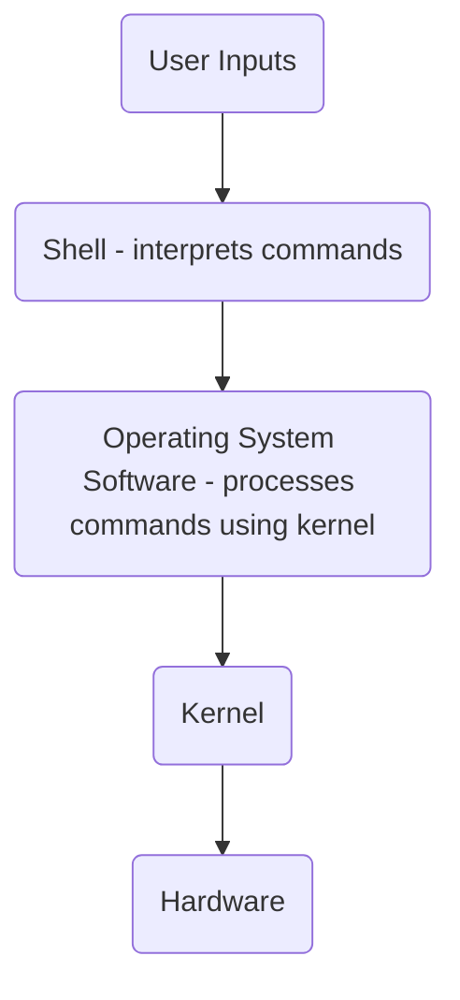

# Infra Tech Notes 

A collection of notes on infrastructure essentials like Linux, Kubernetes, containerization, and networking. 

<details>
<summary><h2>🐧 Linux in Action</h2></summary>

<details>
<summary><h3>CH1. Welcome to Linux</h3></summary>

### What makes Linux different from other operating systems 
Linux is free, making it easier to install without worrying about licenses or DRM, ideal for testing various hardware and server setups.

Built on UNIX-like technology, Linux offers stability, security, and reliable package management for thousands of free apps. As open source, it’s customizable, leading to a vast range of specialized distributions (distros) tailored for different needs.

Linux stands out from other operating systems due to its cost-effectiveness, stability, and security. Its open-source nature and robust package management foster a diverse ecosystem of customizable distributions, making it a versatile choice for various applications and user needs.

### The Linux File System 
Since it's commonly believed that <ins>everything in Linux operates through plain text files</ins>, it makes sense to begin by familiarizing yourself with the Linux file system.

To ensure reliable data retrieval, you need an index that consistently directs you to your desired resources. A file system uses this index to create an organized structure of directories and files within a <ins>partition</ins>.

All files in a disk partition are organized in directories under the root directory, represented by the `/` (forward slash). This directory structure follows the UNIX Filesystem Hierarchy Standard (FHS).

Here’s a list of top-level directories in the Linux file system along with brief explanations:

- `/etc`: Contains configuration files for the system and installed applications.
- `/var`: Stores variable data files, such as logs, databases, and spool files.
- `/home`: Contains user home directories, where personal files and settings are stored.
- `/sbin`: Holds system binaries, essential for system administration and maintenance tasks, typically used by the root user.
- `/bin`: Contains essential user binaries (executable programs) required for basic system operation, available to all users.
- `/lib`: Stores shared libraries needed by binaries in `/bin` and `/sbin` for execution.
- `/usr`: Contains user-related programs, libraries, and documentation, often divided into subdirectories like `/usr/bin` (user binaries) and `/usr/lib` (libraries for user applications).

### What is Bash? 

Bash is one of the most popular UNIX shells. A <ins>**shell** is a user interface that interprets commands</ins>, either through a command-line interface (CLI) or a graphical user interface (GUI). It acts as a software layer that executes formatted commands using the system's kernel and hardware resources.

A kernel is the core part of an operating system that manages hardware resources and enables communication between software and hardware, handling processes, memory, and devices.



### Pseudo file systems

A normal file is a stable collection of data that can be accessed repeatedly, even after a reboot. In contrast, Linux pseudo (or virtual) files, found in directories like /sys/ and /proc/, do not exist in the traditional sense; their contents are dynamically generated by the OS to represent specific values.

To check the total space on your hard drive, you can use the cat command to read the size file for the disk, such as `/sys/block/sda/size`:

```bash
$ cat /sys/block/sda/size 
```
> In Linux, storage devices are designated as `/dev/sda`, `/dev/sdb`, `/dev/sdc`, etc., with `/dev/hda` for hard drives, `/dev/sr0` for DVD drives, `/dev/cdrom` for CD-ROMs, and `/dev/fd0` for floppy drives.

### `journalctl`

You can access all system logs using `journalctl`:

```
# journalctl
```

Running `journalctl` without arguments will produce a large amount of data, so you can filter it using `grep`. To exclude lines containing the word "error," use the `-v` option:

```
# journalctl | grep -v error
```

</details>

<details>
<summary><h3>CH2. Linux virtualization: Building a Linux working environment</h3></summary>

### What is Virtualization? 

Virtualization is the creation of virtual versions of physical resources, allowing multiple virtual instances to run on a single physical machine, which improves resource utilization and management.

> Virtual Machines vs. Containers
> 
> Applications have been packaged into individual virtual machines (VMs), <ins>providing isolated operating environments</ins> for dependency management and resource allocation. However, this approach incurs high overhead due to the need to maintain separate operating systems and packages for each application.
>
> Containers offer a more efficient solution by packaging just the application and its dependencies in an isolated environment. Unlike VMs, <ins>containers don't require a separate operating system</ins>, significantly reducing overhead while retaining many of the benefits of virtualization. This makes containers a more practical modern solution.

<ins>**Successful virtualization**</ins> creates an isolated space on a physical computer where <ins>**a guest OS can be installed and convinced that it is the sole occupant of its own machine**</ins>. These guest operating systems can share network connections, allowing administrators to log in remotely.

<ins>**Successful containerization**</ins> creates lightweight, <ins>**isolated environments for applications to run with their dependencies**</ins>, making each container think it has its own OS while sharing the host's kernel. This setup allows multiple containers to coexist efficiently, enabling quick deployment, management, and scaling of applications.

**Hypervisors** are software that manage host system hardware, <ins>allocating necessary resources to guest operating systems</ins>. They run guest machines as system processes with virtualized access to hardware resources. Examples include Xen, KVM, VMware ESXi, and Microsoft Hyper-V, which provide the foundation for many cloud services, such as those offered by AWS.

</details>

<details>
<summary><h3>CH3. Remote connectivity: Safely accessing networked machines</h3></summary>

### Getting Started with OpenSSH

To safeguard data privacy, security software employs an encryption key—a small file with a random character sequence. Secure communications involve quickly encrypting data before transmission and decrypting it upon receipt. The SSH protocol facilitates this process seamlessly, providing secure remote logins for UNIX-like systems since the 1990s. OpenSSH is widely used, and Microsoft now offers it natively on Windows.

The `dpkg` command-line tool manages and queries software packages within the Advanced Package Tool (APT) system.

Run the following commands to inspect the `opeenssh-client` and `opeenssh-server` packages. 

<details><summary><code>$ dpkg -s openssh-client</code><br></summary>
<br>
    
```
Package: openssh-client
Status: install ok installed
Priority: standard
Section: net
Installed-Size: 3536
Maintainer: Ubuntu Developers <ubuntu-devel-discuss@lists.ubuntu.com>
Architecture: amd64
Multi-Arch: foreign
Source: openssh
Version: 1:9.6p1-3ubuntu13.5
Replaces: openssh-sk-helper, ssh, ssh-krb5
Provides: ssh-client
Depends: adduser, passwd, libc6 (>= 2.38), libedit2 (>= 2.11-20080614-0), libfido2-1 (>= 1.8.0), libgssapi-krb5-2 (>= 1.17), libselinux1 (>= 3.1~), libssl3t64 (>= 3.0.13), zlib1g (>= 1:1.1.4)
Recommends: xauth
Suggests: keychain, libpam-ssh, monkeysphere, ssh-askpass
Breaks: openssh-sk-helper
Conflicts: sftp
Conffiles:
 /etc/ssh/ssh_config d11fe67b3cd9180e1c0e888c5e5b93f6
Description: secure shell (SSH) client, for secure access to remote machines
 This is the portable version of OpenSSH, a free implementation of
 the Secure Shell protocol as specified by the IETF secsh working
 group.
 .
 Ssh (Secure Shell) is a program for logging into a remote machine
 and for executing commands on a remote machine.
 It provides secure encrypted communications between two untrusted
 hosts over an insecure network. X11 connections and arbitrary TCP/IP
 ports can also be forwarded over the secure channel.
 It can be used to provide applications with a secure communication
 channel.
 .
 This package provides the ssh, scp and sftp clients, the ssh-agent
 and ssh-add programs to make public key authentication more convenient,
 and the ssh-keygen, ssh-keyscan, ssh-copy-id and ssh-argv0 utilities.
 .
 In some countries it may be illegal to use any encryption at all
 without a special permit.
 .
 ssh replaces the insecure rsh, rcp and rlogin programs, which are
 obsolete for most purposes.
Homepage: https://www.openssh.com/
Original-Maintainer: Debian OpenSSH Maintainers <debian-ssh@lists.debian.org>
```
</details>

<details><summary><code>$ dpkg -s openssh-server</code><br></summary>
<br>
    
```
Package: openssh-server
Status: install ok installed
Priority: optional
Section: net
Installed-Size: 2097
Maintainer: Ubuntu Developers <ubuntu-devel-discuss@lists.ubuntu.com>
Architecture: amd64
Multi-Arch: foreign
Source: openssh
Version: 1:9.6p1-3ubuntu13.5
Replaces: openssh-client (<< 1:7.9p1-8), ssh, ssh-krb5
Provides: ssh-server
Depends: adduser, libpam-modules, libpam-runtime, lsb-base, openssh-client (= 1:9.6p1-3ubuntu13.5), openssh-sftp-server, procps, ucf, debconf (>= 0.5) | debconf-2.0, libaudit1 (>= 1:2.2.1), libc6 (>= 2.38), libcom-err2 (>= 1.43.9), libcrypt1 (>= 1:4.1.0), libgssapi-krb5-2 (>= 1.17), libkrb5-3 (>= 1.13~alpha1+dfsg), libpam0g (>= 0.99.7.1), libselinux1 (>= 3.1~), libssl3t64 (>= 3.0.13), libwrap0 (>= 7.6-4~), zlib1g (>= 1:1.1.4)
Pre-Depends: init-system-helpers (>= 1.54~)
Recommends: default-logind | logind | libpam-systemd, ncurses-term, xauth, ssh-import-id
Suggests: molly-guard, monkeysphere, ssh-askpass, ufw
Conflicts: sftp, ssh-socks, ssh2
Conffiles:
 /etc/default/ssh 500e3cf069fe9a7b9936108eb9d9c035
 /etc/init.d/ssh 3649a6fe8c18ad1d5245fd91737de507
 /etc/pam.d/sshd 8b4c7a12b031424b2a9946881da59812
 /etc/ssh/moduli 366395e79244c54223455e5f83dafba3
 /etc/ufw/applications.d/openssh-server 486b78d54b93cc9fdc950c1d52ff479e
Description: secure shell (SSH) server, for secure access from remote machines
 This is the portable version of OpenSSH, a free implementation of
 the Secure Shell protocol as specified by the IETF secsh working
 group.
 .
 Ssh (Secure Shell) is a program for logging into a remote machine
 and for executing commands on a remote machine.
 It provides secure encrypted communications between two untrusted
 hosts over an insecure network. X11 connections and arbitrary TCP/IP
 ports can also be forwarded over the secure channel.
 It can be used to provide applications with a secure communication
 channel.
 .
 This package provides the sshd server.
 .
 In some countries it may be illegal to use any encryption at all
 without a special permit.
 .
 sshd replaces the insecure rshd program, which is obsolete for most
 purposes.
Homepage: https://www.openssh.com/
Original-Maintainer: Debian OpenSSH Maintainers <debian-ssh@lists.debian.org>
```
</details>

Note that the server version also includes all the tools you’ll find in the client package.

You can check if SSH is running on your machine by using the command `systemctl status`.

<details><summary><code>$ systemctl status ssh</code><br></summary>
<br> 
    
```
● ssh.service - OpenBSD Secure Shell server
     Loaded: loaded (/usr/lib/systemd/system/ssh.service; disabled; preset: enabled)
     Active: active (running) since Wed 2024-10-30 05:45:34 UTC; 2h 10min ago
TriggeredBy: ● ssh.socket
       Docs: man:sshd(8)
             man:sshd_config(5)
    Process: 1145 ExecStartPre=/usr/sbin/sshd -t (code=exited, status=0/SUCCESS)
   Main PID: 1147 (sshd)
      Tasks: 1 (limit: 2276)
     Memory: 3.1M (peak: 4.1M)
        CPU: 91ms
     CGroup: /system.slice/ssh.service
             └─1147 "sshd: /usr/sbin/sshd -D [listener] 0 of 10-100 startups"

Oct 30 05:45:34 Ubuntu-server systemd[1]: Starting ssh.service - OpenBSD Secure Shell server...
Oct 30 05:45:34 Ubuntu-server sshd[1147]: Server listening on :: port 22.
Oct 30 05:45:34 Ubuntu-server systemd[1]: Started ssh.service - OpenBSD Secure Shell server.
Oct 30 05:45:39 Ubuntu-server sshd[1148]: Accepted password for cynicdog from 10.0.2.2 port 64573 ssh2
Oct 30 05:45:39 Ubuntu-server sshd[1148]: pam_unix(sshd:session): session opened for user cynicdog(uid=1000) by cynicdog(uid=0)

```
</details>

### Logging into a remote server with SSH 

Let's simulate a network with two hosts in Docker following the steps below. We will create a Docker network (`ubuntwos`) and there we will run two ubuntu containers, `ubuntu-1` as a server and `ubuntu-2` as a client that connects to the server.   

1. Create a Docker network.
   ```bash
   docker network create ubuntwos 
   ```

2. Start and access two ubuntu containers in interactive terminals.
   ```bash
   docker run -dt -p 8080:80 --name ubuntu-1 --network ubuntwos ubuntu
   docker run -dt -p 8081:80 --name ubuntu-2 --network ubuntwos ubuntu
   docker exec -it ubuntu-1 /bin/bash
   docker exec -it ubuntu-2 /bin/bash
   ```

3. Install common tools for both of the containers.
   ```bash
   apt-get update && apt-get install -y net-tools iproute2 iputils-ping tcpdump vim 
   ```

   You can check the ip address assigned to the container's <ins>**default network interface**</ins>(`eth0`) as below.

   <details><summary>For <code>ubuntu-1</code>, run <code>root@8885b89799a2:/# ip addr</code><br></summary>
   <br>
       
   ```bash
      1: lo: <LOOPBACK,UP,LOWER_UP> mtu 65536 qdisc noqueue state UNKNOWN group default qlen 1000
        link/loopback 00:00:00:00:00:00 brd 00:00:00:00:00:00
        inet 127.0.0.1/8 scope host lo
          valid_lft forever preferred_lft forever
        inet6 ::1/128 scope host
          valid_lft forever preferred_lft forever
      2: tunl0@NONE: <NOARP> mtu 1480 qdisc noop state DOWN group default qlen 1000
        link/ipip 0.0.0.0 brd 0.0.0.0
      21: eth0@if22: <BROADCAST,MULTICAST,UP,LOWER_UP> mtu 1500 qdisc noqueue state UP group default
        link/ether 02:42:ac:13:00:02 brd ff:ff:ff:ff:ff:ff link-netnsid 0
        inet 172.19.0.2/16 brd 172.19.255.255 scope global eth0    [1] 
          valid_lft forever preferred_lft forever
   ```
   > The ip address assigned to the default network interface for `ubuntu-1` container (the server host) is `172.19.0.2`.
   </details>

   <details><summary>For <code>ubuntu-2</code>, run <code>root@8bbdca37e251:/# ip addr</code><br></summary>
   <br>
       
   ```bash
      1: lo: <LOOPBACK,UP,LOWER_UP> mtu 65536 qdisc noqueue state UNKNOWN group default qlen 1000
        link/loopback 00:00:00:00:00:00 brd 00:00:00:00:00:00
        inet 127.0.0.1/8 scope host lo
          valid_lft forever preferred_lft forever
        inet6 ::1/128 scope host
          valid_lft forever preferred_lft forever
      2: tunl0@NONE: <NOARP> mtu 1480 qdisc noop state DOWN group default qlen 1000
        link/ipip 0.0.0.0 brd 0.0.0.0
      23: eth0@if24: <BROADCAST,MULTICAST,UP,LOWER_UP> mtu 1500 qdisc noqueue state UP group default
        link/ether 02:42:ac:13:00:03 brd ff:ff:ff:ff:ff:ff link-netnsid 0
        inet 172.19.0.3/16 brd 172.19.255.255 scope global eth0    [1] 
          valid_lft forever preferred_lft forever
   ```
   > The ip address assigned to the default network interface for `ubuntu-2` container (the client host) is `172.19.0.3`.   
   </details>

   We can also inspect networkings between two containers as below.

   ```bash
   root@8885b89799a2:/# ping 172.19.0.3
   PING 172.19.0.3 (172.19.0.3) 56(84) bytes of data.
   64 bytes from 172.19.0.3: icmp_seq=1 ttl=64 time=0.555 ms
   ```
   > The server container (`172.19.0.2`) pings to the client container (`172.19.0.3`).

   ```bash
   root@8bbdca37e251:/# tcpdump -i eth0 icmp
   tcpdump: verbose output suppressed, use -v[v]... for full protocol decode
   listening on eth0, link-type EN10MB (Ethernet), snapshot length 262144 bytes
   14:59:46.419641 IP ubuntu-1.ubuntwos > 8bbdca37e251: ICMP echo request, id 3, seq 55, length 64
   14:59:46.419655 IP 8bbdca37e251 > ubuntu-1.ubuntwos: ICMP echo reply, id 3, seq 55, length 64
   14:59:47.459640 IP ubuntu-1.ubuntwos > 8bbdca37e251: ICMP echo request, id 3, seq 56, length 64
   ```
   > The client container (`172.19.0.3`) processes incoming ping requests and sends back the corresponding ICMP echo replies.
   
5. Configure the server.

   First, let's install the `openssh-server` on the `ubuntu-1`.
   ```bash
   root@8885b89799a2:/# apt-get install openssh-server -y 
   ```

   Then we need to configure ssh daemon (`sshd_config`) file.
   ```bash
   root@8885b89799a2:/# vim /etc/ssh/sshd_config
   ```
   > Set the `PermitRootLogin` to `yes` and uncomment the line. Save the configuration and exit (`:wq`). 

   Then we set the password as below:
   ```bash
   root@8885b89799a2:/# passwd
   New password: ****
   Retype new password: **** 
   passwd: password updated successfully
   ```

   Now let's start the ssh daemon.
   ```bash
   root@8885b89799a2:/# service ssh start
     * Starting OpenBSD Secure Shell server sshd   
   root@8885b89799a2:/# service ssh status
     * sshd is running
   ```

6. Configure the client.

   Install the `openssh-client` on the `ubuntu-2`.
   ```bash
   root@8bbdca37e251:/# apt-get install openssh-client -y 
   ```

7. Access to the server host from the client.

   ```text
   root@8bbdca37e251:/# ssh root@172.19.0.2
   root@172.19.0.2's password: ****
   Welcome to Ubuntu 24.04.1 LTS (GNU/Linux 5.15.153.1-microsoft-standard-WSL2 x86_64)

    * Documentation:  https://help.ubuntu.com
    * Management:     https://landscape.canonical.com
    * Support:        https://ubuntu.com/pro

   This system has been minimized by removing packages and content that are
   not required on a system that users do not log into.

   To restore this content, you can run the 'unminimize' command.
   Last login: Thu Oct 31 05:10:35 2024 from 172.19.0.3
   root@8885b89799a2:~#
   ```

### Password-free SSH access (SSH key-based authentication)

Instead of using password authentication for SSH, you can create a key pair and copy the public key to the remote host where you want to log in. The implementation steps are as follows.
   
1. Create a key pair in the client host.
   ```bash
   root@8bbdca37e251:/# ssh-keygen
   Generating public/private ed25519 key pair.
   Enter file in which to save the key (/root/.ssh/id_ed25519):
   Enter passphrase (empty for no passphrase):
   Enter same passphrase again:
   Your identification has been saved in /root/.ssh/id_ed25519
   Your public key has been saved in /root/.ssh/id_ed25519.pub
   ... 
   ```

2. Copy the public key from the client to the remote server host.
   ```bash
   root@8bbdca37e251:/# ssh root@172.19.0.2 mkdir -p .ssh
   root@172.19.0.2 password: **** 

   root@1ab415eaeebe:~# scp /root/.ssh/id_ed25519.pub root@172.19.0.2:.ssh/authorized_keys
   root@172.19.0.2 password: ****
   id_ed25519.pub                                    100%   99   213.4KB/s   00:00
   ```

3. Configure ssh daemon on the server host.
   ```bash
   root@8885b89799a2:/# vim /etc/ssh/sshd_config 
   ```
   > Set the `PasswordAuthentication` as `no` to disable the basic authentication. 

4. Connect to the remote server by using the ssh key-based authentication
   ```bash
   root@8bbdca37e251:/# ssh root@172.19.0.2
   Welcome to Ubuntu 24.04.1 LTS (GNU/Linux 5.15.153.1-microsoft-standard-WSL2 x86_64)
   ... 
   root@8885b89799a2:~#
   ```


### Linux process management 

<ins>**Software**</ins> consists of <ins>programming code that instructs computer hardware</ins> on behalf of users. A <ins>**process**</ins> is <ins>an instance of a running software program</ins>. An <ins>**operating system**</ins> <ins>organizes and manages these processes</ins> to optimize the use of hardware resources.

When you run the `ps` command, you'll typically see two results: the `bash` process <ins>representing the Bash command interpreter for your current shell session</ins>, and <ins>the most recent command executed</ins>, which is `ps` itself. If there are background processes or jobs running in your session, those will also appear in the output.

Adding the -e argument to ps retrieves all processes from your current shell and all parent shells up to init.

```bash
root@51c80d3eb605:/# ps -e
    PID TTY          TIME CMD
      1 pts/0    00:00:00 bash
      9 pts/1    00:00:00 bash
   4041 pts/2    00:00:00 bash
   4241 pts/2    00:00:00 ps
```

If you want to visualize the parent and children processes, you can run `pstree` command with `-p` argument, to display the PIDs of each process included. 

<details><summary><code>cynicdog@Ubuntu-server:~$ pstree -p</code><br></summary>
<br>

```bash
systemd(1)─┬─ModemManager(763)─┬─{ModemManager}(788)
           │                   ├─{ModemManager}(792)
           │                   └─{ModemManager}(795)
           ├─cron(828)
           ├─dbus-daemon(635)
           ├─login(875)───bash(1072)
           ├─multipathd(3150)─┬─{multipathd}(3174)
           │                  ├─{multipathd}(3176)
           │                  ├─{multipathd}(3177)
           │                  ├─{multipathd}(3178)
           │                  ├─{multipathd}(3179)
           │                  └─{multipathd}(3180)
           ├─ovs-vswitchd(8901)
           ├─ovsdb-server(8850)
           ├─polkitd(647)─┬─{polkitd}(742)
           │              ├─{polkitd}(743)
           │              └─{polkitd}(744)
           ├─rsyslogd(707)─┬─{rsyslogd}(759)
           │               ├─{rsyslogd}(760)
           │               └─{rsyslogd}(762)
           ├─sshd(1147)───sshd(1767)───sshd(1849)───bash(1850)───pstree(13952)
           ├─systemd(1062)───(sd-pam)(1063)
           ├─systemd-journal(289)
           ├─systemd-logind(666)
           ├─systemd-network(404)
           ├─systemd-resolve(421)
           ├─systemd-timesyn(427)───{systemd-timesyn}(479)
           ├─systemd-udevd(353)
           ├─udisksd(680)─┬─{udisksd}(717)
           │              ├─{udisksd}(718)
           │              ├─{udisksd}(721)
           │              ├─{udisksd}(761)
           │              └─{udisksd}(804)
           ├─unattended-upgr(837)───{unattended-upgr}(870)
           └─upowerd(1489)─┬─{upowerd}(1491)
                           ├─{upowerd}(1492)
                           └─{upowerd}(1493)

```    
</details>

`systemd` manages process lifecycles, including creation and termination, using the `systemctl` command. It also oversees various system services, such as `journald` (logging), `networkd` (network management), and `udevd` (device management). The "d" in systemd stands for daemon, indicating its role as a background process.

</details>

<details>
<summary><h3>CH4. Archive management: Backing up or copying entire file systems</h3></summary>

In Linux, **tar** is commonly used for archiving multiple files into one (`.tar` file), often combined with compression (`.tar.gz`). **dd** creates disk image archives by copying data at the block level, ideal for backing up entire partitions or drives. **rsync** is used for incremental archiving, efficiently syncing files and directories between locations, often for backups or mirroring.

**Compression** reduces file size, commonly using `gzip` or `bzip2`, to save space. Archiving and compression are often used together, like `tar.gz`.

An **image** is a file that represents an exact, byte-for-byte copy of data from a storage device, like a disk, partition, or filesystem. It includes all files, system metadata, and boot information, making it useful for backups, system recovery, or deployment. Images can be created with tools like `dd` or `Clonezilla` for disk cloning and `ISO` files for operating system installations.

A **partition** is a defined section of a storage device, such as a hard drive or SSD, that is treated as a separate logical unit. Each partition can hold a file system, allowing the operating system to manage and organize data independently. Partitions help optimize storage, separate operating systems, and improve data management and security.

### What to archive 

Let's start with the `df` command, which shows all currently mounted partitions on a Linux system, along with their disk usage and file system locations.

```bash
root@1ab415eaeebe:/# df
Filesystem      1K-blocks     Used Available Use% Mounted on
overlay        1055762868 19854556 982204840   2% /
tmpfs               65536        0     65536   0% /dev
tmpfs             4029616        0   4029616   0% /sys/fs/cgroup
shm                 65536        0     65536   0% /dev/shm
/dev/sdc       1055762868 19854556 982204840   2% /etc/hosts
tmpfs             4029616        0   4029616   0% /proc/acpi
tmpfs             4029616        0   4029616   0% /sys/firmware
```

It's essential to differentiate between real and pseudo file systems. If the file system is designated as `tmpfs` and the Used column shows 0 bytes, it indicates that no space is currently in use.

Be sure to follow best practices for backups. Your backups should be:

1. **Reliable**: Use storage media that are likely to maintain integrity for the duration of their intended use.
2. **Tested**: Regularly test the restoration of backups in simulated production environments.
3. **Rotated**: Keep several historical backups that are older than the most recent one to safeguard against potential failures.
4. **Distributed**: Store some backups in a physically remote location to protect against data loss from disasters like fire.
5. **Secure**: Avoid exposing your data to insecure networks or storage sites during the backup process.
6. **Compliant**: Adhere to all relevant regulatory and industry standards at all times.
7. **Up-to-Date**: Ensure your backups reflect the current live version, avoiding outdated archives.
8. **Scripted**: Automate backup processes to eliminate reliance on human memory for ongoing tasks.

### Archiving files and file systems using `tar`

#### Simple archive and compression examples

- Let's create some files to archive by runnning: 
  ```bash
  root@1ab415eaeebe:~# touch file1 file2 file3
  ```
- Now, let's archive these files into a tarball:
  ```bash
  root@1ab415eaeebe:~# tar cvf files.tar *
  file1
  file2
  file3
  ```
- You can also use globbing to archive specific file types:
  ```bash
  root@1ab415eaeebe:~# touch hello.mp4
  root@1ab415eaeebe:~# tar cvf audio.tar *.mp4
  hello.mp4
  ```
- Now, let's create a compressed tarball of the MP4 files:
  ```
  root@1ab415eaeebe:~# tar czvf audio.tar.gz *.mp4
  hello.mp4
  ```
- Since `tar` is aware of its Linux environment, you can use it to select files and directories outside your current working directory. For example, to add all `.mp4` files from the `/home/myuser/Videos/` directory:
  ```bash
  root@1ab415eaeebe:~# tar czvf archivename.tar.gz /home/myuser/Videos/*.mp4
  ```
- You can split a zipped file into parts using `split` with the `-b` argument:
  ```bash
  root@1ab415eaeebe:~# split -b 1G archivename.tar.gz "archivename.tar.gz.part"
  ```
- To combine these parts back into the original file, use:
  ```bash
  root@1ab415eaeebe:~# cat archivename.tar.gz.part* > archivename.tar.gz
  ```

#### Streaming file system archives

An archive is a file that can be copied or moved using standard Bash commands, allowing us to stream it to a remote server. 

One advantage of using the `cat` operation to generate archives is that it eliminates the need for an intermediate step, avoiding temporary storage of the archive on the local machine.

```bash
root@d41115ff5e58:~# tar czvf - audio.mp4 | ssh root@172.19.0.2 "cat > /home/ubuntu/audio.tar.gz"
```

#### Aggregating files with find

We can aggregate files with the help of `find` search command and `tar` with `-r` option to append the found results as below: 
```bash
root@d41115ff5e58:/home/ubuntu# touch word-1.txt
root@d41115ff5e58:/home/ubuntu# echo "Hello," > word-1.txt
root@d41115ff5e58:/home/ubuntu# touch word-2.txt
root@d41115ff5e58:/home/ubuntu# echo " World!" > word-2.txt
root@d41115ff5e58:/home/ubuntu# find . -name "*.txt" -exec tar -rvf archive.tar {} +
./word-1.txt
./word-2.txt
root@d41115ff5e58:/home/ubuntu# cat archive.tar
./word-1.txt0000644000000000000000000000000714711067750011570 0ustar  rootrootHello,
./word-2.txt0000644000000000000000000000001014711067764011570 0ustar  rootroot World!
```

#### Preserving permissions and ownership...and extracting archives

Let's first with checking the permission and ownership information by running: 
```bash
root@d41115ff5e58:/# ls -l /usr/lib/openssh/
total 856
-rwxr-xr-x 1 root root   1190 Apr  4  2024 agent-launch
-rwsr-xr-x 1 root root 342632 Aug  9 11:33 ssh-keysign
-rwxr-xr-x 1 root root 256432 Aug  9 11:33 ssh-pkcs11-helper
-rwxr-xr-x 1 root root 268720 Aug  9 11:33 ssh-sk-helper
```

**Permissions** dictate what actions users can perform on a file or directory, including reading, writing, and executing.

To modify an object's permissions with `chmod` command, you need to input the total score for each user category: owner, group, and others.
```bash
root@d41115ff5e58:/# chmod 771 /usr/lib/openssh/ssh-sk-helper
root@d41115ff5e58:/# ls -l /usr/lib/openssh/
total 856
-rwxr-xr-x 1 root root   1190 Apr  4  2024 agent-launch
-rwsr-xr-x 1 root root 342632 Aug  9 11:33 ssh-keysign
-rwxr-xr-x 1 root root 256432 Aug  9 11:33 ssh-pkcs11-helper
-rwxrwx--x 1 root root 268720 Aug  9 11:33 ssh-sk-helper         [1]
```
> [1] The write permission on `ssh-sk-helper` is newly given to group. 

**Ownership** in a filesystem determines which user and group have control over a file or directory, influencing permissions for reading, writing, and executing.

```bash
root@d41115ff5e58:/home/ubuntu# touch newfile
root@d41115ff5e58:/home/ubuntu# ls -l
total 0
-rw-r--r-- 1 root root 0 Nov  1 15:39 newfile
```

You can change a file's ownership using `chown` as follows:  
```bash
root@d41115ff5e58:/home/ubuntu# chown cynicdog:cynicdog newfile
```
> Ensure the user you want to assign as the owner exists beforehand. If it doesn’t, create it using `adduser USERNAME`.

To extract the archive, use the `tar` command with the `x` argument instead of `c`:  
```bash
root@d41115ff5e58:/home/ubuntu# tar xvf archive.tar
```

### Archiving partitions with `dd`

Previously, you used `tar` to copy files between systems, needing a host OS as a base. In contrast, `dd` creates perfect byte-for-byte images of any digital content.

You can create a file filled with zeros (or any other data) using the `dd` command. For example, to create a 1MB file:
```
root@d41115ff5e58:/home/ubuntu# dd if=/dev/zero of=testfile bs=1M count=1
1+0 records in
1+0 records out
1048576 bytes (1.0 MB, 1.0 MiB) copied, 0.00149206 s, 703 MB/s
```
> The `if=` parameter specifies the source drive, while the `of=` parameter indicates the file or location where you want to save the data.

You can check the content of the copied result:
```bash
root@d41115ff5e58:/home/ubuntu# od -x testfile
0000000 0000 0000 0000 0000 0000 0000 0000 0000
*
4000000
```

You can create a `.img` file using a file within your container.
```bash
root@d41115ff5e58:/home/ubuntu# dd if=/dev/zero of=partition.img bs=1M count=100
100+0 records in
100+0 records out
104857600 bytes (105 MB, 100 MiB) copied, 0.18416 s, 569 MB/s
```
> The `bs` parameter sets the number of bytes to copy at one time.

Restoring is straightforward: you simply swap the values of `if` and `of`. 

By using the /dev/urandom file as the source, you can overwrite a disk with random data.
```bash
root@d41115ff5e58:/home/ubuntu# dd if=/dev/urandom of=/dev/sdXYZ bs=1M status=progress
```
> ⚠️ This command will completely overwrite the specified disk, erasing all existing data on it. Be very careful to specify the correct device.

### Synchronizing archives with `rsync`

`rsync` is a fast, versatile command-line tool for synchronizing files and directories between two locations. It efficiently transfers only the differences between source and destination, minimizing data transfer and making it ideal for backups and remote file syncing.

Let's first install the tool both on the server and client hosts. 
```bash
root@323e5033944b:/# apt-get install rsync -y 
root@56ad7b47a68a:/# apt-get install rsync -y 
```

Then Navigate to the desired directory on the client host and create sample files for transfer. 
```bash
root@56ad7b47a68a:/home/ubuntu/sub_directory# touch file1 file2 file3
```

Now create the destination directory on the remote host and synchronize files to it
```bash
root@56ad7b47a68a:/home/ubuntu/sub_directory# ssh root@172.19.0.2 "mkdir sub_directory"
root@56ad7b47a68a:/home/ubuntu/sub_directory# rsync -av * root@172.19.0.2:sub_directory
sending incremental file list
file1
file2
file3

sent 202 bytes  received 73 bytes  550.00 bytes/sec
total size is 0  speedup is 0.00
```
</details>

<details>
<summary><h3>CH7. Web servers: building a React Web App with Apache Web Server</h3></summary>

### Create a vite-react web app and Serve with Apache on Docker Container

#### Install necessary packages
```bash
root@c3141d39ae83:~# apt install -y nodejs npm apache2 
```
Installs Node.js, npm (Node Package Manager), and the Apache2 web server.

#### Start the Apache web server
```bash
root@c3141d39ae83:~# service apache2 start
```
Starts the Apache server so it can serve files.

#### Create a new Vite-React application 
```bash
root@c3141d39ae83:~# npx create-vite@latest my-react-app --template react
root@c3141d39ae83:~# cd my-react-app/
```
Uses `npx` to create a new Vite app with a React template and then navigates into the project directory.

#### Install dependencies and build the application 
```bash
root@c3141d39ae83:/my-react-app# npm install 
root@c3141d39ae83:/my-react-app# npm run build 
```
Installs project dependencies and builds the production-ready static files.

#### Copy the build files to Apache’s serving directory and set permissions
```bash
root@c3141d39ae83:/my-react-app# cp -r dist/* /var/www/html
root@c3141d39ae83:/my-react-app# chmod -R 755 /var/www/html/
```
Copies the build output to `/var/www/html` so Apache can serve it, and sets permissions to allow access.

#### Set up Apache Virtual Host
```bash
export APACHE_LOG_DIR="/var/log/apache2"
vim /etc/apache2/sites-available/my-react-app.conf
```
Defines `APACHE_LOG_DIR` for the log location and opens a new configuration file for the virtual host.

#### Apache Virtual Host configuration file (`my-react-app.conf`)
```xml
<VirtualHost *:80>
    ServerAdmin webmaster@localhost
    DocumentRoot /var/www/html
    <Directory /var/www/html>
        Options Indexes FollowSymLinks
        AllowOverride All
        Require all granted
    </Directory>

    ErrorLog ${APACHE_LOG_DIR}/error.log
    CustomLog ${APACHE_LOG_DIR}/access.log combined
</VirtualHost>
```
Specifies Apache’s document root, directory permissions, and log file locations.

In Apache, a `VirtualHost` allows hosting multiple websites on a single server by directing requests based on domain name, IP address, or port. It’s commonly used to serve multiple domains from one IP using name-based hosting. Each `VirtualHost` block specifies settings like the document root and logging for an individual site.

#### Disable default site and enable the new site 
```bash
root@c3141d39ae83:~# a2dissite 000-default.conf
root@c3141d39ae83:~# a2ensite my-react-app.conf
```
Disables the default Apache site and enables the new virtual host configuration.

#### Restart the Apache server to apply changes   
```bash 
service apache2 reload
service apache2 restart
```
Reloads and restarts Apache to apply the virtual host configuration changes.

#### Fetch from the client host. 
```bash
root@b32690965a6e:/# curl http://172.19.0.2:80/
<!doctype html>
<html lang="en">
  <head>
    <meta charset="UTF-8" />
    <link rel="icon" type="image/svg+xml" href="/vite.svg" />
    <meta name="viewport" content="width=device-width, initial-scale=1.0" />
    <title>Vite + React</title>
    <script type="module" crossorigin src="/assets/index-Bw3cTkF-.js"></script>
    <link rel="stylesheet" crossorigin href="/assets/index-n_ryQ3BS.css">
  </head>
  <body>
    <div id="root"></div>
  </body>
</html>
```
> You might need to install `curl` first by running `apt install curl`. Note that the port of the web app is mapped to 80.  

### Create a vite-react web app and Serve with nginx on Docker Container 

#### Turn off the Apache server if running. 
```bash
root@c3141d39ae83:/my-react-app# service apache2 stop 
```

#### Install `nginx` 
```bash
root@c3141d39ae83:/my-react-app# apt install -y nginx
```

#### Create a new Vite-React application 
```bash
root@c3141d39ae83:~# npx create-vite@latest my-react-app --template react
root@c3141d39ae83:~# cd my-react-app/
```
Uses `npx` to create a new Vite app with a React template and then navigates into the project directory.

#### Install dependencies and build the application 
```bash
root@c3141d39ae83:/my-react-app# npm install 
root@c3141d39ae83:/my-react-app# npm run build 
```
Installs project dependencies and builds the production-ready static files.

#### Copy the build files to Apache’s serving directory and set permissions
```bash
root@c3141d39ae83:/my-react-app# cp -r dist/* /var/www/html
root@c3141d39ae83:/my-react-app# chmod -R 755 /var/www/html/
```
Copies the build output to `/var/www/html` so Apache can serve it, and sets permissions to allow access.

#### Configure nginx if needed 
```bash
vim /etc/nginx/sites-available/default
```

<details><summary>where the configuration file <code>default</code> reads: </summary>
<br> 

```conf
##
# You should look at the following URL's in order to grasp a solid understanding
# of Nginx configuration files in order to fully unleash the power of Nginx.
# https://www.nginx.com/resources/wiki/start/
# https://www.nginx.com/resources/wiki/start/topics/tutorials/config_pitfalls/
# https://wiki.debian.org/Nginx/DirectoryStructure
#
# In most cases, administrators will remove this file from sites-enabled/ and
# leave it as reference inside of sites-available where it will continue to be
# updated by the nginx packaging team.
#
# This file will automatically load configuration files provided by other
# applications, such as Drupal or Wordpress. These applications will be made
# available underneath a path with that package name, such as /drupal8.
#
# Please see /usr/share/doc/nginx-doc/examples/ for more detailed examples.
##

# Default server configuration
#
server {
        listen 80 default_server;
        listen [::]:80 default_server;

        # SSL configuration
        #
        # listen 443 ssl default_server;
        # listen [::]:443 ssl default_server;
        #
        # Note: You should disable gzip for SSL traffic.
        # See: https://bugs.debian.org/773332
        #
        # Read up on ssl_ciphers to ensure a secure configuration.
        # See: https://bugs.debian.org/765782
        #
        # Self signed certs generated by the ssl-cert package
        # Don't use them in a production server!
        #
        # include snippets/snakeoil.conf;

        root /var/www/html;

        # Add index.php to the list if you are using PHP
        index index.html index.htm index.nginx-debian.html;

        server_name _;

        location / {
                # First attempt to serve request as file, then
                # as directory, then fall back to displaying a 404.
                try_files $uri $uri/ =404;
        }

        # pass PHP scripts to FastCGI server
        #
        #location ~ \.php$ {
        #       include snippets/fastcgi-php.conf;
        #
        #       # With php-fpm (or other unix sockets):
        #       fastcgi_pass unix:/run/php/php7.4-fpm.sock;
        #       # With php-cgi (or other tcp sockets):
        #       fastcgi_pass 127.0.0.1:9000;
        #}

        # deny access to .htaccess files, if Apache's document root
        # concurs with nginx's one
        #
        #location ~ /\.ht {
        #       deny all;
        #}
}


# Virtual Host configuration for example.com
#
# You can move that to a different file under sites-available/ and symlink that
# to sites-enabled/ to enable it.
#
#server {
#       listen 80;
#       listen [::]:80;
#
#       server_name example.com;
#
#       root /var/www/example.com;
#       index index.html;
#
#       location / {
#               try_files $uri $uri/ =404;
#       }
#}
```
</details>
  
#### Start nginx 
```bash
root@c3141d39ae83:/my-react-app# service nginx start 
```

With the help of container's port-forwading, you can now navigate to the default page in your browser. 

</details>

<details>
<summary><h3>CH9. Securing your web server</h3></summary>

To enhance security for the web server, we need to migrate the Nginx/React web app from the Docker container to VirtualBox, as the container limits our ability to configure firewalld or UFW networking settings.

### Deploy a Vite-React App with Nginx on an Ubuntu Server in VirtualBox

The build process for deploying the application in VirtualBox is the same as for creating a React app with Nginx in a Docker container (Refer to [this guide](#create-a-vite-react-web-app-and-serve-with-nginx-on-docker-container) in the chapter 7).

However, since we're now working inside VirtualBox, one network configuration is needed, similar to Docker's port forwarding option.

### Add a Port Forwarding Rule for the Nginx Process

Navigate to the network settings of the Ubuntu Server instance. By default, the network is set to NAT. Click on **Port Forwarding** and add a new entry named `http`, with the host port set to `8080` and the guest port set to `80`.

Now you can see the web app up and running in your host machine's browser with the url of `http://localhost:8080/`.

### Controlling network access

The web server needs to accept incoming web traffic globally using either HTTP or HTTPS. Additionally, SSH traffic should be permitted only for authorized developers and admins, while all other service requests should be automatically denied.

Linux machines can configure firewall rules at the kernel level using a program called `iptables`. Creating `iptables` rules is relatively straightforward, and the syntax can be learned easily. However, to simplify the process, many Linux distributions offer higher-level tools, such as Uncomplicated Firewall (UFW) for Ubuntu, to abstract the configuration.

Firewall functionality is also provided by hardware appliances from companies like Juniper and Cisco, which run on proprietary operating systems with distinct syntax and design.

### Working with UncomplicatedFirewall (`ufw`) in Ubuntu Server 

Let's first install/update the `ufw`. 
```bash
root@Ubuntu-server:~$ apt install ufw
```

Since UFW starts with all ports closed, enabling it may block new SSH sessions. Existing sessions should remain unaffected, but it's advisable to add a rule to allow SSH before enabling UFW:
```bash
root@Ubuntu-server:~# ufw allow ssh
Rules updated
Rules updated (v6)
```

Next, enable UFW with the following command:
```bash
root@Ubuntu-server:~# ufw enable
Command may disrupt existing ssh connections. Proceed with operation (y|n)? y
Firewall is active and enabled on system startup
```

You will notice that you can no longer access the React app with Nginx at `http://localhost:8080/` after enabling UFW.

Let's fix that by allowing traffic on the guest port `80`, and we’ll also allow port `443` for HTTPS now: 
```bash
root@Ubuntu-server:~# ufw allow 80
Rule added
Rule added (v6)
root@Ubuntu-server:~# ufw allow 443
Rule added
Rule added (v6)
```

You can see the status of `ufw` rules as below:  
```bash
root@Ubuntu-server:~# ufw status
Status: active

To                         Action      From
--                         ------      ----
22/tcp                     ALLOW       Anywhere
80                         ALLOW       Anywhere
443                        ALLOW       Anywhere
22/tcp (v6)                ALLOW       Anywhere (v6)
80 (v6)                    ALLOW       Anywhere (v6)
443 (v6)                   ALLOW       Anywhere (v6)
```

You can finetune access to ports by specifying source IP address. Let's first disable the `ufw` and delete the existing rule for port `80`.  
```bash
root@Ubuntu-server:~# ufw disable
Firewall stopped and disabled on system startup
root@Ubuntu-server:~# ufw delete 2
```

### Encrypting data in transit 

Browsers authenticate your site's security and exchange encrypted data during a session. Modern browsers have preinstalled root certificates to authenticate sites using private <ins>**Certificate Authorities**</ins> (CAs). Here’s the process:

1. The client browser requests the server's identity to initiate a **_handshake_**.
2. The server sends its CA-issued certificate.
3. The browser checks the certificate against its root certificate list and verifies it’s valid.
4. If valid, the browser encrypts a session key with the server’s public key and sends it.
5. All communications are encrypted using the session key.

</details>

</details>

<details>
<summary><h2>⚓ Kubernetes for Developers</h2></summary>
<details>
<summary><h3>CH3. Deploying to Kubernetes</h3></summary>

### Kubernetes Architecture 

Kubernetes is <ins>an abstraction layer that sits at the workload level on top of the raw compute primitives</ins> like VMs (or bare metal machines) and load balancers.

VMs are referred to as nodes and are arranged into a cluster. Containers (one or multiple) are grouped into a scheduling unit known as a Pod. Networking is configured via a Service. 

Worker nodes (herein referred to simply as nodes) are responsible for managing the lifecycle of containers that run, including tasks such as starting and stopping containers. The control plane will instruct the node to run a certain container, but the actual execution of the container is then the responsibility of the node.

The **Pod** is used as the primary scheduling unit in Kubernetes. Encompassing your application and its containers, it’s the unit of compute that Kubernetes schedules onto nodes according to the resources you require. 

A **Deployment** is a specification for the desired state of the system, which Kubernetes seeks to actuate. Kubernetes continuously reconciles the observed state to the desired state while attempting to deliver what you requested. 

**Services** are how you expose an application running on a set of Pods as a network service.

</details>
</details>

<details>
<summary><h2>⚓ Core Kubernetes</h2></summary>

<details>
<summary><h3>CH1. Why Kubernetes exists</h3></summary>

### Reviewing a few key terms before we get started 

- **CNI** and **CSI** — The container networking interface and container storage interface, respectively, that allow pluggable networking and storage for Pods that run in Kubernetes.
- **Container** — A standard unit of software that packages up code and all its dependencies so the application runs quickly and reliably from one computing environment to another.
- **Control plane** — The brains of a Kubernetes cluster, where scheduling of containers and managing all Kubernetes objects takes place (sometimes referred to as Masters).
- **DaemonSet** — Ensures that all (or some) Nodes run a copy of a Pod.
- **OCI** — The common image format for building executable, self-contained applications. Also referred to as Docker images.
- **Privileged containers** — A container that can run with elevated permissions, granting them access to all devices, capabilities, and the host's kernel features, effectively giving them the same level of access as processes running directly on the host system.

### Containers and images 

The OCI specification is a standard way to define an image that can be executed by a program such as Docker, and it ultimately is a tarball with various layers.

Containers provide a layer of isolation that eliminates the need to manage libraries on a server or preload infrastructure with unintended application dependencies.

### Core foundation of Kubernetes 

When the nodes in the cluster respond to ongoing events and update their Node objects through the kubelet's communication with the API server, things can go wrong at any time. So we refer to Kubernetes as an **<ins>eventually consistent system</ins>**, where reconciliation of the desired state over time is a key design philosophy.

Kubernetes automates the technology stack using the Kubernetes API, managed entirely as YAML and JSON resources. This includes traditional IT infrastructure rules that still apply to microservices, such as:

- Server configuration of ports or IP routes
- Persistent storage availability for applications
- Hosting software on specific or arbitrary servers
- Security provisioning, including RBAC and networking rules for application access
- DNS configuration for applications on a per-application and global basis

These components are defined in configuration files representing objects in the Kubernetes API. Kubernetes uses these building blocks to apply changes, monitor them, and address temporary failures or disruptions until the desired end state is achieved.

### Kubernetes features 

- Expose a cloud-neutral API for all functionality within the API server.
- Integrate with major cloud and hypervisor platforms through the Kubernetes controller manager (KCM).
- Provide a fault-tolerant framework to store and define the state of all services, applications, and data center configurations.
- Manage deployments to minimize user-facing downtime, whether for an individual host, service, or application.
- Automate scaling for hosts and applications, ensuring rolling updates are handled smoothly.
- Enable internal and external integrations (such as ClusterIP, NodePort, or LoadBalancer Service types) with load balancing.
- Schedule applications to run on specific virtualized hardware based on metadata, using node labeling and the Kubernetes scheduler.
- Deliver a highly available platform through DaemonSets and other technologies that prioritize container deployment on all nodes in the cluster.
- Support service discovery via a domain name service (DNS), implemented by KubeDNS and more recently by CoreDNS, which integrates with the API server.
- Run batch processes (known as Jobs) that utilize storage and containers similarly to persistent applications.
- Include API extensions and allow the creation of native API-driven programs using custom resource definitions without the need for port mappings.
- Enable inspection of failed cluster-wide processes, including remote execution into any container at any time using `kubectl exec` and `kubectl describe`.
- Allow the mounting of local or remote storage to containers and manage declarative storage volumes with the StorageClass API and PersistentVolumes.

### Kubernetes components 

Kubernetes is a state-reconciliation machine with various control loops. 

- Hardware infrastructure - Includes computers, network infrastructure, storage infrastructure and a container registry
- Kubernetes worker nodes - The base unit of compoute in a Kubernetes cluster.
- Kubernetes control plane = The mothership of Kubernetes which covers the API server, schedulers controller manager and other controllers. 

Virtually everything in Kubernetes exists to support Pods. There are 70 different API types, you can view those by running: 
<details>
  <summary>
    <code><br>kubectl api-resources<br></code>
  </summary>
  <br>

  ```bash
  NAME                                SHORTNAMES   APIVERSION                        NAMESPACED   KIND
  bindings                                         v1                                true         Binding
  componentstatuses                   cs           v1                                false        ComponentStatus
  configmaps                          cm           v1                                true         ConfigMap
  endpoints                           ep           v1                                true         Endpoints
  events                              ev           v1                                true         Event
  limitranges                         limits       v1                                true         LimitRange
  namespaces                          ns           v1                                false        Namespace
  nodes                               no           v1                                false        Node
  persistentvolumeclaims              pvc          v1                                true         PersistentVolumeClaim
  persistentvolumes                   pv           v1                                false        PersistentVolume
  pods                                po           v1                                true         Pod
  podtemplates                                     v1                                true         PodTemplate
  replicationcontrollers              rc           v1                                true         ReplicationController
  resourcequotas                      quota        v1                                true         ResourceQuota
  secrets                                          v1                                true         Secret
  serviceaccounts                     sa           v1                                true         ServiceAccount
  services                            svc          v1                                true         Service
  mutatingwebhookconfigurations                    admissionregistration.k8s.io/v1   false        MutatingWebhookConfiguration
  validatingadmissionpolicies                      admissionregistration.k8s.io/v1   false        ValidatingAdmissionPolicy
  validatingadmissionpolicybindings                admissionregistration.k8s.io/v1   false        ValidatingAdmissionPolicyBinding
  validatingwebhookconfigurations                  admissionregistration.k8s.io/v1   false        ValidatingWebhookConfiguration
  customresourcedefinitions           crd,crds     apiextensions.k8s.io/v1           false        CustomResourceDefinition
  apiservices                                      apiregistration.k8s.io/v1         false        APIService
  controllerrevisions                              apps/v1                           true         ControllerRevision
  daemonsets                          ds           apps/v1                           true         DaemonSet
  deployments                         deploy       apps/v1                           true         Deployment
  replicasets                         rs           apps/v1                           true         ReplicaSet
  statefulsets                        sts          apps/v1                           true         StatefulSet
  selfsubjectreviews                               authentication.k8s.io/v1          false        SelfSubjectReview
  tokenreviews                                     authentication.k8s.io/v1          false        TokenReview
  localsubjectaccessreviews                        authorization.k8s.io/v1           true         LocalSubjectAccessReview
  selfsubjectaccessreviews                         authorization.k8s.io/v1           false        SelfSubjectAccessReview
  selfsubjectrulesreviews                          authorization.k8s.io/v1           false        SelfSubjectRulesReview
  subjectaccessreviews                             authorization.k8s.io/v1           false        SubjectAccessReview
  horizontalpodautoscalers            hpa          autoscaling/v2                    true         HorizontalPodAutoscaler
  cronjobs                            cj           batch/v1                          true         CronJob
  jobs                                             batch/v1                          true         Job
  certificatesigningrequests          csr          certificates.k8s.io/v1            false        CertificateSigningRequest
  leases                                           coordination.k8s.io/v1            true         Lease
  endpointslices                                   discovery.k8s.io/v1               true         EndpointSlice
  events                              ev           events.k8s.io/v1                  true         Event
  flowschemas                                      flowcontrol.apiserver.k8s.io/v1   false        FlowSchema
  prioritylevelconfigurations                      flowcontrol.apiserver.k8s.io/v1   false        PriorityLevelConfiguration
  ingressclasses                                   networking.k8s.io/v1              false        IngressClass
  ingresses                           ing          networking.k8s.io/v1              true         Ingress
  networkpolicies                     netpol       networking.k8s.io/v1              true         NetworkPolicy
  runtimeclasses                                   node.k8s.io/v1                    false        RuntimeClass
  poddisruptionbudgets                pdb          policy/v1                         true         PodDisruptionBudget
  clusterrolebindings                              rbac.authorization.k8s.io/v1      false        ClusterRoleBinding
  clusterroles                                     rbac.authorization.k8s.io/v1      false        ClusterRole
  rolebindings                                     rbac.authorization.k8s.io/v1      true         RoleBinding
  roles                                            rbac.authorization.k8s.io/v1      true         Role
  priorityclasses                     pc           scheduling.k8s.io/v1              false        PriorityClass
  csidrivers                                       storage.k8s.io/v1                 false        CSIDriver
  csinodes                                         storage.k8s.io/v1                 false        CSINode
  csistoragecapacities                             storage.k8s.io/v1                 true         CSIStorageCapacity
  storageclasses                      sc           storage.k8s.io/v1                 false        StorageClass
  volumeattachments                                storage.k8s.io/v1                 false        VolumeAttachment
  ```
</details>


Several API elements we will look in details are:

- Runtime Pods and deployments
- API implementation details
- Ingress Services and load balancing
- PersistentVolumes and PersistentVolumeClaims storage
- NetworkPolicies and network security

When you experience the benefits of moving to a standardized API-driven methodology, you begin to appreciate the declarative nature of Kubernetes and its cloud-native approach to the container orchestration.

</details>

<details>
<summary><h3>CH2. Why the Pod?</h3></summary>

### What is a Pod? 

The Pod is the smallest atomic unint that can be deployed to a Kubernetes cluster. 

Many other Kubernetes API objects either use pods directly or support Pods. A Deployment object, for example, uses Pods, as well as StatefulSets and DaemonSets. Several different high-level Kubernetes controllers create and manage the life cycles of Pods. 

Containerized applications running at large scale require a high level of awareness when it comes to scheduling services and managing load balancers:
- Storage-aware scheduling - To schedule a process in concert with making its data available.  
- Service-aware network load balancing - To send traffic to different IP addresses as containers move from one machine to another.

Roughly, a Pod is one or more OCI images that run as containers on a Kubernetes cluster node. The Kubernetes node is a single piece of computing power (a server) that runs a kubelet.

Pods aren’t deployed directly in most cases. Instead, they are automatically created for us by other API objects such as:

- Deployments — The most commonly used API object in a Kubernetes cluster. They are the typical API object that, say, deploys a microservice.
- Jobs — Run a Pod as a batch process.
- StatefulSets — Host applications that require specific needs and that are often stateful applications like databases.
- DaemonSets — Used when we want to run a single Pod as an “agent” on every node of a cluster (commonly used for system services involving networking, storage, or logging).

### Linux namespaces and the Pod

Linux namespaces are a Linux kernel feature that allows for process separation inside the kernel, providing the base functionality to take an image and create a running container. 

The Pod, along with its foundation in Linux namespaces, enables a variety of features in Kubernetes. Within the networking namespace, there is a virtual networking stack that integrates with a software-defined networking (SDN) system covering the entire Kubernetes cluster. To meet scaling needs, load balancing across multiple Pods of the application is commonly employed. The SDN framework within a Kubernetes cluster supports this load balancing.

### Kubernetes, infrastructure and the Pod 

As a unit of compute, a unit of CPU power is represented by a Kubernetes API object: Node. Node requires the following infrastructure: 

- Server
- Operating System
- systemd
- kubelet
- network proxy (kube-proxy)
- <ins>CNI provider</ins>
- <ins>container runtime accessble via a CRI</ins> 

Kubelet is a binary program that runs as an agent. Without it, a Kubernetes node is not schedulable or considered to be a part of a cluster. It ensures:
- Pods on a kubelet's host operate through a control loop that monitors their assignments to nodes.
- Since Kubernetes 1.17, the API server is updated about kubelet health via a heartbeat mechanism checked through the `kube-node-lease` namespace.
- Garbage collection manages ephemeral storage and network devices for Pods as needed.

<ins>Kubelet utilizes CRI and CNI to reconcile the state of a node with the state of the control plane</ins>. For example, when the control plane determines that NGINX will run on nodes two, three, and four of a five-node cluster, the kubelet ensures that the CRI provider pulls the container from an image registry and assigns it an IP address within the `podCIDR` range.

Service is an API object defined by Kubernetes. The Kubernetes network proxy binary(kube-proxy) handles the creation of the ClusterIP and NodePort Services on every node. The type of Services are: 
- ClusterIP - An internal Service that load balances Kubernetes Pods
- NodePort - An open port on a Kubernetes node that load balances multiple Pods
- LoadBalancer - An external Service that creates a load balancer external to the cluster

A DNS system like CoreDNS provides application lookup, allowing microservices in one Pod to look up and communicate with another Pod. 

### The Node API Object

We can view a Kind cluster's node details by running:

<details>
  <summary>
    <code><br>kubectl get node/kind-control-plane -o yaml<br></code>
  </summary>
  <br>

  ```yaml
  apiVersion: v1
  kind: Node
  metadata:
    annotations:
      kubeadm.alpha.kubernetes.io/cri-socket: unix:///run/containerd/containerd.sock    [1]
      node.alpha.kubernetes.io/ttl: "0"
      volumes.kubernetes.io/controller-managed-attach-detach: "true"
    creationTimestamp: "2024-08-12T05:13:53Z"
    labels:
      beta.kubernetes.io/arch: amd64
      beta.kubernetes.io/os: linux
      kubernetes.io/arch: amd64
      kubernetes.io/hostname: kind-control-plane
      kubernetes.io/os: linux
      node-role.kubernetes.io/control-plane: ""
    name: kind-control-plane
    resourceVersion: "588604"
    uid: 30eab556-6338-4784-9a51-03ae64603876
  spec:
    podCIDR: 10.244.0.0/24    [2] 
    podCIDRs:
      - 10.244.0.0/24
    providerID: kind://docker/kind/kind-control-plane
  status:
    addresses:
      - address: 172.18.0.2
        type: InternalIP
      - address: kind-control-plane
        type: Hostname
    allocatable:
      cpu: "16"
      ephemeral-storage: 1055762868Ki
      hugepages-1Gi: "0"
      hugepages-2Mi: "0"
      memory: 8059232Ki
      pods: "110"
    capacity:
      cpu: "16"
      ephemeral-storage: 1055762868Ki
      hugepages-1Gi: "0"
      hugepages-2Mi: "0"
      memory: 8059232Ki
      pods: "110"

  #...
  ```
  > [1] The CRI socket used. With kind (and most clusters), containerd socket is used.
  > 
  > [2] CNI IP address, which is CIDR for the Pod network. 

</details>

### The Kubernetes API server

The Kubernetes API server, `kube-apiserver`, is an HTTP-based REST server that exposes the various API objects for a Kubernetes cluster. 

The API server is the only component on the control plane that communicates with etcd, the database for Kubernetes. In essence, the API server provides a stateful interface for all operations modifying a Kubernetes cluster. 

Admission controllers that run as part of the API server provide both authentication and authorization when a client communicates with the API server.

### The Kubernetes scheduler 

The Kubernetes scheduler, `kube-scheduler`, provides a clean, simple implementation of scheduling.

The scheduler considers multiple factors in Pod scheduling. These include hardware components on a node, available CPU and memory resources, policy scheduling constraints, and other weighting factors.

The scheduler also follows Pod affinity and anti-affinity rules that specify Pod scheduling and placement behavior. 

### Infrastructure controllers 

The API objects PersistentVolume (PV) and PersistentVolumeClaim (PVC) create the storage definitions and are brought to life by the Kubernetes controller manager (KCM) or the `kube-controller-manager` component, or cloud controller manager (CCM).

When running Kubernetes on a cloud platform, Kubernetes interacts with cloud APIs, and the **Cloud Controller Manager (CCM)** handles most of these API calls. For example, if you define a service like this:

```yaml
apiVersion: v1
kind: Service
metadata:
  name: example-service
spec:
  selector:
    app: example
  ports:
    - port: 8765
      targetPort: 9376
  type: LoadBalancer
```

- The **Kubernetes Controller Manager (KCM)** detects that a load balancer is needed based on the service configuration and makes the necessary API calls to the cloud provider to create one.
- Once the load balancer is set up, the **Container Network Interface (CNI) provider** manages the network routing, ensuring that traffic from the load balancer is directed to the correct Pod.

</details>

<details>
<summary><h3>CH3. Let's build a Pod </h3></summary>

### Pod Startup Latency

When you start a Pod, you might notice some latency. This is due to several low-level Linux processes needed to create the container. Here's what happens:

- The **kubelet** first identifies that it needs to run a container.
- The kubelet communicates with the **container runtime** to launch a **pause container**, which sets up the network environment for the actual application container. This pause container serves as a placeholder, allowing the Linux system to set up the container's network and assign its **Process ID (PID)**.
- During this setup, various components (e.g., **CNI provider**) go through different states. For example, the CNI provider remains idle until it needs to attach the pause container to the network namespace.

When a Pod starts, subpaths and storage directories are mounted using Linux bind mounts, allowing containers to access specific directories. These mounts facilitate critical Kubernetes functions, such as providing storage access to Pods. Tools like `nsenter` can inspect these directories directly through the OS, independent of container runtimes like Docker.

### Linux Primitives 

The <ins>network proxy `kube-proxy` creates iptables rules</ins>, and these rules are often inspected to debug container networking issues in large clusters. Running `iptables -L` in a Kubernetes node is an example usage. <ins>Container Network Interface providers also use this network proxy as well for tasks related to NetworkPolicies implementation</ins>. 

The <ins>Container Storage Interface defines a socket for communication between kubelet and storage stacks</ins> such as Network File System (NFS). For example, running `mount` in a cluster will show you the container and volume mounts managed by Kubernetes solely relying on Linux capabilities.   

Container runtime commands like `unshare` and `mount` are used when creating isolated processes. These commands typically need to be executed by the technologies that manage the containers. 

Linux primitives are fundamentally focused on manipulating, moving, or abstracting files. The entire design of Linux relies on <ins>the file abstraction as a control primitive</ins>.

- A directory is considered a file but contains the names of other files.
- Devices are represented as files to the Linux kernel, allowing you to use commands like ls to check if an Ethernet device is attached inside a container.
- Sockets and pipes are also treated as files, enabling local communication between processes. Later, we'll explore how the Container Storage Interface (CSI) leverages this abstraction to define how the kubelet communicates with volume providers, facilitating storage for our Pods.

We can use a pipe (`|`) to take the output from one command and pass it as input to another command: 
```bash
$ ls /var/log/containers/ | grep etcd
etcd-kind-control-plane_kube-system_etcd-44daab302813923f188d864543c....log
```

In most Linux environments, the things we call containers are just processes created with a few isolated bells and whistles that enable them to play nicely with hundreds of other processes in a microservices cluster. 

### Building a Pod from scratch 

<details>
  <summary>
    <h4><ins>Installing Essential Tools in the Kind Control Plane Container</ins></h4>
  </summary>
  
First we need to get inside the container where the control plane is running: 

```
$ kind create cluster
$ docker exec -it  kind-control-plane /bin/bash
```

Because we will edit a text file in our kind cluster, let’s install the Vim editor first:  
```
root@kind-control-plane:/# apt-get update -y
root@kind-control-plane:/# apt-get install vim
```

Since the image of `kind-control-plane` container does not include `ip` command binary, we will install it now too:   
```
root@kind-control-plane:/# apt install iproute2
```

We'll create a minimal container—a folder with just enough to run a Bash shell—using the `chroot` command. 

<ins>**The purpose of chroot is to create an isolated root for a process**</ins>. There are three steps to this:

- Decide what program you want to run and where on your filesystem it should run.
- Create an environment for the process to run. There are many Linux programs that live in the lib64 directory, which are required to run even something like Bash. These need to be loaded into the new root.
- Copy the program you want to run to the chrooted location.

<details>
  <summary>
    Here's the script that includes `chroot` operation: 
  </summary>
  <br>
  
  ```shell
  #!/bin/bash
  mkdir -p /home/namespace/box
  mkdir -p /home/namespace/box/bin
  mkdir -p /home/namespace/box/lib
  mkdir -p /home/namespace/box/lib64
  mkdir -p /home/namespace/box/proc
  mkdir -p /home/namespace/box/usr/sbin
  mkdir -p /home/namespace/box/usr/bin
  mkdir -p /home/namespace/box/usr/share/
  mkdir -p /home/namespace/box/etc/

  cp -v /usr/bin/kill /home/namespace/box/bin/
  cp -v /usr/bin/ps /home/namespace/box/bin
  cp -v /bin/bash /home/namespace/box/bin
  cp -v /bin/ls /home/namespace/box/bin
  cp -v /usr/sbin/ip /home/namespace/box/usr/sbin/
  cp -v /usr/bin/vim /home/namespace/box/usr/bin/
  cp -r /usr/share/vim /home/namespace/box/usr/share/
  cp -r /etc/vim /home/namespace/box/etc/

  cp -r /lib/* /home/namespace/box/lib/
  cp -r /lib64/* /home/namespace/box/lib64/
  
  mount -t proc proc /home/namespace/box/proc

  chroot /home/namespace/box /bin/bash
  ```
</details>

</details>


<details>
  <summary>
    <h4><ins>Mounting Directories for Persistent Storage in the Chroot Environment</ins></h4>
  </summary>

Give an execute permission to the script file and run the script: 
```
root@kind-control-plane:/# chmod +x chroot.sh
root@kind-control-plane:/# ./chroot.sh
```

You will then realize that we have isolated a separate `chroot` environment by seeing the result of `ls` on the new root directory: 
```
bash-5.2# ls
bin  lib  lib64 proc
```

We can `mount` <ins>**a folder to create a consistent reference point for a disk**</ins>, enabling it to exist in a different location. Open a new terminal and access the control plane container again. Then, create a new directory for the box namespace and `mount /tmp/` to that directory:
```
root@kind-control-plane:/# mkdir -p /home/namespace/box/data
root@kind-control-plane:/# mount --bind /tmp/ /home/namespace/box/data
```

You've now created something similar to a container with access to storage. Let's check that access:

```bash
root@kind-control-plane:/# touch /tmp/a
root@kind-control-plane:/# touch /tmp/b
root@kind-control-plane:/# touch /tmp/c
```

Now, let's list the contents in the mounted directory:
```shell
bash-5.2# ls /data/ 
a  b  c
```

Running `ps -ax` will still show that our chrooted container has full access to the host, which could lead to permanent damage. Using the `unshare` command, however, we can use `chroot` to run Bash in an isolated terminal with a truly disengaged process space: 
```
root@kind-control-plane:/# unshare -p -n -f --mount-proc=/home/namespace/box/proc chroot /home/namespace/box /bin/bash
```

You will see the unawareness of host processes has been accomplished as below:  

```bash
bash-5.2# ps -ax 
  PID TTY      STAT   TIME COMMAND
    1 ?        S      0:00 /bin/bash
    4 ?        R+     0:00 ps -ax
```
</details>

<details>
  <summary>
    <h4><ins>Creating a network namespace</ins></h4>
  </summary>

Although the previous command isolated the process from our other processes, it still uses the same network. 

Run the following command to see the ip addresses in use in the network: 

<details>
  <summary>
    <code><br>bash-5.2# ip a<br></code>
  </summary>
  <br>
  
  ```shell
  1: lo: <LOOPBACK,UP,LOWER_UP> mtu 65536 qdisc noqueue state UNKNOWN group default qlen 1000
    link/loopback 00:00:00:00:00:00 brd 00:00:00:00:00:00
    inet 127.0.0.1/8 scope host lo
       valid_lft forever preferred_lft forever
    inet6 ::1/128 scope host
       valid_lft forever preferred_lft forever
  2: vethbd91ad41@if2: <BROADCAST,MULTICAST,UP,LOWER_UP> mtu 1500 qdisc noqueue state UP group default
      link/ether d2:4a:47:e7:b5:b8 brd ff:ff:ff:ff:ff:ff link-netnsid 1
      inet 10.244.0.1/32 scope global vethbd91ad41
         valid_lft forever preferred_lft forever
      inet6 fe80::d04a:47ff:fee7:b5b8/64 scope link
         valid_lft forever preferred_lft forever
  3: veth13a4fbcb@if2: <BROADCAST,MULTICAST,UP,LOWER_UP> mtu 1500 qdisc noqueue state UP group default
      link/ether 26:b0:93:34:14:79 brd ff:ff:ff:ff:ff:ff link-netnsid 2
      inet 10.244.0.1/32 scope global veth13a4fbcb
         valid_lft forever preferred_lft forever
      inet6 fe80::24b0:93ff:fe34:1479/64 scope link
         valid_lft forever preferred_lft forever
  4: veth04e35c60@if2: <BROADCAST,MULTICAST,UP,LOWER_UP> mtu 1500 qdisc noqueue state UP group default
      link/ether d6:1f:db:70:41:63 brd ff:ff:ff:ff:ff:ff link-netnsid 3
      inet 10.244.0.1/32 scope global veth04e35c60
         valid_lft forever preferred_lft forever
      inet6 fe80::d41f:dbff:fe70:4163/64 scope link
         valid_lft forever preferred_lft forever
  5: vethf09bcc10@if2: <BROADCAST,MULTICAST,UP,LOWER_UP> mtu 1500 qdisc noqueue state UP group default
      link/ether e2:91:5c:60:c0:68 brd ff:ff:ff:ff:ff:ff link-netnsid 4
      inet 10.244.0.1/32 scope global vethf09bcc10
         valid_lft forever preferred_lft forever
      inet6 fe80::e091:5cff:fe60:c068/64 scope link
         valid_lft forever preferred_lft forever
  6: eth0@if7: <BROADCAST,MULTICAST,UP,LOWER_UP> mtu 1500 qdisc noqueue state UP group default
      link/ether 02:42:ac:12:00:02 brd ff:ff:ff:ff:ff:ff link-netnsid 0
      inet 172.18.0.2/16 brd 172.18.255.255 scope global eth0
         valid_lft forever preferred_lft forever
      inet6 fc00:f853:ccd:e793::2/64 scope global nodad
         valid_lft forever preferred_lft forever
      inet6 fe80::42:acff:fe12:2/64 scope link
         valid_lft forever preferred_lft forever
  ```
</details>

<ins>**If we want to run the same program within a new network, we can again use the**</ins> `unshare` <ins>**command**</ins>: 
```bash
root@kind-control-plane:/# unshare -p -n -f --mount-proc=/home/namespace/box/proc chroot /home/namespace/box /bin/bash
```

Here we see network status in the new network:

<details>
  <summary>
    <code><br>bash-5.2# ip a<br></code>
  </summary>
  <br>
  
  ```shell
  1: lo: <LOOPBACK> mtu 65536 qdisc noop state DOWN group default qlen 1000
    link/loopback 00:00:00:00:00:00 brd 00:00:00:00:00:00
  ```
</details>

A chrooted process differs from a real Kubernetes Pod primarily by the absence of a functional `eth0` network device. While chroot forms the basis of containerization in Docker and Kubernetes, it lacks the necessary network and other features required for running containerized applications.

</details>

<details>
  <summary>
    <h4><ins>Allocating resource usages</ins></h4>
  </summary>
  
We'll walk through how the kubelet defines cgroup limits, which is configurable via the `--cgroup-driver` flag (commonly using `systemd`). The steps are consistent across Kubernetes, even with different architectures like Windows. To set cgroup limits, get the process PID (`echo $$`) first. 
```
bash-5.2# echo $$
3821
```

Write its limits to the OS to restrict its memory usage:
```
root@kind-control-plane:/# mkdir /sys/fs/cgroup/memory/chroot
root@kind-control-plane:/# echo "10" > /sys/fs/cgroup/memory/chroot/memory.limit_in_bytes   [1] 
root@kind-control-plane:/# echo "0" > /sys/fs/cgroup/memory/chroot/memory.swappiness        [2] 
root@kind-control-plane:/# echo 3821 >  /sys/fs/cgroup/memory/chroot/tasks
```
> [1] Allocates our container only 10 bytes of memory, making it incapable of doing basic work. 
> 
> [2] Ensures the container doesn’t allocate swap space (Kubernetes almost always runs this way).  

</details>

### Understainding `kube-proxy` service implementations  

Kubernetes services route traffic to multiple endpoints via `kube-proxy`, typically using iptables for network routing.

A Pod requires:

- Capability to accept traffic as a service endpoint
- Ability to send outbound traffic
- Mechanism to track ongoing TCP connections, typically via the conntrack module in the Linux kernel

The `kube-dns` is a great example to study as it typifies a Pod you'd commonly deploy in a Kubernetes application. Key points about the `kube-dns` include:

- It operates in any Kubernetes cluster.
- It has no special privileges and utilizes the standard Pod network instead of the host network.
- It communicates over port 53, the standard DNS port.
- It's included by default in your kind cluster.

In Kubernetes, a CNI provider provides a unique IP address and routing rules to access a Pod. We can investigate these routes by running the following command: 
```bash
root@kind-control-plane:/# ip route
default via 172.18.0.1 dev eth0
10.244.0.2 dev veth4c4e1e72 scope host
10.244.0.3 dev veth228a67a5 scope host
10.244.0.4 dev veth79bea39b scope host
172.18.0.0/16 dev eth0 proto kernel scope link src 172.18.0.2
```
> In the code snippet, IP routes direct traffic to specific veth devices created by our networking plugin.

But how do Kubernetes Services route traffic to these devices? We can find the answer by examining the output of the iptables program:

<details>
  <summary>
    <code><br>root@kind-control-plane:/# iptables-save | grep 10.244.0.* <br></code>
  </summary>
  <br>
  
  ```shell
  -A KIND-MASQ-AGENT -d 10.244.0.0/16 -m comment --comment "kind-masq-agent: local traffic is not subject to MASQUERADE" -j RETURN       
  -A KUBE-SEP-IT2ZTR26TO4XFPTO -s 10.244.0.2/32 -m comment --comment "kube-system/kube-dns:dns-tcp" -j KUBE-MARK-MASQ   [1] 
  -A KUBE-SEP-IT2ZTR26TO4XFPTO -p tcp -m comment --comment "kube-system/kube-dns:dns-tcp" -m tcp -j DNAT --to-destination 10.244.0.2:53
  -A KUBE-SEP-N4G2XR5TDX7PQE7P -s 10.244.0.2/32 -m comment --comment "kube-system/kube-dns:metrics" -j KUBE-MARK-MASQ
  -A KUBE-SEP-N4G2XR5TDX7PQE7P -p tcp -m comment --comment "kube-system/kube-dns:metrics" -m tcp -j DNAT --to-destination 10.244.0.2:9153
  -A KUBE-SEP-PUHFDAMRBZWCPADU -s 10.244.0.4/32 -m comment --comment "kube-system/kube-dns:metrics" -j KUBE-MARK-MASQ
  -A KUBE-SEP-PUHFDAMRBZWCPADU -p tcp -m comment --comment "kube-system/kube-dns:metrics" -m tcp -j DNAT --to-destination 10.244.0.4:9153
  -A KUBE-SEP-SF3LG62VAE5ALYDV -s 10.244.0.4/32 -m comment --comment "kube-system/kube-dns:dns-tcp" -j KUBE-MARK-MASQ
  -A KUBE-SEP-SF3LG62VAE5ALYDV -p tcp -m comment --comment "kube-system/kube-dns:dns-tcp" -m tcp -j DNAT --to-destination 10.244.0.4:53
  -A KUBE-SEP-WXWGHGKZOCNYRYI7 -s 10.244.0.4/32 -m comment --comment "kube-system/kube-dns:dns" -j KUBE-MARK-MASQ
  -A KUBE-SEP-WXWGHGKZOCNYRYI7 -p udp -m comment --comment "kube-system/kube-dns:dns" -m udp -j DNAT --to-destination 10.244.0.4:53
  -A KUBE-SEP-YIL6JZP7A3QYXJU2 -s 10.244.0.2/32 -m comment --comment "kube-system/kube-dns:dns" -j KUBE-MARK-MASQ
  -A KUBE-SEP-YIL6JZP7A3QYXJU2 -p udp -m comment --comment "kube-system/kube-dns:dns" -m udp -j DNAT --to-destination 10.244.0.2:53
  -A KUBE-SVC-ERIFXISQEP7F7OF4 ! -s 10.244.0.0/16 -d 10.96.0.10/32 -p tcp -m comment --comment "kube-system/kube-dns:dns-tcp cluster IP" -m tcp --dport 53 -j KUBE-MARK-MASQ
  -A KUBE-SVC-ERIFXISQEP7F7OF4 -m comment --comment "kube-system/kube-dns:dns-tcp -> 10.244.0.2:53" -m statistic --mode random --probability 0.50000000000 -j KUBE-SEP-IT2ZTR26TO4XFPTO
  -A KUBE-SVC-ERIFXISQEP7F7OF4 -m comment --comment "kube-system/kube-dns:dns-tcp -> 10.244.0.4:53" -j KUBE-SEP-SF3LG62VAE5ALYDV
  -A KUBE-SVC-JD5MR3NA4I4DYORP ! -s 10.244.0.0/16 -d 10.96.0.10/32 -p tcp -m comment --comment "kube-system/kube-dns:metrics cluster IP" -m tcp --dport 9153 -j KUBE-MARK-MASQ
  -A KUBE-SVC-JD5MR3NA4I4DYORP -m comment --comment "kube-system/kube-dns:metrics -> 10.244.0.2:9153" -m statistic --mode random --probability 0.50000000000 -j KUBE-SEP-N4G2XR5TDX7PQE7P
  -A KUBE-SVC-JD5MR3NA4I4DYORP -m comment --comment "kube-system/kube-dns:metrics -> 10.244.0.4:9153" -j KUBE-SEP-PUHFDAMRBZWCPADU
  -A KUBE-SVC-NPX46M4PTMTKRN6Y ! -s 10.244.0.0/16 -d 10.96.0.1/32 -p tcp -m comment --comment "default/kubernetes:https cluster IP" -m tcp --dport 443 -j KUBE-MARK-MASQ
  -A KUBE-SVC-TCOU7JCQXEZGVUNU ! -s 10.244.0.0/16 -d 10.96.0.10/32 -p udp -m comment --comment "kube-system/kube-dns:dns cluster IP" -m udp --dport 53 -j KUBE-MARK-MASQ
  -A KUBE-SVC-TCOU7JCQXEZGVUNU -m comment --comment "kube-system/kube-dns:dns -> 10.244.0.2:53" -m statistic --mode random --probability 0.50000000000 -j KUBE-SEP-YIL6JZP7A3QYXJU2
  -A KUBE-SVC-TCOU7JCQXEZGVUNU -m comment --comment "kube-system/kube-dns:dns -> 10.244.0.4:53" -j KUBE-SEP-WXWGHGKZOCNYRYI7
  ```
  > [1] In the command, the `-j` option directs any access to the rule `KUBE-SEP-IT2ZTR26TO4XFPTO` to jump to the `KUBE-MARK-MASQ` rule.
  > 
  > When a request is made to a service, kube-proxy relies on these rules to determine where to forward the traffic. It uses the rules to:
  >
  > 1. Identify the service (via the KUBE-SVC rules).
  > 2. Determine the available endpoints (via the KUBE-SEP rules) for that service.
  > 3. Route the traffic to one of the pod endpoints, using the DNAT rules for destination address translation.

</details>

Kubernetes Services route traffic to pods by utilizing iptables, a Linux utility for configuring network packet filtering rules. By examining the output of the `iptables-save` command, we can understand how this routing process works.

- **Traffic Masquerading**: The rule `-A KIND-MASQ-AGENT -d 10.244.0.0/16 ... -j RETURN` allows local traffic within the cluster network (`10.244.0.0/16`) to bypass masquerading, ensuring it remains within the internal network.

- **Service Endpoints (SEP)**: Each service has associated endpoint rules. For example, the rule `-A KUBE-SEP-IT2ZTR26TO4XFPTO -s 10.244.0.2/32 ... -j KUBE-MARK-MASQ` marks traffic going to a specific pod (`10.244.0.2`) for masquerading.

- **Destination NAT (DNAT)**: The `-A KUBE-SEP-IT2ZTR26TO4XFPTO -p tcp ... -j DNAT --to-destination 10.244.0.2:53` rule redirects TCP traffic destined for the service to the specific pod IP (`10.244.0.2`) on port 53. This is the endpoint where the `kube-dns`'s Pod serves its traffic (the IP address of the CoreDNS Pod that is running). Note that `kube-dns` is the name of our service, and CoreDNS is the very Pod that implements our `kube-dns` service endpoint.   

- **Service Routing (SVC)**: The rules for service routing, such as `-A KUBE-SVC-ERIFXISQEP7F7OF4 ... -m comment --comment "kube-system/kube-dns:dns-tcp -> 10.244.0.2:53"`, indicate that traffic directed to the service's Cluster IP (`10.96.0.10`) will be routed to one of the pod endpoints (`10.244.0.2` or `10.244.0.4`) based on random probability. This helps in load balancing.

- **Multiple Protocols**: Different protocols (TCP and UDP) are handled with specific rules. For example, the DNS service can route UDP packets via `KUBE-SVC-TCOU7JCQXEZGVUNU` to the appropriate endpoints.

- **Service Types**: The rules apply to various service types. For instance, the output shows service rules for DNS and metrics services within the kube-system namespace, highlighting the versatility of routing configurations in Kubernetes.

- **Load Balancing**: The use of `-m statistic --mode random --probability` within rules demonstrates how traffic can be distributed randomly across multiple endpoints to ensure efficient load balancing.

</details>

<details>
<summary><h3>CH4. Using cgroups for process in our Pods</h3></summary>

Rather than allowing all processes full access to the system's limited resources, we could allocate specific portions of CPU, memory, and disk resources to each process. 

cgroups allow us to define hierarchically separated bins for memory, CPU, and other OS resources. All threads created by a program use the same pool of resources initially granted to the parent process. In other words, no one can play in someone else’s pool.

### Processes and threads in Linux

Each process in Linux can create multiple threads, which are abstractions that allow programs to share memory with other processes. For instance, we can examine independent scheduling threads in Kubernetes using the `ps -T` command. 

<details>
  <summary>
    <code><br>root@kind-control-plane:/# ps -T $(pgrep -f kube-scheduler) <br></code>
  </summary>
  <br>
  
  ```shell
  PID    SPID TTY      STAT   TIME COMMAND
  554     554 ?        Ssl    0:19 kube-scheduler --authentication-kubeconfig=/etc/kubernet..
  554     623 ?        Ssl    0:04 kube-scheduler --authentication-kubeconfig=/etc/kubernet..
  554     624 ?        Ssl    0:00 kube-scheduler --authentication-kubeconfig=/etc/kubernet..
  554     625 ?        Ssl    0:02 kube-scheduler --authentication-kubeconfig=/etc/kubernet..
  554     626 ?        Ssl    0:02 kube-scheduler --authentication-kubeconfig=/etc/kubernet..
  554     627 ?        Ssl    0:00 kube-scheduler --authentication-kubeconfig=/etc/kubernet..
  554     628 ?        Ssl    0:00 kube-scheduler --authentication-kubeconfig=/etc/kubernet..
  554     629 ?        Ssl    0:00 kube-scheduler --authentication-kubeconfig=/etc/kubernet..
  554     630 ?        Ssl    0:01 kube-scheduler --authentication-kubeconfig=/etc/kubernet..
  554     631 ?        Ssl    0:00 kube-scheduler --authentication-kubeconfig=/etc/kubernet..
  554     633 ?        Ssl    0:02 kube-scheduler --authentication-kubeconfig=/etc/kubernet..
  554     634 ?        Ssl    0:00 kube-scheduler --authentication-kubeconfig=/etc/kubernet..
  554     635 ?        Ssl    0:00 kube-scheduler --authentication-kubeconfig=/etc/kubernet..
  554     638 ?        Ssl    0:00 kube-scheduler --authentication-kubeconfig=/etc/kubernet..
  554     677 ?        Ssl    0:00 kube-scheduler --authentication-kubeconfig=/etc/kubernet..
  554     741 ?        Ssl    0:01 kube-scheduler --authentication-kubeconfig=/etc/kubernet..
  554     742 ?        Ssl    0:01 kube-scheduler --authentication-kubeconfig=/etc/kubernet..
  554    1733 ?        Ssl    0:00 kube-scheduler --authentication-kubeconfig=/etc/kubernet..
  554    1734 ?        Ssl    0:01 kube-scheduler --authentication-kubeconfig=/etc/kubernet..
  ```
  > This query displays parallel scheduler threads that share memory with each other.
</details>

### cgroups for our process 

We now have a clear understanding of what this scheduler Pod is doing: it has spawned several child processes, likely created by Kubernetes, as it is a child of containerd, the container runtime used by Kubernetes in `kind`. 

To understand how processes work, you can kill the containerd process and observe the scheduler and its subthreads come back to life. This is managed by the kubelet, which contains a `/manifests` directory. This directory informs the kubelet about essential processes that should run even before an API server can schedule containers. In fact, this is how Kubernetes installs itself through the kubelet.

The life cycle of a Kubernetes installation using kubeadm, the most common installation tool, proceeds as follows:

1. The kubelet has a manifests directory containing the API server, scheduler, and controller manager.
2. The kubelet is initiated by systemd.
3. The kubelet instructs containerd (or the configured container runtime) to start all processes listed in the manifests directory.
4. Once the API server is up and running, the kubelet connects to it and executes any containers requested by the API server.

<ins>Static Pods</ins> are managed directly by the kubelet daemon on a specific node, without the API server observing them. Unlike Pods managed by the control plane (e.g., Deployments), the kubelet monitors and restarts static Pods if they fail, ensuring high availability.

The `kube-scheduler-kind-control-plane` is an example of a static Pod, which the kubelet manages. The corresponding mirror Pod is created for it in the API.

Static Pods are always bound to a single kubelet on a specific node, making them ideal for critical workloads. The kubelet automatically creates a <ins>mirror Pod</ins> for each static Pod, allowing visibility in the API without control plane management.

Run the following command on your mahcine to see details: 

<details><summary><code>kubectl edit pod/kube-scheduler-kind-control-plane -n kube-system <br></code></summary>
<br> 
  
```yaml
apiVersion: v1
kind: Pod
metadata:
  annotations:
    kubernetes.io/config.hash: 9bdf7f956212aa6f2f85e496c389a56e
    kubernetes.io/config.mirror: 9bdf7f956212aa6f2f85e496c389a56e
    kubernetes.io/config.seen: "2024-10-11T05:56:44.346226347Z"
    kubernetes.io/config.source: file
...
```
> [1] The mirror Pod ID of the scheduler. 

</details>

To make this clearer, we can examine the mirror Pod ID of the scheduler to locate its control groups (cgroups). Cgroups are used by the operating system to manage and limit the resources (like CPU and memory) allocated to processes. By looking at the mirror Pod ID, we can determine which cgroups are assigned to the scheduler, allowing us to understand how it manages its resources.

Let’s check for any cgroups associated with our processor by executing the following command: 

<details>
  <summary>
    <code><br>root@kind-control-plane:/# cat /proc/$(pgrep -f kube-scheduler)/cgroup <br></code>
  </summary>
  <br>
  
  ```shell
  29:name=systemd:/kubelet.slice/kubelet-kubepods.slice/kubelet-kubepods-burstable.slice/kubelet-kubepods-burstable-pod9bdf7f956212aa6f2f85e496c389a56e.slice/cri-containerd-a3ea79e0b419762300820f80caa43ebf0c7622d8ee128442421dea6c2cba9cce.scope
  28:misc:/
  27:rdma:/kubelet.slice/kubelet-kubepods.slice/kubelet-kubepods-burstable.slice/kubelet-kubepods-burstable-pod9bdf7f956212aa6f2f85e496c389a56e.slice/cri-containerd-a3ea79e0b419762300820f80caa43ebf0c7622d8ee128442421dea6c2cba9cce.scope
  26:pids:/kubelet.slice/kubelet-kubepods.slice/kubelet-kubepods-burstable.slice/kubelet-kubepods-burstable-pod9bdf7f956212aa6f2f85e496c389a56e.slice/cri-containerd-a3ea79e0b419762300820f80caa43ebf0c7622d8ee128442421dea6c2cba9cce.scope
  25:hugetlb:/kubelet.slice/kubelet-kubepods.slice/kubelet-kubepods-burstable.slice/kubelet-kubepods-burstable-pod9bdf7f956212aa6f2f85e496c389a56e.slice/cri-containerd-a3ea79e0b419762300820f80caa43ebf0c7622d8ee128442421dea6c2cba9cce.scope
  24:net_prio:/kubelet.slice/kubelet-kubepods.slice/kubelet-kubepods-burstable.slice/kubelet-kubepods-burstable-pod9bdf7f956212aa6f2f85e496c389a56e.slice/cri-containerd-a3ea79e0b419762300820f80caa43ebf0c7622d8ee128442421dea6c2cba9cce.scope
  23:perf_event:/kubelet.slice/kubelet-kubepods.slice/kubelet-kubepods-burstable.slice/kubelet-kubepods-burstable-pod9bdf7f956212aa6f2f85e496c389a56e.slice/cri-containerd-a3ea79e0b419762300820f80caa43ebf0c7622d8ee128442421dea6c2cba9cce.scope
  22:net_cls:/kubelet.slice/kubelet-kubepods.slice/kubelet-kubepods-burstable.slice/kubelet-kubepods-burstable-pod9bdf7f956212aa6f2f85e496c389a56e.slice/cri-containerd-a3ea79e0b419762300820f80caa43ebf0c7622d8ee128442421dea6c2cba9cce.scope
  21:freezer:/kubelet.slice/kubelet-kubepods.slice/kubelet-kubepods-burstable.slice/kubelet-kubepods-burstable-pod9bdf7f956212aa6f2f85e496c389a56e.slice/cri-containerd-a3ea79e0b419762300820f80caa43ebf0c7622d8ee128442421dea6c2cba9cce.scope
  20:devices:/kubelet.slice/kubelet-kubepods.slice/kubelet-kubepods-burstable.slice/kubelet-kubepods-burstable-pod9bdf7f956212aa6f2f85e496c389a56e.slice/cri-containerd-a3ea79e0b419762300820f80caa43ebf0c7622d8ee128442421dea6c2cba9cce.scope
  19:memory:/kubelet.slice/kubelet-kubepods.slice/kubelet-kubepods-burstable.slice/kubelet-kubepods-burstable-pod9bdf7f956212aa6f2f85e496c389a56e.slice/cri-containerd-a3ea79e0b419762300820f80caa43ebf0c7622d8ee128442421dea6c2cba9cce.scope
  18:blkio:/kubelet.slice/kubelet-kubepods.slice/kubelet-kubepods-burstable.slice/kubelet-kubepods-burstable-pod9bdf7f956212aa6f2f85e496c389a56e.slice/cri-containerd-a3ea79e0b419762300820f80caa43ebf0c7622d8ee128442421dea6c2cba9cce.scope
  17:cpuacct:/kubelet.slice/kubelet-kubepods.slice/kubelet-kubepods-burstable.slice/kubelet-kubepods-burstable-pod9bdf7f956212aa6f2f85e496c389a56e.slice/cri-containerd-a3ea79e0b419762300820f80caa43ebf0c7622d8ee128442421dea6c2cba9cce.scope
  16:cpu:/kubelet.slice/kubelet-kubepods.slice/kubelet-kubepods-burstable.slice/kubelet-kubepods-burstable-pod9bdf7f956212aa6f2f85e496c389a56e.slice/cri-containerd-a3ea79e0b419762300820f80caa43ebf0c7622d8ee128442421dea6c2cba9cce.scope
  15:cpuset:/kubelet.slice/kubelet-kubepods.slice/kubelet-kubepods-burstable.slice/kubelet-kubepods-burstable-pod9bdf7f956212aa6f2f85e496c389a56e.slice/cri-containerd-a3ea79e0b419762300820f80caa43ebf0c7622d8ee128442421dea6c2cba9cce.scope
  0::/kubelet.slice/kubelet-kubepods.slice/kubelet-kubepods-burstable.slice/kubelet-kubepods-burstable-pod9bdf7f956212aa6f2f85e496c389a56e.slice/cri-containerd-a3ea79e0b419762300820f80caa43ebf0c7622d8ee128442421dea6c2cba9cce.scope
  ```
  > Each line in the output follows the structure `<cgroup_id>:<subsystem>:<path>`, where `<cgroup_id>` serves as the identifier for the cgroup, `<subsystem>` represents the resource controller being managed (such as `cpu` or `memory`), and `<path>` indicates the hierarchical location of the cgroup within the system.

</details>

We have observed that every process in Kubernetes (on a Linux machine) is ultimately recorded in the bookkeeping tables located in the `/proc` directory, which includes the `/cgroup` folder that provides details about control groups managing resource allocation for these processes. 

### Implementing cgroups for a normal Pod

A more realistic scenario might be checking whether the cgroups for an application you're running (like NGINX) were set up correctly.

Let's create a deployment of NGINX with three pods by running: 
```bash
kubectl apply -f nginx.yml 
```

<details><summary>where the <code>nginx.yml</code> would look like: </summary>
<br>

```yaml
apiVersion: apps/v1
kind: Deployment
metadata:
  name: nginx
spec:
  replicas: 3
  selector:
    matchLabels:
      app: nginx
  template:
    metadata:
      labels:
        app: nginx
    spec:
      containers:
      - name: nginx
        image: nginx
        resources:
          requests: 
            cpu: 1
            memory: "3G" 
        ports:
        - containerPort: 80
```
</details>

The NGINX container now has dedicated access to one core and one GB of memory. After creating this pod, we can directly examine its cgroup hierarchy by accessing the memory field, which can be tracked down by running the `ps -ax` command: 

```bash
root@kind-control-plane:/# ps ax | grep nginx 
   7623 ?        Ss     0:00 nginx: master process nginx -g daemon off;
   7661 ?        S      0:00 nginx: worker process
   7662 ?        S      0:00 nginx: worker process
```

Now, let's investigate the cgroup hierarchy for the NGINX master process to understand how it is managed by Kubernetes: 
```bash
root@kind-control-plane:/# cat /proc/7623/cgroup 
0::/kubelet.slice/kubelet-kubepods.slice/kubelet-kubepods-burstable.slice/kubelet-kubepods-burstable-pod99939d4f_c8cc_4e3a_93ff_8b265731a3cf.slice/cri-containerd-40cca363ebb6feabb8f6e6c72d5359bd30725aeab1bd6e2f5adf5317c1673701.scope
```
> This command reveals the cgroup path for the NGINX master process, showing its allocation under Kubernetes' management structures.

Next, we can explore the contents of this cgroup to see the available resources and settings.
This will lead us to ...
```bash
root@kind-control-plane:/# ls /sys/fs/cgroup/kubelet.slice/kubelet-kubepods.slice/kubelet-kubepods-burstable.slice/kubelet-kubepods-burstable-pod99939d4f_c8cc_4e3a_93ff_8b265731a3cf.slice/cri-containerd-40cca363ebb6feabb8f6e6c72d5359bd30725aeab1bd6e2f5adf5317c1673701.scope/
cgroup.controllers	cgroup.threads	 cpuset.cpus		   hugetlb.1GB.numa_stat     hugetlb.2MB.rsvd.max	hugetlb.64KB.events	   memory.events	memory.stat	      pids.events
cgroup.events		cgroup.type	 cpuset.cpus.effective	   hugetlb.1GB.rsvd.current  hugetlb.32MB.current	hugetlb.64KB.events.local  memory.events.local	memory.swap.current   pids.max
cgroup.freeze		cpu.idle	 cpuset.cpus.partition	   hugetlb.1GB.rsvd.max      hugetlb.32MB.events	hugetlb.64KB.max	   memory.high		memory.swap.events    pids.peak
cgroup.kill		cpu.max		 cpuset.mems		   hugetlb.2MB.current	     hugetlb.32MB.events.local	hugetlb.64KB.numa_stat	   memory.low		memory.swap.high      rdma.current
cgroup.max.depth	cpu.max.burst	 cpuset.mems.effective	   hugetlb.2MB.events	     hugetlb.32MB.max		hugetlb.64KB.rsvd.current  memory.max		memory.swap.max       rdma.max
cgroup.max.descendants	cpu.stat	 hugetlb.1GB.current	   hugetlb.2MB.events.local  hugetlb.32MB.numa_stat	hugetlb.64KB.rsvd.max	   memory.min		memory.swap.peak
cgroup.procs		cpu.stat.local	 hugetlb.1GB.events	   hugetlb.2MB.max	     hugetlb.32MB.rsvd.current	io.max			   memory.oom.group	memory.zswap.current
cgroup.stat		cpu.weight	 hugetlb.1GB.events.local  hugetlb.2MB.numa_stat     hugetlb.32MB.rsvd.max	io.stat			   memory.peak		memory.zswap.max
cgroup.subtree_control	cpu.weight.nice  hugetlb.1GB.max	   hugetlb.2MB.rsvd.current  hugetlb.64KB.current	memory.current		   memory.reclaim	pids.current
```
> This command lists the files related to the NGINX container’s cgroup, providing insights into its resource limits, current usage statistics, and management settings.

In conclusion, the isolation provided by Kubernetes can be understood on a Linux machine as a regular hierarchical distribution of resources organized through a straightforward directory structure.

### How the kubelet manages cgroups 

While most focus on CPU and memory isolation, understanding others is useful. For example, the `freezer` cgroup manages groups of tasks for pausing and resuming, though Kubernetes doesn’t fully utilize this. The `blkio` cgroup handles I/O management, and `/sys/fs/cgroup` shows how resources are allocated in Linux. 

<details><summary><code>root@kind-control-plane:/# ls -d /sys/fs/cgroup/*<br> </code></summary>

<br>

```bash
/sys/fs/cgroup/cgroup.controllers	  /sys/fs/cgroup/hugetlb.32MB.rsvd.current
/sys/fs/cgroup/cgroup.events		  /sys/fs/cgroup/hugetlb.32MB.rsvd.max
/sys/fs/cgroup/cgroup.freeze		  /sys/fs/cgroup/hugetlb.64KB.current
/sys/fs/cgroup/cgroup.kill		  /sys/fs/cgroup/hugetlb.64KB.events
/sys/fs/cgroup/cgroup.max.depth		  /sys/fs/cgroup/hugetlb.64KB.events.local
/sys/fs/cgroup/cgroup.max.descendants	  /sys/fs/cgroup/hugetlb.64KB.max
/sys/fs/cgroup/cgroup.procs		  /sys/fs/cgroup/hugetlb.64KB.numa_stat
/sys/fs/cgroup/cgroup.stat		  /sys/fs/cgroup/hugetlb.64KB.rsvd.current
/sys/fs/cgroup/cgroup.subtree_control	  /sys/fs/cgroup/hugetlb.64KB.rsvd.max
/sys/fs/cgroup/cgroup.threads		  /sys/fs/cgroup/init.scope
/sys/fs/cgroup/cgroup.type		  /sys/fs/cgroup/io.max
/sys/fs/cgroup/cpu.idle			  /sys/fs/cgroup/io.stat
/sys/fs/cgroup/cpu.max			  /sys/fs/cgroup/kubelet
/sys/fs/cgroup/cpu.max.burst		  /sys/fs/cgroup/kubelet.slice
/sys/fs/cgroup/cpu.stat			  /sys/fs/cgroup/memory.current
/sys/fs/cgroup/cpu.stat.local		  /sys/fs/cgroup/memory.events
/sys/fs/cgroup/cpu.weight		  /sys/fs/cgroup/memory.events.local
/sys/fs/cgroup/cpu.weight.nice		  /sys/fs/cgroup/memory.high
/sys/fs/cgroup/cpuset.cpus		  /sys/fs/cgroup/memory.low
/sys/fs/cgroup/cpuset.cpus.effective	  /sys/fs/cgroup/memory.max
/sys/fs/cgroup/cpuset.cpus.partition	  /sys/fs/cgroup/memory.min
/sys/fs/cgroup/cpuset.mems		  /sys/fs/cgroup/memory.oom.group
/sys/fs/cgroup/cpuset.mems.effective	  /sys/fs/cgroup/memory.peak
/sys/fs/cgroup/dev-hugepages.mount	  /sys/fs/cgroup/memory.reclaim
/sys/fs/cgroup/hugetlb.1GB.current	  /sys/fs/cgroup/memory.stat
/sys/fs/cgroup/hugetlb.1GB.events	  /sys/fs/cgroup/memory.swap.current
/sys/fs/cgroup/hugetlb.1GB.events.local   /sys/fs/cgroup/memory.swap.events
/sys/fs/cgroup/hugetlb.1GB.max		  /sys/fs/cgroup/memory.swap.high
/sys/fs/cgroup/hugetlb.1GB.numa_stat	  /sys/fs/cgroup/memory.swap.max
/sys/fs/cgroup/hugetlb.1GB.rsvd.current   /sys/fs/cgroup/memory.swap.peak
/sys/fs/cgroup/hugetlb.1GB.rsvd.max	  /sys/fs/cgroup/memory.zswap.current
/sys/fs/cgroup/hugetlb.2MB.current	  /sys/fs/cgroup/memory.zswap.max
/sys/fs/cgroup/hugetlb.2MB.events	  /sys/fs/cgroup/pids.current
/sys/fs/cgroup/hugetlb.2MB.events.local   /sys/fs/cgroup/pids.events
/sys/fs/cgroup/hugetlb.2MB.max		  /sys/fs/cgroup/pids.max
/sys/fs/cgroup/hugetlb.2MB.numa_stat	  /sys/fs/cgroup/pids.peak
/sys/fs/cgroup/hugetlb.2MB.rsvd.current   /sys/fs/cgroup/rdma.current
/sys/fs/cgroup/hugetlb.2MB.rsvd.max	  /sys/fs/cgroup/rdma.max
/sys/fs/cgroup/hugetlb.32MB.current	  /sys/fs/cgroup/sys-fs-fuse-connections.mount
/sys/fs/cgroup/hugetlb.32MB.events	  /sys/fs/cgroup/sys-kernel-config.mount
/sys/fs/cgroup/hugetlb.32MB.events.local  /sys/fs/cgroup/sys-kernel-debug.mount
/sys/fs/cgroup/hugetlb.32MB.max		  /sys/fs/cgroup/sys-kernel-tracing.mount
/sys/fs/cgroup/hugetlb.32MB.numa_stat	  /sys/fs/cgroup/system.slice
```
> In cgroup v2, specific controllers like blkio have been consolidated under the unified io controller. 

</details>

With an understanding of cgroups, let's explore how they are used in the kubelet, specifically through the `allocatable` data structure. Examining a Kubernetes node (you can do this with your kind cluster), the output from `kubectl get nodes -o yaml` shows:

root@kind-control-plane:/# kubectl get nodes -o yaml 
<details><summary><code>root@kind-control-plane:/# kubectl get nodes -o yaml </code></summary>
<br> 
  
```yaml
apiVersion: v1
items:
- apiVersion: v1
  kind: Node
  metadata:
    annotations:
      kubeadm.alpha.kubernetes.io/cri-socket: unix:///run/containerd/containerd.sock
      node.alpha.kubernetes.io/ttl: "0"
      volumes.kubernetes.io/controller-managed-attach-detach: "true"
    creationTimestamp: "2024-10-21T10:23:30Z"
    labels:
      beta.kubernetes.io/arch: arm64
      beta.kubernetes.io/os: linux
      kubernetes.io/arch: arm64
      kubernetes.io/hostname: kind-control-plane
      kubernetes.io/os: linux
      node-role.kubernetes.io/control-plane: ""
    name: kind-control-plane
    resourceVersion: "836"
    uid: 9c74ecaf-24c3-4eda-ad43-a475fc90cdba
  spec:
    podCIDR: 10.244.0.0/24
    podCIDRs:
    - 10.244.0.0/24
    providerID: kind://docker/kind/kind-control-plane
  status:
    addresses:
    - address: 172.18.0.2
      type: InternalIP
    - address: kind-control-plane
      type: Hostname
    allocatable:                          [1] 
      cpu: "8"
      ephemeral-storage: 235280588Ki
      hugepages-1Gi: "0"
      hugepages-2Mi: "0"
      hugepages-32Mi: "0"
      hugepages-64Ki: "0"
      memory: 8131696Ki
      pods: "110"
    capacity:
      cpu: "8"
      ephemeral-storage: 235280588Ki
      hugepages-1Gi: "0"
      hugepages-2Mi: "0"
      hugepages-32Mi: "0"
      hugepages-64Ki: "0"
      memory: 8131696Ki
      pods: "110"

```
> [1] These values represent the cgroup resources available for Pods, indicating the limits for CPU, memory, and other resources. The kubelet determines these values by calculating the node's total capacity and then subtracting the CPU and memory it needs for itself and the node's system processes. The remaining resources form the allocatable budget available for containers. (<ins>**Allocatable resource budget**</ins> = node capacity - `kubeReserved` - `systemReserved`)

</details>

To understand how this applies to a running container:

- The kubelet creates cgroups when Pods are launched, limiting their resource usage based on the Pod specifications.
- `systemd` usually manages the kubelet, which periodically reports available node resources to the Kubernetes API.
- `systemd` also typically manages the container runtime, ensuring it runs alongside the kubelet.
- The container runtime (e.g., containerd, CRI-O, or Docker) starts the container process within these cgroups, ensuring it adheres to the specified resource limits.

<ins>Kubernetes disables swap to ensure predictable resource allocation</ins>. By doing so, it avoids slowing down memory access for Pods, which could violate their guaranteed memory limits and lead to unpredictable performance.

Cgroups manage memory usage with two types of limits:

- **Soft limits**: Allow processes to use varying amounts of RAM based on system load.
- **Hard limits**: Terminate processes that exceed their memory limit for too long.

<ins>Kubernetes enforces hard limits</ins>, reporting an exit code and `OOMKilled` status when a process is terminated for exceeding these limits.

### QoS classes: Why they matter and how they work 

<ins>**Quality of Service** (QoS) refers to the availability of resources when needed</ins>. It helps maintain the performance of critical services while allowing less important services to operate suboptimally during peak times. Kubernetes defines three QoS classes based on how you configure a Pod:

- <ins>**BestEffort Pods**</ins>: Pods with no CPU or memory requests. They are easily killed or displaced when resources are scarce and may be rescheduled on a new node.
- <ins>**Burstable Pods**</ins>: Pods with defined memory or CPU requests but without limits for all classes. They are less likely to be displaced than BestEffort Pods.
- <ins>**Guaranteed Pods**</ins>: Pods with both CPU and memory requests. They are the least likely to be displaced compared to Burstable Pods.

When you run `kubectl get pods -o yaml`, you'll see the Burstable class assigned to your Pod's status field. During peak times, use this technique to ensure that critical processes are assigned a Guaranteed or Burstable status.

<details><summary><code>root@kind-control-plane:/# kubectl get pods -o yaml </code></summary>

<br>

```yaml
- apiVersion: v1
  kind: Pod
  metadata:
    creationTimestamp: "2024-10-21T11:09:54Z"
    generateName: nginx-6d65c5c6cb-
    labels:
      app: nginx
      pod-template-hash: 6d65c5c6cb
    name: nginx-6d65c5c6cb-zncnw
    namespace: default
    ownerReferences:
    - apiVersion: apps/v1
      blockOwnerDeletion: true
      controller: true
      kind: ReplicaSet
      name: nginx-6d65c5c6cb
      uid: dc09217b-d518-4b97-acc1-7421e8623758
    resourceVersion: "4092"
    uid: 9b3f8262-c12d-407d-82ec-6222b9bb352d
  spec:
    containers:
    - image: nginx
      imagePullPolicy: Always
      name: nginx
      ports:
      - containerPort: 80
        protocol: TCP
      resources:
        requests:
          cpu: "1"
          memory: 3G
      terminationMessagePath: /dev/termination-log
      terminationMessagePolicy: File
      volumeMounts:
      - mountPath: /var/run/secrets/kubernetes.io/serviceaccount
        name: kube-api-access-v67hh
        readOnly: true
    dnsPolicy: ClusterFirst
    enableServiceLinks: true
    nodeName: kind-control-plane
    preemptionPolicy: PreemptLowerPriority
    priority: 0
    restartPolicy: Always
    schedulerName: default-scheduler
    securityContext: {}
    serviceAccount: default
    serviceAccountName: default
    terminationGracePeriodSeconds: 30
    tolerations:
    - effect: NoExecute
      key: node.kubernetes.io/not-ready
      operator: Exists
      tolerationSeconds: 300
    - effect: NoExecute
      key: node.kubernetes.io/unreachable
      operator: Exists
      tolerationSeconds: 300
    volumes:
    - name: kube-api-access-v67hh
      projected:
        defaultMode: 420
        sources:
        - serviceAccountToken:
            expirationSeconds: 3607
            path: token
        - configMap:
            items:
            - key: ca.crt
              path: ca.crt
            name: kube-root-ca.crt
        - downwardAPI:
            items:
            - fieldRef:
                apiVersion: v1
                fieldPath: metadata.namespace
              path: namespace
  status:
    conditions:
    - lastProbeTime: null
      lastTransitionTime: "2024-10-21T11:10:18Z"
      status: "True"
      type: PodReadyToStartContainers
    - lastProbeTime: null
      lastTransitionTime: "2024-10-21T11:09:54Z"
      status: "True"
      type: Initialized
    - lastProbeTime: null
      lastTransitionTime: "2024-10-21T11:10:18Z"
      status: "True"
      type: Ready
    - lastProbeTime: null
      lastTransitionTime: "2024-10-21T11:10:18Z"
      status: "True"
      type: ContainersReady
    - lastProbeTime: null
      lastTransitionTime: "2024-10-21T11:09:54Z"
      status: "True"
      type: PodScheduled
    containerStatuses:
    - containerID: containerd://21465a16f6f1e6566ceb03a4529018895c8fce656cd8d26b46f286e1011687e0
      image: docker.io/library/nginx:latest
      imageID: docker.io/library/nginx@sha256:28402db69fec7c17e179ea87882667f1e054391138f77ffaf0c3eb388efc3ffb
      lastState: {}
      name: nginx
      ready: true
      restartCount: 0
      started: true
      state:
        running:
          startedAt: "2024-10-21T11:10:18Z"
      volumeMounts:
      - mountPath: /var/run/secrets/kubernetes.io/serviceaccount
        name: kube-api-access-v67hh
        readOnly: true
        recursiveReadOnly: Disabled
    hostIP: 172.18.0.2
    hostIPs:
    - ip: 172.18.0.2
    phase: Running
    podIP: 10.244.0.6
    podIPs:
    - ip: 10.244.0.6
    qosClass: Burstable                 [1]
    startTime: "2024-10-21T11:09:54Z"
kind: List
metadata:
  resourceVersion: ""
```
> [1] The line indicates the Pod is **Burstable**, allowing it to use extra resources if available.

</details>

### Monitoring the Linux kernel

In theory, a metric is any measurable value. The three fundamental types of metrics we focus on are histograms, gauges, and counters.

- **Gauges**: Measure the rate of requests per second at a specific moment in time.  
- **Histograms**: Track the distribution of event durations, such as the number of requests completed within different time ranges (e.g., under 500 ms).  
- **Counters**: Record a continuously increasing count of events, like the total number of requests processed.  

Metrics are crucial for containerized and cloud-based applications, but they need to be managed in a lightweight, decoupled way. This is achieved by integrating a Prometheus handler into a REST API server, which exposes a single meaningful endpoint: `/metrics`.

You can check if requests for Pods are straining your Kubernetes API server by running the following commands in your terminal (assuming your kind cluster is up and running). In a separate terminal, execute the `kubectl proxy` command, then use `curl` to access the API server’s metrics endpoint:

```
PS C:\Users> kubectl proxy
Starting to serve on 127.0.0.1:8001
```

Then you can make a GET request to the endpoint `/metrics` as follows: 
```
PS C:\Users> http 127.0.0.1:8001/metrics
apiserver_request_sli_duration_seconds_bucket{component="apiserver",group="batch",resource="jobs",scope="cluster",subresource="",verb="LIST",version="v1",le="0.2"} 1
apiserver_request_sli_duration_seconds_bucket{component="apiserver",group="batch",resource="jobs",scope="cluster",subresource="",verb="LIST",version="v1",le="0.4"} 1
apiserver_request_sli_duration_seconds_bucket{component="apiserver",group="batch",resource="jobs",scope="cluster",subresource="",verb="LIST",version="v1",le="0.6"} 1
apiserver_request_sli_duration_seconds_bucket{component="apiserver",group="batch",resource="jobs",scope="cluster",subresource="",verb="LIST",version="v1",le="0.8"} 1
...
```

</details>

<details>
<summary><h3>CH5. CNIs and providing the Pod with a network</h3></summary>

<ins>**Software-Defined Networking** (SDN)</ins> traditionally manages load balancing, isolation, and security for VMs in the cloud and on-premises data centers. It simplifies network reconfiguration for system administrators, enabling changes as frequently as daily with the creation or deletion of VMs. In the era of containers, SDN gains new significance, as networks in large Kubernetes clusters change constantly, necessitating software automation. The Kubernetes network is fully software-defined and dynamic, reflecting the ephemeral nature of Pods and service endpoints.

We'll explore Pod-to-Pod networking, focusing on how hundreds or thousands of containers on a machine can have unique, cluster-routable IP addresses. Kubernetes achieves this through the <ins>**Container Network Interface** (CNI)</ins> standard, which allows various technologies to provide each Pod with a unique routable IP address in a modular and extensible manner.

Kube-proxy manages <ins>**iptables rules**</ins> for <ins>nftables, IPVS (IP Virtual Server), and other network proxy implementations</ins>. It creates various `KUBE-SEP` rules that <ins>instruct the Linux kernel to masquerade traffic</ins>, meaning <ins>traffic leaving a container is marked as originating from a node, or to NAT traffic via a service IP</ins>. This traffic is then forwarded to a running Pod, which may often reside on a different node within the cluster.

<ins>Kube-proxy routes services to Pods</ins>, like when exposing an app via a node port. <ins>Its job is to map service IPs to Pod IPs</ins>, but it depends on a strong Pod network. If Pod IPs aren’t routable between nodes, kube-proxy’s routing fails, making the application inaccessible. Essentially, a load balancer remains the only reliable option.

### Why we need software-defined networks in Kubernetes

The container networking challenge is routing traffic consistently to the correct Pods, even as they move. Kubernetes solves this with two key tools:

- <ins>**Service Proxy**</ins>: Ensures stable IPs and load balances traffic across Pods behind a service.
- <ins>**CNI**</ins>: Maintains a flat, accessible network for Pods to be continually recreated within the cluster.

At the core of the solution is the <ins>**ClusterIP**</ins> service, a Kubernetes Service that <ins>routes traffic within the cluster</ins> but is not accessible externally. It serves as a foundational component for building other services.

We can see how new IP addresses are easily assigned when creating Pods. Since our kind cluster has two running CoreDNS Pods, we can verify their IP addresses to confirm this:
```bash
root@kind-control-plane:/# kubectl get pods -A -o wide | grep coredns
kube-system   coredns-7db6d8ff4d-9jk7h  1/1   Running   8 (6h1m ago)   10d   10.244.0.3   kind-control-plane   <none>  <none>
kube-system   coredns-7db6d8ff4d-jrsm6  1/1   Running   8 (6h1m ago)   10d   10.244.0.2   kind-control-plane   <none>  <none>
```

Kubernetes offers three main types of Service objects: <ins>**ClusterIP**</ins>, <ins>**NodePort**</ins>, and <ins>**LoadBalancer**</ins>. These Services determine which backend Pods to connect to using labels.

In SDN framework, kube-proxy plays a crucial role by maintaining network rules on each node. It watches for changes in the Services and updates the underlying routing rules so that traffic can reach the correct Pods, even when Pods or IPs change. This ensures that communication between Services and Pods remains consistent, making kube-proxy a key component of Kubernetes' SDN architecture.

### The kube-proxy's data plane 

We find that **kube-proxy** is split into two control paths: `server_windows.go` and `server_others.go`. The `server_windows.go` file is compiled into `kube-proxy.exe`, which makes native calls to Windows system APIs. These include the `netsh` command for the userspace proxy and the `hcsshim` and HCN containerization APIs for the Windows kernel proxy.

In most cases, **kube-proxy** runs on Linux, where a different binary (also called `kube-proxy`) is used without the Windows functionality. On Linux, it typically uses the **iptables** proxy. In kind clusters, **kube-proxy** defaults to **iptables mode**, which can be confirmed by running:

<details><summary><code>root@kind-control-plane:/# kubectl edit cm kube-proxy -n kube-system<br></code></summary>
<br>

```yaml
apiVersion: v1
data:
  config.conf: |-
    apiVersion: kubeproxy.config.k8s.io/v1alpha1
    bindAddress: 0.0.0.0
    bindAddressHardFail: false
    clientConnection:
      acceptContentTypes: ""
      burst: 0
      contentType: ""
      kubeconfig: /var/lib/kube-proxy/kubeconfig.conf
      qps: 0
    clusterCIDR: 10.244.0.0/16
    configSyncPeriod: 0s
    conntrack:
      maxPerCore: 0
      min: null
      tcpBeLiberal: false
      tcpCloseWaitTimeout: null
      tcpEstablishedTimeout: null
      udpStreamTimeout: 0s
      udpTimeout: 0s
    detectLocal:
      bridgeInterface: ""
      interfaceNamePrefix: ""
    detectLocalMode: ""
    enableProfiling: false
    healthzBindAddress: ""
    hostnameOverride: ""
    iptables:
      localhostNodePorts: null
      masqueradeAll: false
      masqueradeBit: null
      minSyncPeriod: 1s
      syncPeriod: 0s
    ipvs:
      excludeCIDRs: null
      minSyncPeriod: 0s
      scheduler: ""
      strictARP: false
      syncPeriod: 0s
      tcpFinTimeout: 0s
      tcpTimeout: 0s
      udpTimeout: 0s
    kind: KubeProxyConfiguration
    logging:
      flushFrequency: 0
      options:
        json:
          infoBufferSize: "0"
        text:
          infoBufferSize: "0"
      verbosity: 0
    metricsBindAddress: ""
    mode: iptables               [1] 
    nftables:
      masqueradeAll: false
      masqueradeBit: null
      minSyncPeriod: 0s
      syncPeriod: 0s
    nodePortAddresses: null
    oomScoreAdj: null
    portRange: ""
    showHiddenMetricsForVersion: ""
    winkernel:
      enableDSR: false
      forwardHealthCheckVip: false
      networkName: ""
      rootHnsEndpointName: ""
      sourceVip: ""
  kubeconfig.conf: |-
    apiVersion: v1
    kind: Config
    clusters:
    - cluster:
        certificate-authority: /var/run/secrets/kubernetes.io/serviceaccount/ca.crt
        server: https://kind-control-plane:6443
      name: default
    contexts:
    - context:
        cluster: default
        namespace: default
        user: default
      name: default
    current-context: default
    users:
    - name: default
      user:
        tokenFile: /var/run/secrets/kubernetes.io/serviceaccount/token
kind: ConfigMap
metadata:
  creationTimestamp: "2024-10-23T08:13:15Z"
  labels:
    app: kube-proxy
  name: kube-proxy
  namespace: kube-system
  resourceVersion: "228"
  uid: 59a420cd-4d02-40f2-891c-bdb9e44eb7c5
~                                                    
```
> The kube-proxy mode is set to `iptables`.

</details>

and checking the `mode` field.

There are three types of kube-proxy mode: 

1. `iptables`: Uses Linux iptables to route traffic to Pods via defined rules. Simple and effective but may struggle with scale.

2. `IPVS` (IP Virtual Server): Utilizes the IPVS module for load balancing TCP/UDP traffic. Offers better performance and scalability with various load-balancing algorithms.

3. `userspace` (deprecated): Runs a proxy in userspace to forward traffic to Pods. Simple but has performance issues; now deprecated.

External load balancers or ingress/gateway routers are responsible for forwarding traffic into a Kubernetes cluster. The kube-proxy, on the other hand, manages the routing of traffic between services and Pods. It's worth noting that the term "proxy" can be misleading; typically, kube-proxy maintains static routing rules implemented by kernel technologies or other data plane methods, such as iptables rules.

### What about NodePorts?

Let's create a new Kubernetes service to demonstrate adding and modifying load-balancing rules. We'll set up a NodePort service pointing to a CoreDNS container in a Pod. Let's start the configuration by running the command and change the service type from `ClusterIP` to `NodePort` as below: 

<details><summary><code>kubectl get svc kube-dns -o yaml -n kube-system</code><br></summary> 
<br>

```yaml
apiVersion: v1
kind: Service
metadata:
  annotations:
    prometheus.io/port: "9153"
    prometheus.io/scrape: "true"
  creationTimestamp: "2024-10-11T05:56:44Z"
  labels:
    k8s-app: kube-dns
    kubernetes.io/cluster-service: "true"
    kubernetes.io/name: CoreDNS
  name: kube-dns
  namespace: kube-system
  resourceVersion: "240"
  uid: 9f99d4dc-8618-4522-bc55-6e7d57f2bf09
spec:
  clusterIP: 10.96.0.10
  clusterIPs:
  - 10.96.0.10
  internalTrafficPolicy: Cluster
  ipFamilies:
  - IPv4
  ipFamilyPolicy: SingleStack
  ports:
  - name: dns
    port: 53
    protocol: UDP
    targetPort: 53
  - name: dns-tcp
    port: 53
    protocol: TCP
    targetPort: 53
  - name: metrics
    port: 9153
    protocol: TCP
    targetPort: 9153
  selector:
    k8s-app: kube-dns
  sessionAffinity: None
  type: NodePort       [1]
status:
  loadBalancer: {}
```
> Changed from `ClusterIP` to `NodePort`

</details>

Running the command below will see that random ports (`30247`, `32585`) assigned for the NodePort service, which now forwards traffic to CoreDNS.

```bash
root@kind-control-plane:/# kubectl get svc -A
NAMESPACE     NAME         TYPE        CLUSTER-IP   EXTERNAL-IP   PORT(S)                                         AGE
default       kubernetes   ClusterIP   10.96.0.1    <none>        443/TCP                                         13d
kube-system   kube-dns     NodePort    10.96.0.10   <none>        53:30247/UDP,53:32585/TCP,9153:31915/TCP   [1]  13d    
```
> [1] With service type of `ClusterIP`, it used to look like `53/UDP,53/TCP,9153/TCP`, with no random ports assigned. 

The random ports are mapped to port 53 from our DNS service Pods and are open on all cluster nodes, as each node runs kube-proxy.

### CNI Providers 

CNI providers implement the CNI specification, which outlines a contract that enables container runtimes to request a valid IP address for a process when it starts up. A CNI provider implements three key CNI operations: ADD, DELETE, and CHECK, which are invoked when containerd starts or deletes a Pod. CNIs are said to be configured once a CNI container writes a /etc/cni/net.d file on a kubelet’s local filesystem.

When a Pod is created, the CNI provider assigns it an IP address, allowing the Pod to communicate with other Pods and services within the cluster.

- **Calico**: is a networking and security solution for containers that uses a Layer 3 approach and supports IPv4 and IPv6, offering network policy enforcement and IP address management.

- **Flannel**: is a simple overlay network for Kubernetes that creates a Layer 3 network between containers, supporting various backends like VXLAN and host-gw.

- **Weave Net**: provides an easy-to-use overlay network with features like automatic service discovery, traffic encryption, and basic network policy management.

- **Cilium**: leverages eBPF technology for advanced networking capabilities, including dynamic load balancing and strong security measures.

- **Kube-Router**: integrates routing, load balancing, and network policy enforcement using standard Linux networking and supports BGP for route propagation.

- **Romana**: focuses on Layer 3 networking with integrated security policies, supporting IP address management and network isolation.

- **Antrea**: offers advanced networking features based on Open vSwitch, including network policies and traffic visibility, suitable for enterprise environments.

- **Contiv**: emphasizes policy-driven networking for microservices and supports multiple network models.

- **OpenShift SDN**: is integrated into OpenShift, supporting various networking models and providing multi-tenancy and service discovery.

- **Amazon VPC CNI**: integrates Kubernetes Pods with AWS VPC networking, allowing Pods to use IP addresses from the VPC subnet for seamless communication with AWS resources.

For our part, we will install the Calico provider and complete the implementation of CNI in our Kubernetes cluster.

### Kubernetes Networking with BGP and Calico 

#### Create a deedicated cluster

The first is to create a `kind-Calico-conf.yaml` that looks as below: 

```yaml
kind: Cluster
apiVersion: kind.x-k8s.io/v1alpha4
networking:
  disableDefaultCNI: true
  podSubnet: 192.168.0.0/16
nodes:
- role: control-plane
- role: worker
- role: worker  
```

Then, run the following command to create a cluster: 

```bash
PS C:\Users> kind create cluster --name=calico --config=./kind-Calico-conf.yaml
```

It's important to note what happens when a Pod's CNI isn't available, leading to unschedulable Pods that aren't listed in the kubelet/manifests directory. You can observe this by running the following kubectl commands:

```bash
PS C:\Users> kubectl get pods -A
NAMESPACE            NAME                                           READY   STATUS    RESTARTS   AGE
kube-system          coredns-7db6d8ff4d-jfhw9                       0/1     Pending   0          3m6s
kube-system          coredns-7db6d8ff4d-k6kjv                       0/1     Pending   0          3m6s
...
```

#### Install Calico CNI provider 

To download the Calico configuration file and create according resources, run: 
```bash
root@calico-control-plane:/# curl -O https://raw.githubusercontent.com/projectcalico/calico/refs/heads/release-v3.28/manifests/calico.yaml
root@calico-control-plane:/# kubectl create -f calico.yaml
```

You will then see the resources are correctly in place by running:

<details><summary><code>root@calico-control-plane:/# kubectl get pods --all-namespaces -o wide</code><br></summary>
<br>

```bash
NAMESPACE            NAME                                           READY   STATUS    RESTARTS   AGE     IP              NODE                   NOMINATED NODE   READINESS GATES
kube-system          calico-kube-controllers-5b9b456c66-p5wb5       1/1     Running   0          7m53s   192.168.9.131   calico-worker          <none>           <none>
kube-system          calico-node-54gt9                              1/1     Running   0          7m54s   172.18.0.4      calico-control-plane   <none>           <none>
kube-system          calico-node-8f2r8                              1/1     Running   0          7m54s   172.18.0.3      calico-worker          <none>           <none>
kube-system          coredns-7db6d8ff4d-jfhw9                       1/1     Running   0          24m     192.168.9.129   calico-worker          <none>           <none>
kube-system          coredns-7db6d8ff4d-k6kjv                       1/1     Running   0          24m     192.168.9.132   calico-worker          <none>           <none>
kube-system          etcd-calico-control-plane                      1/1     Running   0          24m     172.18.0.4      calico-control-plane   <none>           <none>
kube-system          kube-apiserver-calico-control-plane            1/1     Running   0          24m     172.18.0.4      calico-control-plane   <none>           <none>
kube-system          kube-controller-manager-calico-control-plane   1/1     Running   0          24m     172.18.0.4      calico-control-plane   <none>           <none>
kube-system          kube-proxy-rc2pk                               1/1     Running   0          24m     172.18.0.3      calico-worker          <none>           <none>
kube-system          kube-proxy-scthx                               1/1     Running   0          24m     172.18.0.4      calico-control-plane   <none>           <none>
kube-system          kube-scheduler-calico-control-plane            1/1     Running   0          24m     172.18.0.4      calico-control-plane   <none>           <none>
local-path-storage   local-path-provisioner-988d74bc-phz5f          1/1     Running   0          24m     192.168.9.130   calico-worker          <none>           <none>
```
</details>

Calico sets up a <ins>**DaemonSet**</ins> in Kubernetes to run its components on every node in the cluster. This is essential for managing networking for the Pods. 

The coordination container in Calico is responsible for tasks like aggregating or proxying metadata from Kubernetes, for example, aggregating NetworkPolicy information in a single place so that it can easily be consumed and deduplicated by the DaemonSet Pods.

Within this DaemonSet, there’s often a <ins>**coordination container**</ins> (like **calico-node**) that handles key network operations. This container configures network interfaces, sets up routes, manages network policies, and ensures connectivity between Pods across different nodes. 

You can list such Calico DaemonSet by running:  
```bash
root@calico-control-plane:/# kubectl get daemonsets -n kube-system
NAME          DESIRED   CURRENT   READY   UP-TO-DATE   AVAILABLE   NODE SELECTOR            AGE
calico-node   2         2         2       2            2           kubernetes.io/os=linux   12m
kube-proxy    2         2         2       2            2           kubernetes.io/os=linux   29m
```

Let's look into details of the `calico-node` container: 

<details><summary><code>root@calico-control-plane:/# kubectl describe daemonset calico-node -n kube-system</code><br></summary>
<br>

```bash
Name:           calico-node
Selector:       k8s-app=calico-node
Node-Selector:  kubernetes.io/os=linux
Labels:         k8s-app=calico-node
Annotations:    deprecated.daemonset.template.generation: 1
Desired Number of Nodes Scheduled: 2
Current Number of Nodes Scheduled: 2
Number of Nodes Scheduled with Up-to-date Pods: 2
Number of Nodes Scheduled with Available Pods: 2
Number of Nodes Misscheduled: 0
Pods Status:  2 Running / 0 Waiting / 0 Succeeded / 0 Failed
Pod Template:
  Labels:           k8s-app=calico-node
  Service Account:  calico-node
  Init Containers:
   upgrade-ipam:
    Image:      docker.io/calico/cni:v3.28.2
    Port:       <none>
    Host Port:  <none>
    Command:
      /opt/cni/bin/calico-ipam
      -upgrade
    Environment Variables from:
      kubernetes-services-endpoint  ConfigMap  Optional: true
    Environment:
      KUBERNETES_NODE_NAME:        (v1:spec.nodeName)
      CALICO_NETWORKING_BACKEND:  <set to the key 'calico_backend' of config map 'calico-config'>  Optional: false
    Mounts:
      /host/opt/cni/bin from cni-bin-dir (rw)
      /var/lib/cni/networks from host-local-net-dir (rw)
   install-cni:
    Image:      docker.io/calico/cni:v3.28.2
    Port:       <none>
    Host Port:  <none>
    Command:
      /opt/cni/bin/install
    Environment Variables from:
      kubernetes-services-endpoint  ConfigMap  Optional: true
    Environment:
      CNI_CONF_NAME:         10-calico.conflist
      CNI_NETWORK_CONFIG:    <set to the key 'cni_network_config' of config map 'calico-config'>  Optional: false
      KUBERNETES_NODE_NAME:   (v1:spec.nodeName)
      CNI_MTU:               <set to the key 'veth_mtu' of config map 'calico-config'>  Optional: false
      SLEEP:                 false
    Mounts:
      /host/etc/cni/net.d from cni-net-dir (rw)
      /host/opt/cni/bin from cni-bin-dir (rw)
   mount-bpffs:
    Image:      docker.io/calico/node:v3.28.2
    Port:       <none>
    Host Port:  <none>
    Command:
      calico-node
      -init
      -best-effort
    Environment:  <none>
    Mounts:
      /nodeproc from nodeproc (ro)
      /sys/fs from sys-fs (rw)
      /var/run/calico from var-run-calico (rw)
  Containers:
   calico-node:
    Image:      docker.io/calico/node:v3.28.2
    Port:       <none>
    Host Port:  <none>
    Requests:
      cpu:      250m
    Liveness:   exec [/bin/calico-node -felix-live -bird-live] delay=10s timeout=10s period=10s #success=1 #failure=6
    Readiness:  exec [/bin/calico-node -felix-ready -bird-ready] delay=0s timeout=10s period=10s #success=1 #failure=3
    Environment Variables from:
      kubernetes-services-endpoint  ConfigMap  Optional: true
    Environment:
      DATASTORE_TYPE:                     kubernetes
      WAIT_FOR_DATASTORE:                 true
      NODENAME:                            (v1:spec.nodeName)
      CALICO_NETWORKING_BACKEND:          <set to the key 'calico_backend' of config map 'calico-config'>  Optional: false
      CLUSTER_TYPE:                       k8s,bgp
      IP:                                 autodetect
      CALICO_IPV4POOL_IPIP:               Always
      CALICO_IPV4POOL_VXLAN:              Never
      CALICO_IPV6POOL_VXLAN:              Never
      FELIX_IPINIPMTU:                    <set to the key 'veth_mtu' of config map 'calico-config'>  Optional: false
      FELIX_VXLANMTU:                     <set to the key 'veth_mtu' of config map 'calico-config'>  Optional: false
      FELIX_WIREGUARDMTU:                 <set to the key 'veth_mtu' of config map 'calico-config'>  Optional: false
      CALICO_DISABLE_FILE_LOGGING:        true
      FELIX_DEFAULTENDPOINTTOHOSTACTION:  ACCEPT
      FELIX_IPV6SUPPORT:                  false
      FELIX_HEALTHENABLED:                true
    Mounts:
      /host/etc/cni/net.d from cni-net-dir (rw)
      /lib/modules from lib-modules (ro)
      /run/xtables.lock from xtables-lock (rw)
      /sys/fs/bpf from bpffs (rw)
      /var/lib/calico from var-lib-calico (rw)
      /var/log/calico/cni from cni-log-dir (ro)
      /var/run/calico from var-run-calico (rw)
      /var/run/nodeagent from policysync (rw)
  Volumes:
   lib-modules:
    Type:          HostPath (bare host directory volume)
    Path:          /lib/modules
    HostPathType:
   var-run-calico:
    Type:          HostPath (bare host directory volume)
    Path:          /var/run/calico
    HostPathType:  DirectoryOrCreate
   var-lib-calico:
    Type:          HostPath (bare host directory volume)
    Path:          /var/lib/calico
    HostPathType:  DirectoryOrCreate
   xtables-lock:
    Type:          HostPath (bare host directory volume)
    Path:          /run/xtables.lock
    HostPathType:  FileOrCreate
   sys-fs:
    Type:          HostPath (bare host directory volume)
    Path:          /sys/fs/
    HostPathType:  DirectoryOrCreate
   bpffs:
    Type:          HostPath (bare host directory volume)
    Path:          /sys/fs/bpf
    HostPathType:  Directory
   nodeproc:
    Type:          HostPath (bare host directory volume)
    Path:          /proc
    HostPathType:
   cni-bin-dir:
    Type:          HostPath (bare host directory volume)
    Path:          /opt/cni/bin
    HostPathType:  DirectoryOrCreate
   cni-net-dir:
    Type:          HostPath (bare host directory volume)
    Path:          /etc/cni/net.d      [1]
    HostPathType:
   cni-log-dir:
    Type:          HostPath (bare host directory volume)
    Path:          /var/log/calico/cni
    HostPathType:
   host-local-net-dir:
    Type:          HostPath (bare host directory volume)
    Path:          /var/lib/cni/networks
    HostPathType:
   policysync:
    Type:               HostPath (bare host directory volume)
    Path:               /var/run/nodeagent
    HostPathType:       DirectoryOrCreate
  Priority Class Name:  system-node-critical
  Node-Selectors:       kubernetes.io/os=linux
  Tolerations:          :NoSchedule op=Exists
                        :NoExecute op=Exists
                        CriticalAddonsOnly op=Exists
Events:                 <none>
```
> [1] Calico mounts a hostPath volume type that connects to `/etc/cni/net.d/` on the kubelet. The CNI binary for the Calico-node process accesses this hostPath to call the CNI API when an IP address is needed for a new Pod. This setup serves as the installation mechanism for the host's CNI provider. 

</details>

<details><summary>We can verify Calico's Pod-to-Pod networking following the steps.</summary>

- Deploy an nginx pod:
  ```bash
  root@calico-control-plane:/# kubectl run test-nginx --image=nginx --port=80
  ```

- Expose the nginx pod as a service:
  ```bash
  root@calico-control-plane:/# kubectl expose pod test-nginx --port=80 --target-port=80
  ```

- Get the service’s cluster IP:
  ```bash
  root@calico-control-plane:/# kubectl get svc test-nginx
  NAME         TYPE        CLUSTER-IP      EXTERNAL-IP   PORT(S)   AGE
  test-nginx   ClusterIP   10.96.210.232   <none>        80/TCP    20m
  ```

- Run a test pod:
  ```bash
  root@calico-control-plane:/# kubectl run test-pod --image=busybox --restart=Never -- sleep 3600
  ```

- Exec into the test pod:
  ```bash
  root@calico-control-plane:/# kubectl exec -it test-pod -- sh
  ```

- Test connectivity:
  ```bash
  / # wget http://<CLUSTER-IP>:80
  / # cat index.html
  <!DOCTYPE html>
  <html>
  <head>
  <title>Welcome to nginx!</title>
  <style>
  html { color-scheme: light dark; }
  body { width: 35em; margin: 0 auto;
  font-family: Tahoma, Verdana, Arial, sans-serif; }
  </style>
  </head>
  <body>
  <h1>Welcome to nginx!</h1>
  <p>If you see this page, the nginx web server is successfully installed and
  working. Further configuration is required.</p>
  
  <p>For online documentation and support please refer to
  <a href="http://nginx.org/">nginx.org</a>.<br/>
  Commercial support is available at
  <a href="http://nginx.com/">nginx.com</a>.</p>
  
  <p><em>Thank you for using nginx.</em></p>
  </body>
  </html>
  ```

</details>

We can now examine the routes created by Calico.

Let's first install and give execution permission to `calicoctl`, a command-line tool for managing Calico networking.  

```bash
root@calico-control-plane:~# curl -L https://github.com/projectcalico/calico/releases/download/v3.28.2/calicoctl-linux-amd64 -o calicoctl
root@calico-control-plane:~# mv calicoctl usr/local/bin/
root@calico-control-plane:~# chmod +x usr/local/bin/calicoctl
root@calico-control-plane:~# calicoctl version
Client Version:    v3.28.2
Git commit:        9a96ee39f
Cluster Version:   v3.28.2
Cluster Type:      k8s,bgp,kubeadm,kdd
```

You can then perform inspections by running the commands below: 
<details><summary><code>root@calico-control-plane:/# calicoctl node status</code><br></summary>
<br>

```bash
Calico process is running.
IPv4 BGP status
+--------------+-------------------+-------+----------+-------------+
| PEER ADDRESS |     PEER TYPE     | STATE |  SINCE   |    INFO     |
+--------------+-------------------+-------+----------+-------------+
| 172.18.0.2   | node-to-node mesh | up    | 01:30:23 | Established |
| 172.18.0.3   | node-to-node mesh | up    | 01:30:23 | Established |
+--------------+-------------------+-------+----------+-------------+
```
</details>

<details><summary><code>root@calico-control-plane:/# calicoctl get ippools</code><br></summary>
<br>

```bash
NAME                  CIDR             SELECTOR
default-ipv4-ippool   192.168.0.0/16   all()
```
</details>

<details><summary><code>root@calico-control-plane:/# calicoctl get wep --all-namespaces</code><br></summary>
<br>

```bash
NAMESPACE            WORKLOAD                                   NODE            NETWORKS            INTERFACE
default              test-nginx                                 calico-worker   192.169.213.10/32   calidc04c0cba51
default              test-pod                                   calico-worker                       cali7fba7a35b74
kube-system          calico-kube-controllers-65dcc554ff-fwxrm   calico-worker   192.169.213.7/32    cali06377f61327
kube-system          coredns-7db6d8ff4d-7rv7w                   calico-worker   192.169.213.9/32    cali35bb5ef2e32
kube-system          coredns-7db6d8ff4d-mb5vk                   calico-worker   192.169.213.8/32    calie2b4b3a7cc1
local-path-storage   local-path-provisioner-988d74bc-k8qs9      calico-worker   192.169.213.11/32   cali03395987d47
```
</details>

Let's now inspect how IP addresses and interfaces are used for communication among Pods and services.

```bash
root@calico-worker:/# ip route
default via 172.18.0.1 dev eth0
172.18.0.0/16 dev eth0 proto kernel scope link src 172.18.0.2
blackhole 192.168.9.128/26 proto bird                             [0] 
192.168.9.129 dev cali5551bbd9c08 scope link                      [1]
192.168.9.130 dev cali5d4b88a1313 scope link
192.168.9.131 dev calia82da4400b7 scope link
192.168.9.132 dev cali003a7fd37ed scope link
192.168.71.0/26 via 172.18.0.4 dev tunl0 proto bird onlink
192.168.88.0/26 via 172.18.0.3 dev tunl0 proto bird onlink
```
> [0] This route is a blackhole, meaning any traffic destined for the `192.168.9.128/26` subnet will be discarded, preventing routing to that network.
>
> [1] Routes for Pods using Calico interfaces, indicating that `192.168.9.129` is reachable directly via the `cali5551bbd9c08` interface.

#### Pings from control plane node to a Pod in worker node 

Let's validate the ping connection between the control plane node and the NGINX pod running on the Calico worker node. 

First, label the worker node and create/assign a pod to the node: 
```bash
root@calico-control-plane:/# kubectl label nodes calico-worker calico-node=calico-worker
root@calico-control-plane:/# kubectl apply -f nginx-in-worker-node.yml  
```
where the `nginx-in-worker-node.yml` reads as below: 
```yaml
apiVersion: v1
kind: Pod
metadata:
  name: nginx
spec:
  containers:
  - name: nginx
    image: nginx
    imagePullPolicy: IfNotPresent
  nodeSelector:
    calico-node: calico-worker
```

Then you will see an IP address assigned to the pod: 
```bash
root@calico-control-plane:/# kubectl get pods -o wide
NAME    READY   STATUS    RESTARTS   AGE   IP              NODE            NOMINATED NODE   READINESS GATES
nginx   1/1     Running   0          16m   192.168.9.133   calico-worker   <none>           <none>
```

Let's ping to the pod via the IP address:
```bash
root@calico-control-plane:/# ping 192.168.9.133
PING 192.168.9.133 (192.168.9.133) 56(84) bytes of data.
64 bytes from 192.168.9.133: icmp_seq=1 ttl=63 time=1.44 ms
64 bytes from 192.168.9.133: icmp_seq=2 ttl=63 time=0.108 ms
64 bytes from 192.168.9.133: icmp_seq=3 ttl=63 time=0.107 ms
...
```
> You might need to install `iputils-ping` to run the command by running: `apt-get install iputils-ping` 

Now, open a new terminal and connect to the worker node: 
```bash
PS C:\Users> docker exec -it calico-worker /bin/bash
```

Then find the calico interface corresponding to the nginx pod we created in the node: 
```bash
root@calico-worker:/# ip route get 192.168.9.133
192.168.9.133 dev calic440f455693 src 192.168.9.128 uid 0   [1]
```
> [1] The route lookup shows that traffic to the nginx pod's IP `192.168.9.133` will use the interface `calic440f455693`, with a source IP of `192.168.9.128`.

Now let's analyze network traffic for the pod: 
```bash
root@calico-worker:/# tcpdump -s 0 -i calic440f455693 -v | grep 192
tcpdump: listening on calic440f455693, link-type EN10MB (Ethernet), snapshot length 262144 bytes
    192.168.71.0 > 192.168.9.133: ICMP echo request, id 1, seq 178, length 64       [1] 
    192.168.9.133 > 192.168.71.0: ICMP echo reply, id 1, seq 178, length 64         [2] 
    192.168.71.0 > 192.168.9.133: ICMP echo request, id 1, seq 179, length 64
    192.168.9.133 > 192.168.71.0: ICMP echo reply, id 1, seq 179, length 64
    192.168.71.0 > 192.168.9.133: ICMP echo request, id 1, seq 180, length 64
    192.168.9.133 > 192.168.71.0: ICMP echo reply, id 1, seq 180, length 64
... 
```
> [1] the control plane node (`192.168.71.0`) sends a ping request to the Nginx pod (`192.168.9.133`) running on the worker node.
>
> [2] the worker node's pod (`192.168.9.133`) responds back to the control plane node with an ICMP echo reply.
>
> You might need to install `tcpdump`. Run `apt-get install tcpdump -y` if needed.

### Kubernetes Networking with OVS and Antrea 

To a casual user, Antrea and Calico might seem to perform the same function—routing traffic between containers across a multi-node cluster. However, the underlying mechanisms differ subtly.

Antrea leverages OVS (Open vSwitch) for its CNI capabilities. Unlike Calico, which relies on BGP for direct node-to-node routing using IP addresses, Antrea doesn’t route traffic in the same way. It creates a local bridge on each Kubernetes node using OVS, which functions as a software-defined switch—similar to the physical ones you’d find at a computer store. In Antrea, OVS serves as the interface between Pods and the outside world.

Let's start the inspections with writing `kind-Antrea-conf.yaml` configuration that reads as below: 

```yaml
kind: Cluster
apiVersion: kind.x-k8s.io/v1alpha4
networking:
  disableDefaultCNI: true
  podSubnet: 192.168.0.0/16
nodes:
- role: control-plane
- role: worker
```

Then let's create a kind cluster: 
```bash
PS C:\Users> kind create cluster --name=antrea --config=antrea.yml
```

Once the cluster is up, let's install the Antrea resources in our cluster: 
```bash
PS C:\Users> curl -O https://raw.githubusercontent.com/antrea-io/antrea/refs/heads/main/build/yamls/antrea.yml
PS C:\Users> kubectl create -f antrea.yml 
```

You will see the Antrea agent pods and an Antrea controller are up and running with running the command below: 

<details><summary><code>root@antrea-control-plane:/# kubectl get all -A</code><br></summary>
<br>

```bash
NAMESPACE            NAME                                               READY   STATUS    RESTARTS   AGE
kube-system          pod/antrea-agent-5krx6                             2/2     Running   0          2m7s
kube-system          pod/antrea-agent-69cmd                             2/2     Running   0          2m7s
kube-system          pod/antrea-agent-xsp72                             2/2     Running   0          2m7s
kube-system          pod/antrea-controller-7dd65ff7b9-m6lbc             1/1     Running   0          2m7s
kube-system          pod/coredns-6f6b679f8f-4q9mx                       1/1     Running   0          10m
kube-system          pod/coredns-6f6b679f8f-xkp6h                       1/1     Running   0          10m
kube-system          pod/etcd-antrea-control-plane                      1/1     Running   0          10m
kube-system          pod/kube-apiserver-antrea-control-plane            1/1     Running   0          10m
kube-system          pod/kube-controller-manager-antrea-control-plane   1/1     Running   0          10m
kube-system          pod/kube-proxy-4wwwv                               1/1     Running   0          10m
kube-system          pod/kube-proxy-929ld                               1/1     Running   0          10m
kube-system          pod/kube-proxy-h72dh                               1/1     Running   0          10m
kube-system          pod/kube-scheduler-antrea-control-plane            1/1     Running   0          10m
local-path-storage   pod/local-path-provisioner-57c5987fd4-zdlm2        1/1     Running   0          10m

NAMESPACE     NAME                 TYPE        CLUSTER-IP    EXTERNAL-IP   PORT(S)                  AGE
default       service/kubernetes   ClusterIP   10.96.0.1     <none>        443/TCP                  11m
kube-system   service/antrea       ClusterIP   10.96.49.15   <none>        443/TCP                  2m7s
kube-system   service/kube-dns     ClusterIP   10.96.0.10    <none>        53/UDP,53/TCP,9153/TCP   10m

NAMESPACE     NAME                          DESIRED   CURRENT   READY   UP-TO-DATE   AVAILABLE   NODE SELECTOR            AGE
kube-system   daemonset.apps/antrea-agent   3         3         3       3            3           kubernetes.io/os=linux   2m7s
kube-system   daemonset.apps/kube-proxy     3         3         3       3            3           kubernetes.io/os=linux   10m

NAMESPACE            NAME                                     READY   UP-TO-DATE   AVAILABLE   AGE
kube-system          deployment.apps/antrea-controller        1/1     1            1           2m7s
kube-system          deployment.apps/coredns                  2/2     2            2           10m
local-path-storage   deployment.apps/local-path-provisioner   1/1     1            1           10m

NAMESPACE            NAME                                                DESIRED   CURRENT   READY   AGE
kube-system          replicaset.apps/antrea-controller-7dd65ff7b9        1         1         1       2m7s
kube-system          replicaset.apps/coredns-6f6b679f8f                  2         2         2       10m
local-path-storage   replicaset.apps/local-path-provisioner-57c5987fd4   1         1         1       10m

```
  
</details>

When we run `ip route`, we don’t see a new route for each Pod. This is because OVS uses a bridge, with all traffic routed through the local OVS instance. Running the command below reveals Antrea’s subnet logic:

```bash
root@antrea-control-plane:/# ip route 
default via 172.18.0.1 dev eth0 
172.18.0.0/16 dev eth0 proto kernel scope link src 172.18.0.5 
192.168.0.0/24 dev antrea-gw0 scope link src 192.168.0.1 
192.168.1.0/24 via 192.168.1.1 dev antrea-gw0 onlink 
```

To confirm, we can run `ip a`, which shows the IP addresses the system recognizes:

```bash
root@antrea-control-plane:/# ip a
1: lo: <LOOPBACK,UP,LOWER_UP> mtu 65536 qdisc noqueue state UNKNOWN group default qlen 1000
    link/loopback 00:00:00:00:00:00 brd 00:00:00:00:00:00
    inet 127.0.0.1/8 scope host lo
       valid_lft forever preferred_lft forever
    inet6 ::1/128 scope host 
       valid_lft forever preferred_lft forever
2: tunl0@NONE: <NOARP> mtu 1480 qdisc noop state DOWN group default qlen 1000
    link/ipip 0.0.0.0 brd 0.0.0.0
3: gre0@NONE: <NOARP> mtu 1476 qdisc noop state DOWN group default qlen 1000
    link/gre 0.0.0.0 brd 0.0.0.0
4: gretap0@NONE: <BROADCAST,MULTICAST> mtu 1462 qdisc noop state DOWN group default qlen 1000
    link/ether 00:00:00:00:00:00 brd ff:ff:ff:ff:ff:ff
5: erspan0@NONE: <BROADCAST,MULTICAST> mtu 1450 qdisc noop state DOWN group default qlen 1000
    link/ether 00:00:00:00:00:00 brd ff:ff:ff:ff:ff:ff
6: ip_vti0@NONE: <NOARP> mtu 1480 qdisc noop state DOWN group default qlen 1000
    link/ipip 0.0.0.0 brd 0.0.0.0
7: ip6_vti0@NONE: <NOARP> mtu 1428 qdisc noop state DOWN group default qlen 1000
    link/tunnel6 :: brd :: permaddr ae76:14d9:9da6::
8: sit0@NONE: <NOARP> mtu 1480 qdisc noop state DOWN group default qlen 1000
    link/sit 0.0.0.0 brd 0.0.0.0
9: ip6tnl0@NONE: <NOARP> mtu 1452 qdisc noop state DOWN group default qlen 1000
    link/tunnel6 :: brd :: permaddr 2e1d:488c:b83b::
10: ip6gre0@NONE: <NOARP> mtu 1448 qdisc noop state DOWN group default qlen 1000
    link/gre6 :: brd :: permaddr 7e6f:3885:dba3::
11: ovs-system: <BROADCAST,MULTICAST> mtu 1500 qdisc noop state DOWN group default qlen 1000                                           [1]
    link/ether d2:85:aa:ff:f8:72 brd ff:ff:ff:ff:ff:ff
12: genev_sys_6081: <BROADCAST,MULTICAST,UP,LOWER_UP> mtu 65000 qdisc noqueue master ovs-system state UNKNOWN group default qlen 1000  [2]
    link/ether ca:08:c0:94:80:5c brd ff:ff:ff:ff:ff:ff
13: antrea-gw0: <BROADCAST,MULTICAST,UP,LOWER_UP> mtu 65000 qdisc noqueue state UNKNOWN group default qlen 1000                        [3] 
    link/ether 66:c7:c1:9d:47:a6 brd ff:ff:ff:ff:ff:ff
    inet 192.168.0.1/24 brd 192.168.0.255 scope global antrea-gw0
       valid_lft forever preferred_lft forever
14: antrea-egress0: <BROADCAST,NOARP> mtu 1500 qdisc noop state DOWN group default 
    link/ether 12:ab:14:e3:c6:d2 brd ff:ff:ff:ff:ff:ff

```
> [1] `ovs-system`: An OVS interface
> 
> [2] `genev_sys_6081`: Antrea’s tunneling protocol interface
>
> [3] `antrea-gw0`: The Antrea interface that routes traffic to Pods


Unlike Calico, Antrea uses a gateway IP on the Pod subnet tied to the cluster's `podCIDR` for routing.

Antrea uses an OVS (Open vSwitch) to create a virtual switch on each Kubernetes node, connecting all Pods on that node to each other and the outside network. Instead of setting up direct routes for each Pod, all traffic flows through this local switch, which handles the connections and routing within the cluster. This design simplifies Pod networking by using a central gateway, rather than setting up multiple routes for each Pod.

Unlike Antrea, which uses a virtual OVS switch on each node to manage Pod connections, Calico sets up direct routes between nodes using BGP (Border Gateway Protocol). Calico assigns each Pod an IP address, routing traffic directly from node to node. Antrea, on the other hand, routes all traffic through a local switch, simplifying connections by using a central gateway on each node.

In the bridged networking model (Antrea), there are a few key differences in device handling:

- No blackhole route is needed, as OVS manages this internally.
- The kernel only manages routes for the Antrea gateway (`Antrea-gw0`).
- All Pod traffic is directed to `Antrea-gw0`, with no global routing to other devices, unlike the BGP routing used by Calico.

Keep in mind that both Calico and Antrea create distinct subnets for nodes' Pod network. Both Calico and Antrea assign each node a unique subnet for its Pods, drawing individual IPs from that subnet for each Pod. 

</details>

<details>
<summary><h3>CH6. Troubleshooting large-scale network errors</h3></summary>

Sonobuoy runs Kubernetes e2e tests in a container, simplifying result retrieval, storage, and archiving. Built on the Kubernetes e2e testing library, Sonobuoy helps verify Kubernetes releases and ensure compliance with the Kubernetes API. Since Kubernetes is essentially an API, a compliant cluster is defined as one that passes the Kubernetes conformance test suite. 

Testing different CNIs offers valuable practice for troubleshooting real-world network issues. 

### Sonobuoy: A tool for confirming the cluster's functionality  

Let's install the sonobuoy on the calico cluster. 
```bash
root@calico-control-plane:/# curl -L -o sonobuoy_0.57.2_linux_amd64.tar.gz https://github.com/vmware-tanzu/sonobuoy/releases/download/v0.57.2/sonobuoy_0.57.2_linux_amd64.tar.gz
```

Unzip the file, give execution permission, and then copy to the binary to `/user/local/bin`. 
```bash
root@calico-control-plane:/# tar -xvf sonobuoy_0.57.2_linux_amd64.tar.gz
root@calico-control-plane:/# chmod +x sonobuoy
root@calico-control-plane:/# cp sonobuoy /usr/local/bin/
```

You can check if the right version is installed by running the following command.  
```bash
root@calico-control-plane:/# sonobuoy version
Sonobuoy Version: v0.57.2
MinimumKubeVersion: 1.17.0
MaximumKubeVersion: 1.99.99
GitSHA: cc22d58f4c8b5a155bd1778cd3702eca5ad43e05
GoVersion: go1.22.4
Platform: linux/amd64
API Version check skipped due to missing `--kubeconfig` or other error
```

To verify the cluster’s networking functionality, run the following command:

<details><summary><code>root@calico-control-plane:/# sonobuoy run --e2e-focus="Networking"</code><br></summary>
<br>
    
```bash
INFO[0000] create request issued                         name=sonobuoy namespace= resource=namespaces
INFO[0000] create request issued                         name=sonobuoy-serviceaccount namespace=sonobuoy resource=serviceaccounts
INFO[0000] create request issued                         name=sonobuoy-serviceaccount-sonobuoy namespace= resource=clusterrolebindings
INFO[0000] create request issued                         name=sonobuoy-serviceaccount-sonobuoy namespace= resource=clusterroles
INFO[0000] create request issued                         name=sonobuoy-config-cm namespace=sonobuoy resource=configmaps
INFO[0000] create request issued                         name=sonobuoy-plugins-cm namespace=sonobuoy resource=configmaps
INFO[0000] create request issued                         name=sonobuoy namespace=sonobuoy resource=pods
INFO[0000] create request issued                         name=sonobuoy-aggregator namespace=sonobuoy resource=services
```

</details>

You can see the created resources about sonobuoy inside the cluster. 

<details><summary><code>root@calico-control-plane:/# kubectl get all -n sonobuoy</code><br></summary>
<br> 
    
```bash
NAME                                                          READY   STATUS    RESTARTS   AGE
pod/sonobuoy                                                  1/1     Running   0          10m
pod/sonobuoy-e2e-job-b364c8a55ba849d5                         2/2     Running   0          10m
pod/sonobuoy-systemd-logs-daemon-set-5bdc643f12844fe5-wbbhx   2/2     Running   0          10m
pod/sonobuoy-systemd-logs-daemon-set-5bdc643f12844fe5-xwfpj   2/2     Running   0          10m

NAME                          TYPE        CLUSTER-IP    EXTERNAL-IP   PORT(S)    AGE
service/sonobuoy-aggregator   ClusterIP   10.96.43.94   <none>        8080/TCP   10m

NAME                                                               DESIRED   CURRENT   READY   UP-TO-DATE   AVAILABLE   NODE SELECTOR            AGE
daemonset.apps/sonobuoy-systemd-logs-daemon-set-5bdc643f12844fe5   2         2         2       2            2           kubernetes.io/os=linux   10m
root@calico-control-plane:/#
```

</details>

You can also see the run process of sonobuoy by running the binary command: 
```bash
root@calico-control-plane:/# sonobuoy status
         PLUGIN     STATUS   RESULT   COUNT                                PROGRESS
            e2e    running                1   Passed:  0, Failed:  0, Remaining: 35
   systemd-logs   complete                2

Sonobuoy is still running. Runs can take 60 minutes or more depending on cluster and plugin configuration.
```

The result of the test will be retrieved by running the following command. 
```bash
root@calico-control-plane:/# sonobuoy retrieve
```

#### Inspecting CNI routing on different providers with the arp and ip commands

IP networking is based on using IP addresses to reach hardware devices. These devices operate at Layer 2 (the Data Link layer), which handles MAC addresses and enables communication between devices that recognize each other’s hardware addresses at this layer.

The `antrea-gw0` device is a tunnel that enables <ins>**flat networking**</ins> between Pods in a cluster. If you're using a Calico cluster, you might see a similar device called `tun0`. These tunnels, such as `antrea-gw0`, correspond to the OVS gateway, which handles traffic for the Antrea CNI. The following shows the output of `ip a` on each cluster, first for Calico and then for Antrea. 

```bash
root@calico-control-plane:/# ip a
... 
2: tunl0@NONE: <NOARP> mtu 1480 qdisc noop state DOWN group default qlen 1000
    link/ipip 0.0.0.0 brd 0.0.0.0
... 
```

```bash
root@antrea-control-plane:/# ip a
...
10: ip6gre0@NONE: <NOARP> mtu 1448 qdisc noop state DOWN group default qlen 1000
    link/gre6 :: brd :: permaddr be9e:b1fe:452c::
11: ovs-system: <BROADCAST,MULTICAST> mtu 1500 qdisc noop state DOWN group default qlen 1000
    link/ether b6:5c:b1:ac:f1:68 brd ff:ff:ff:ff:ff:ff
...
```

All packets are routed through special tunnels to reach the correct physical node before being delivered to a Pod. Since each node manages its own Pod-local traffic, we can use standard Linux tools to monitor Pod traffic without needing specific Kubernetes knowledge.

Now, let’s examine how our CNI manages traffic routing to tunnels by configuring the Linux routing table.

```bash
root@calico-control-plane:/# route -n
Kernel IP routing table
Destination     Gateway         Genmask         Flags Metric Ref    Use Iface
0.0.0.0         172.18.0.1      0.0.0.0         UG    0      0        0 eth0
172.18.0.0      0.0.0.0         255.255.0.0     U     0      0        0 eth0
192.168.9.128   172.18.0.5      255.255.255.192 UG    0      0        0 tunl0
192.168.71.0    0.0.0.0         255.255.255.192 U     0      0        0 *
192.168.71.1    0.0.0.0         255.255.255.255 UH    0      0        0 cali67d9f2747be
192.168.71.2    0.0.0.0         255.255.255.255 UH    0      0        0 calic92c5e72432
192.168.71.3    0.0.0.0         255.255.255.255 UH    0      0        0 calid6049caec0f
192.168.71.4    0.0.0.0         255.255.255.255 UH    0      0        0 calicd0590ab6e7
```
> In a Calico cluster, running `route -n` shows how Calico manages routing using `cali` interfaces for Pods and `tunl0` interfaces for nodes. Calico relies on BGP for Layer 3 routing, allowing nodes to exchange routes directly.

```bash
root@antrea-control-plane:/# route -n
Kernel IP routing table
Destination     Gateway         Genmask         Flags Metric Ref    Use Iface
0.0.0.0         172.18.0.1      0.0.0.0         UG    0      0        0 eth0
172.18.0.0      0.0.0.0         255.255.0.0     U     0      0        0 eth0
192.168.0.0     0.0.0.0         255.255.255.0   U     0      0        0 antrea-gw0
192.168.1.0     192.168.1.1     255.255.255.0   UG    0      0        0 antrea-gw0
192.168.2.0     192.168.2.1     255.255.255.0   UG    0      0        0 antrea-gw0
```
> In contrast, Antrea clusters use a central `antrea-gw0` interface for traffic routing, supported by Open vSwitch (OVS). OVS operates at Layer 2, creating virtual switches within nodes, and relies on encapsulation to route cross-node traffic. 

In this table for Antrea, any traffic destined for the `192.168.1.0` IP range is routed to `192.168.1.1`. This IP address is reserved on the CNI network for Antrea’s OVS-routing mechanism. Instead of routing directly to a node’s IP address, all traffic is sent to an IP address within the Pod network, where Antrea manages a switch service.

Unlike Calico, which routes based on individual Pods, Antrea routes all traffic (including local traffic) through the Antrea gateway device. The gateway IP differentiates the traffic's final destination. Therefore:
- **Antrea** has <ins>one routing table entry **per node**</ins>.
- **Calico** has <ins>one routing table entry **per Pod**</ins>.

### CNI-specific tooling 

####  `antctl` for Antrea 
The antctl binary is included in the Antrea Docker image (`antrea/antrea-ubuntu`) which means that there is no need to install anything to connect to the Antrea Agent. Simply exec into the antrea-agent container for the appropriate antrea-agent Pod and run antctl: 
```bash
root@antrea-control-plane:/# kubectl exec -it pod/antrea-agent-5krx6 -n kube-system -c antrea-agent -- bash
root@antrea-worker:/# antctl version 
agentVersion: 2.2.0-dev-47ce51e
antctlVersion: v2.2.0-dev-47ce51e
```

Let's see the list of nodes in the Antrea cluster along with their current status. 
```bash
root@antrea-worker:/# antctl get memberlist
NODE                 IP         STATUS
antrea-control-plane 172.18.0.3 Alive 
antrea-worker        172.18.0.2 Alive 
```

The interfaces for Pods are identified as below: 
```bash
root@antrea-worker:/# antctl get podinterface
NAMESPACE          NAME                                    INTERFACE-NAME  IP          MAC               PORT-UUID                            OF-PORT CONTAINER-ID
default            nginx                                   nginx-ca6c1b    192.168.2.4 9a:65:cb:3d:11:ad 7153dfcd-1e54-45be-bb4a-a2fd3c2e2048 3       7cb30f7f971 
kube-system        coredns-6f6b679f8f-wp7rh                coredns--4526e6 192.168.2.3 ba:70:54:b0:40:8f 5b4f3d6f-f814-419d-855d-c160fcdf601b 2       8a7c01c0ec3 
local-path-storage local-path-provisioner-57c5987fd4-8fwkw local-pa-8f222f 192.168.2.2 6a:87:73:69:a6:63 2874dd50-89dc-405b-af47-41ffd86b5ed8 1       9edf94c9d63 
```

#### `calicoctl` for Calico  

For the tool for calico CNI implementation, we can install and give execution permission to `calicoctl`, a command-line tool for managing Calico networking.  

```bash
root@calico-control-plane:~# curl -L https://github.com/projectcalico/calico/releases/download/v3.28.2/calicoctl-linux-amd64 -o calicoctl
root@calico-control-plane:~# mv calicoctl usr/local/bin/
root@calico-control-plane:~# chmod +x usr/local/bin/calicoctl
root@calico-control-plane:~# calicoctl version
Client Version:    v3.28.2
Git commit:        9a96ee39f
Cluster Version:   v3.28.2
Cluster Type:      k8s,bgp,kubeadm,kdd
```

The node status reads as below: 
```bash
root@calico-control-plane:/# calicoctl node status
Calico process is running.

IPv4 BGP status
+--------------+-------------------+-------+----------+-------------+
| PEER ADDRESS |     PEER TYPE     | STATE |  SINCE   |    INFO     |
+--------------+-------------------+-------+----------+-------------+
| 172.18.0.5   | node-to-node mesh | up    | 08:50:32 | Established |
+--------------+-------------------+-------+----------+-------------+

IPv6 BGP status
No IPv6 peers found.
```

The calicoctl ippool command is used to manage and inspect IP address pools in Calico, including creating, modifying, and deleting IP pools for pod IP assignment and network configuration.
```bash
root@calico-control-plane:/# calicoctl get ippool
NAME                  CIDR             SELECTOR   
default-ipv4-ippool   192.168.0.0/16   all()    
```

To see the Pod interfaces, run: 
```bash
root@calico-control-plane:/# calicoctl get workloadendpoint
WORKLOAD   NODE   NETWORKS   INTERFACE   
```

### CNIs with NetworkPolicies 

**Ingress** rules and **NetworkPolicies** are powerful Kubernetes networking features. They’re defined by the API but rely on optional external services for implementation within a cluster.

NetworkPolicies in Kubernetes control traffic for Pods, essential for securing a production cluster. Here’s a quick overview:

- Created within a namespace and target Pods by label.
- Must define a type (ingress is default).
- Allow-only, deny by default, and can be layered to allow more traffic.
- **Calico** <ins>uses **iptables**</ins>; **Antrea** <ins>uses **OVS**</ins> for implementation.
- Some CNIs, like Flannel, don’t support NetworkPolicies.
- Cilium and OVN Kubernetes partially implement the NetworkPolicy spec (e.g., missing PortRange or NamedPort).

In this section, we’ll create a network policy and observe its impact on routing rules in Calico and Antrea. We’ll start by testing a NetworkPolicy that blocks all traffic to a Pod named `web`. Let's create an nginx web server first.  

```bash
root@calico-control-plane:/# kubectl create -f web.yml
```

<details><summary>Where the <code>web.yml</code> reads:</summary>
<br>

```yaml
apiVersion: v1
kind: Pod
metadata:
  name: web
  labels:
    app: web
spec:
  containers:
  - name: nginx
    image: nginx
    imagePullPolicy: IfNotPresent
  nodeSelector:
    calico-node: calico-worker
```
> This configuration will create a Pod on the node named `calico-worker`. Make sure you label the calico worker as specified in `nodeSelector`  

</details>   

Upon the `web` Pod, let's apply our first NetworkPolicy which blocks all traffic. 
```yaml
kind: NetworkPolicy
apiVersion: networking.k8s.io/v1
metadata:
  name: web-deny-all
spec:
  podSelector:
    matchLabels:
      app: web
  ingress: []
```
> After applying the `web-deny-all` network policy, you will no longer be able to access the web server with requests being blocked.

Now, let's apply a NetworkPolicy with an ingress rule that allows requests from `web-2` to `web`. 

<details><summary>The configuration of <code>web-2</code> reads:</summary>
<br>

```yaml
apiVersion: v1
kind: Pod
metadata:
  name: web-2
  labels:
    app: web-2
spec:
  containers:
  - name: nginx
    image: nginx
    imagePullPolicy: IfNotPresent
  nodeSelector:
    calico-node: calico-worker
```
</details> 

And the network policy specifies as:
```yaml
apiVersion: networking.k8s.io/v1
kind: NetworkPolicy
metadata:
  name: web-allow-from-web-2
spec:
  podSelector:
    matchLabels:
      app: web
  policyTypes:
  - Ingress
  ingress:
  - from:
    - podSelector:
        matchLabels:
          app: web-2
```

With the new network policy applied, you’ll notice that the `web` server is inaccessible from the control plane node, but accessible from `web-2` as shown below:
```bash
root@calico-control-plane:/# kubectl exec -it pod/web-2 -- /bin/bash
root@web-2:/# curl 192.168.9.175:80  [1] 
<!DOCTYPE html>
<html>
<head>
<title>Welcome to nginx!</title>
...
</html>
```
> [1] The ip address asigned to `web` Pod.  

A reliable way to consistently test these CNI-created policies is <ins>by deploying a **DaemonSet**</ins> that runs the same container on all nodes.

### Ingress Controllers 

Ingress controllers enable routing all cluster traffic through a single IP address. Ingress controllers can be challenging to debug since they are add-ons. To address this, the Kubernetes community has considered providing a default ingress controller. 

- **NGINX Ingress Controller**: A widely-used ingress controller in Kubernetes, providing HTTP and HTTPS routing based on NGINX. It supports advanced routing rules, SSL termination, and load balancing.

- **Contour**: An ingress controller based on <ins>**Envoy**</ins> proxy, known for its high performance, HTTP/2 and gRPC support, and simplified configuration with CRDs.

- **Gateway API**: A newer standard for defining and managing networking in Kubernetes clusters, offering greater flexibility than traditional ingress controllers, with support for complex traffic routing and future extensibility.

To add an ingress controller to a Kubernetes cluster, we'll create a Kind cluster that forwards ingress traffic to port `80`. The Contour ingress controller will handle this traffic, allowing us to bind multiple services by name to port `80`.

Run the following command: 
```bash
PS C:\Users> kind create cluster --name=calico-ingress --config=kind-Calico-conf-2.yml
```
<details><summary>where the <code>kind-Calico-conf-2.yml</code> reads as: </summary>
<br>

```bash
kind: Cluster
apiVersion: kind.x-k8s.io/v1alpha4
networking:
  disableDefaultCNI: true 
  podSubnet: 192.168.0.0/16 
nodes:
- role: control-plane
- role: worker
  extraPortMappings:
  - containerPort: 80
    hostPort: 80
    listenAddress: "0.0.0.0"
  - containerPort: 443
    hostPort: 443
    listenAddress: "0.0.0.0"
```
> The extra port mappings in this code let us access port 80 from our local terminal, forwarding traffic to that port on our Kind nodes. This setup only works with single-node clusters since only one port can be exposed when using Docker-based Kubernetes nodes locally.

After creating the Kind cluster, we'll install Calico, establishing a basic Pod-to-Pod network. To install the Calico CNI, follow the [instructions](https://github.com/CynicDog/infra-tech-notes/tree/main?tab=readme-ov-file#install-calico-cni-provider) in Chapter 5.

Next, we deploy a simple web app using the nginx image with the following specifications:

```yaml
apiVersion: v1
kind: Pod
metadata:
  name: web
  labels:
    app: web 
spec:
  containers:
  - name: nginx
    image: nginx
    imagePullPolicy: IfNotPresent
    ports:
    - containerPort: 80 [1] 
  nodeSelector:
    calico-node: calico-worker
---
apiVersion: v1
kind: Service
metadata:
  name: web
spec:
  selector:
    app: web 
  ports:
    - protocol: TCP
      port: 8080
      targetPort: 80 [2] 
```
> [1] Set the container port to 80 (default for nginx)
> 
> [2] Map the service port to the container's port `80`

</details>

Now let's create a temporary `ubuntu` Pod for debugging the Pod-to-Pod connectivity.
```bash
root@calico-ingress-control-plane:/# kubectl run test-pod --image=busybox --restart=Never -- sleep 3600
root@calico-ingress-control-plane:/# kubectl exec -it test-pod -- sh
```

Once you are inside the `busybox` container, you can make requests to `web` pod that is deployed as a Service with hostname.
```sh
/ # wget web:8080
/ # cat index.html
<!DOCTYPE html>
<html>
<head>
<title>Welcome to nginx!</title>
...
```

Let’s say we want to access this service from the outside world. To achieve this, we need to:

1. Add the service to an ingress resource, allowing the Kubernetes API to route traffic to it.
2. Set up an ingress controller to forward external traffic to the internal service.

We’ll use Contour to access this service. First we need to do is to clone the contour project. 
```bash
root@calico-ingress-control-plane:~# git clone https://github.com/projectcontour/contour.git
```
> Make sure you have `git` tool installed in the cluster before running the command above. 

Then create contour's Kubernetes resource by running the following command: 
```bash
root@calico-ingress-control-plane:/# kubectl apply -f contour/examples/contour/
```

You can see the resources of contour successfully created by running: 

<details><summary><code>root@calico-ingress-control-plane:/# kubectl get all -n projectcontour</code></summary>
<br>

```bash
NAME                           READY   STATUS    RESTARTS   AGE
pod/contour-7f9db5666c-qqvjn   1/1     Running   0          26m
pod/contour-7f9db5666c-x82kd   1/1     Running   0          26m
pod/envoy-dblt8                2/2     Running   0          26m

NAME              TYPE           CLUSTER-IP      EXTERNAL-IP   PORT(S)                      AGE
service/contour   ClusterIP      10.96.194.1     <none>        8001/TCP                     26m
service/envoy     LoadBalancer   10.96.253.231   <pending>     80:31976/TCP,443:32150/TCP   26m

NAME                   DESIRED   CURRENT   READY   UP-TO-DATE   AVAILABLE   NODE SELECTOR   AGE
daemonset.apps/envoy   1         1         1       1            1           <none>          26m

NAME                      READY   UP-TO-DATE   AVAILABLE   AGE
deployment.apps/contour   2/2     2            2           26m

NAME                                 DESIRED   CURRENT   READY   AGE
replicaset.apps/contour-7f9db5666c   2         2         2       26m

```
</details>

Let's create an ingress resource for the controller.

Run the following command:
```bash
root@calico-ingress-control-plane:/# kubectl apply -f ingress.yml
```

The details of the `ingress.yml` file are as follows: 
```yaml
apiVersion: networking.k8s.io/v1
kind: Ingress
metadata:
  name: ingress
spec:
  rules:
  - host: web.local
    http:
      paths:
      - path: /
        pathType: Prefix
        backend:
          service:
            name: web
            port:
              number: 8080
```

Now that the ingress controller is installed to manage all external traffic, the next step is to add an entry to the `/etc/hosts` file on your local machine, so you can access the service via localhost:
```bash
$ echo "127.0.0.1   web.local" >> /etc/hosts
```
> For Windows, the equivalent command would be: `PS C:\WINDOWS\system32> Add-Content C:\Windows\System32\drivers\etc\hosts "127.0.0.1 web.local"`. Make syre you run the PowerShell as Administrator.

We can then make a request to the `web` service deployed on our kind cluster, exposed by the `Envoy` proxy.

```bash
PS C:\Users> http -v http://web.local
GET / HTTP/1.1
Accept: */*
Accept-Encoding: gzip, deflate
Connection: keep-alive
Host: web.local
User-Agent: HTTPie/3.2.2

HTTP/1.1 200 OK
accept-ranges: bytes
content-encoding: gzip
content-type: text/html
date: Mon, 11 Nov 2024 05:49:57 GMT
last-modified: Wed, 02 Oct 2024 15:13:19 GMT
server: envoy   [1]
transfer-encoding: chunked
vary: Accept-Encoding
x-envoy-upstream-service-time: 0

<!DOCTYPE html>
<html>
<head>
<title>Welcome to nginx!</title>
... 
```
> [1] `server: envoy` entry indicates that the request has been routed through the Contour-managed Envoy proxy. Envoy acts as the ingress controller, forwarding the traffic to the appropriate service in the Kubernetes cluster (in this case, the nginx service). 

The process works as follows:

1. On the local machine, the client issues `curl web.local` on port `80`, which resolves to IP address `127.0.0.1`.
2. The traffic directed to localhost is intercepted by the Docker node in the kind cluster, which is listening on port `80`.
3. The Docker node forwards the traffic to the Contour ingress controller.
4. Contour’s ingress controller identifies the request for `web.local` and routes it accordingly.
5. Finally, the traffic is forwarded from the Contour ingress controller to the backend service, `web`.

</details>

<details>
<summary><h3>CH7. Pod storage and CSI</h3></summary>

Kubernetes uses <ins>**PersistentVolume**</ins>(PV), <ins>**PersistentVolumeClaim**</ins> (PVC), and <ins>**StorageClass**</ins> to manage storage:

- PVs allow administrators to manage disk volumes.
- PVCs enable applications (via Pods) to request and use these volumes.
- StorageClass abstracts the implementation details, allowing developers to request a PVC without specifying the underlying PV type.

### Three types of storage requirements for Kubernetes

Kubernetes storage has three main types:

1. **Docker/containerd/CRI storage**: The copy-on-write filesystem running containers, using filesystems like btrfs or overlay2. Containers use this layer to manage changes without affecting the host system.

2. **Kubernetes infrastructure storage**: Volumes like hostPath or Secret, used on kubelets for local data sharing, such as storing secrets or directories used by storage/network plugins.

3. **Application storage**: Volumes used by Pods for persistent data storage, specified in Pod configurations. Common types include OpenEBS, NFS, GCE, EC2, and vSphere persistent disks.

Our kind cluster includes a built-in storage provider. When we request a Pod with a new PVC that hasn't been created yet and has no associated volume, Kubernetes will handle the creation. To check the available storage providers in the cluster, run the `kubectl get sc` command:
```bash
root@calico-ingress-control-plane:/# kubectl get sc
NAME                 PROVISIONER             RECLAIMPOLICY   VOLUMEBINDINGMODE      ALLOWVOLUMEEXPANSION   AGE
standard (default)   rancher.io/local-path   Delete          WaitForFirstConsumer   false                  3h
```

To demonstrate how Pods share data between containers and mount multiple storage points with different semantics, we'll run a Pod with two containers and two volumes as below:
```bash
root@calico-ingress-control-plane:/# cat nginx-with-storage.yml
```

<details><summary>The details of <code>nginx-with-storage.yml</code> reads: </summary>
<br>

```bash
apiVersion: v1
kind: PersistentVolumeClaim
metadata:
  name: dynamic1
spec:
  accessModes:
  - ReadWriteOnce
  resources:
    requests:
      storage: 100k
---
apiVersion: v1
kind: Pod
metadata:
  name: nginx
spec:
  containers:
  - image: busybox
    name: busybox
    command: ["sleep", "3600"]
    volumeMounts:                  [1]
      - mountPath: /shared
        name: shared
  - image: nginx
    imagePullPolicy: Always
    name: nginx
    ports:
    - containerPort: 80
      protocol: TCP
    volumeMounts:                  [2]
      - mountPath: /var/www
        name: dynamic1
      - mountPath: /shared
        name: shared
  nodeSelector:
    calico-node: calico-worker
  volumes:
  - name: dynamic1
    persistentVolumeClaim:
      claimName: dynamic1
  - name: shared
    emptyDir: {}
```
> [1] The `busybox` container mounts an emptyDir volume (`shared`) at `/shared`.
>
> [2] The `nginx` container mounts a PVC volume (`dynamic1`) at `/var/www` and the `shared` volume at `/shared`.
</details> 

Now we can access to `busybox` container in the `nginx` Pod and write out a file by running the following command: 
```bash
root@calico-ingress-control-plane:/# kubectl exec -i -t nginx -t busybox -- /bin/sh
~ # touch /shared/hello_world
```

The Pod now has two volumes: one ephemeral and one persistent. You can see logs about the persistent volume as below:  

<details><summary><code>root@calico-ingress-control-plane:/# kubectl logs pod/local-path-provisioner-988d74bc-gzgkc -n local-path-storage</code></summary>
<br> 
 
```bash
time="2024-11-11T04:37:04Z" level=debug msg="Applied config: {\"nodePathMap\":[{\"node\":\"DEFAULT_PATH_FOR_NON_LISTED_NODES\",\"paths\":[\"/var/local-path-provisioner\"]}]}"
time="2024-11-11T04:37:04Z" level=debug msg="Provisioner started"
I1111 04:37:04.382444       1 controller.go:811] Starting provisioner controller rancher.io/local-path_local-path-provisioner-988d74bc-gzgkc_8010025f-aefc-464d-8568-5fd938a00cb1!
I1111 04:37:04.482922       1 controller.go:860] Started provisioner controller rancher.io/local-path_local-path-provisioner-988d74bc-gzgkc_8010025f-aefc-464d-8568-5fd938a00cb1!
I1111 07:45:25.728414       1 controller.go:1337] provision "default/dynamic1" class "standard": started
time="2024-11-11T07:45:25Z" level=debug msg="config doesn't contain node calico-ingress-worker, use DEFAULT_PATH_FOR_NON_LISTED_NODES instead"
I1111 07:45:25.762061       1 event.go:282] Event(v1.ObjectReference{Kind:"PersistentVolumeClaim", Namespace:"default", Name:"dynamic1", UID:"68e5f52a-4860-4693-b558-06a7ec8ff3c7", APIVersion:"v1", ResourceVersion:"21510", FieldPath:""}): type: 'Normal' reason: 'Provisioning' External provisioner is provisioning volume for claim "default/dynamic1"
time="2024-11-11T07:45:25Z" level=info msg="Creating volume pvc-68e5f52a-4860-4693-b558-06a7ec8ff3c7 at calico-ingress-worker:/var/local-path-provisioner/pvc-68e5f52a-4860-4693-b558-06a7ec8ff3c7_default_dynamic1"
time="2024-11-11T07:45:25Z" level=info msg="create the helper pod helper-pod-create-pvc-68e5f52a-4860-4693-b558-06a7ec8ff3c7 into local-path-storage"
time="2024-11-11T07:45:28Z" level=info msg="Volume pvc-68e5f52a-4860-4693-b558-06a7ec8ff3c7 has been created on calico-ingress-worker:/var/local-path-provisioner/pvc-68e5f52a-4860-4693-b558-06a7ec8ff3c7_default_dynamic1"
I1111 07:45:28.816917       1 controller.go:1442] provision "default/dynamic1" class "standard": volume "pvc-68e5f52a-4860-4693-b558-06a7ec8ff3c7" provisioned
I1111 07:45:28.816965       1 controller.go:1455] provision "default/dynamic1" class "standard": succeeded
I1111 07:45:28.818131       1 volume_store.go:212] Trying to save persistentvolume "pvc-68e5f52a-4860-4693-b558-06a7ec8ff3c7"
I1111 07:45:28.826173       1 volume_store.go:219] persistentvolume "pvc-68e5f52a-4860-4693-b558-06a7ec8ff3c7" saved
I1111 07:45:28.826440       1 event.go:282] Event(v1.ObjectReference{Kind:"PersistentVolumeClaim", Namespace:"default", Name:"dynamic1", UID:"68e5f52a-4860-4693-b558-06a7ec8ff3c7", APIVersion:"v1", ResourceVersion:"21510", FieldPath:""}): type: 'Normal' reason: 'ProvisioningSucceeded' Successfully provisioned volume pvc-68e5f52a-4860-4693-b558-06a7ec8ff3c7
```

</details>

The container runs continuously as a controller in the cluster. When it detects a request for a volume named `dynamic2`, it creates the volume. Once created, Kubernetes automatically binds the volume to the PVC. In Kubernetes, if a volume meets the PVC's requirements, a binding event occurs.

The creation of this volume without manually defining a PersistentVolume demonstrates dynamic storage in the cluster. To view the dynamically generated volumes, use the following command:

```bash
root@calico-ingress-control-plane:/# kubectl get pv
NAME                                       CAPACITY   ACCESS MODES   RECLAIM POLICY   STATUS   CLAIM              STORAGECLASS   VOLUMEATTRIBUTESCLASS   REASON   AGE
pvc-68e5f52a-4860-4693-b558-06a7ec8ff3c7   100k       RWO            Delete           Bound    default/dynamic1   standard       <unset>                          21h
```

When a default storage class is defined, a PVC without a specified storage class is automatically assigned the default class if one exists. This is done by an admission controller that modifies new Pods before they enter the API server, adding the default storage class label. With this label, the volume provisioner (e.g., `local-path-provisioner` bundled with Kind) detects the Pod’s storage request and creates the volume.

Since Pods can use various types of storage, a pluggable storage provider is needed for Kubernetes. This is the purpose of the CSI interface.

### CSI: How a storage driver works

Similar to the CNI, the CSI standard usually deploys a DaemonSet on all nodes to manage mounting (similar to how CNI agents handle IP injection for namespaces). The CSI also enables easy swapping of storage types and running multiple storage types simultaneously, thanks to its specific volume-naming convention—something that’s more difficult to achieve with networks.

The CSI specification defines a generic set of functionalities, enabling the creation of a storage service without specifying its implementation.

The CSI specification defines three key services:

- **Identity services**: Allow plugins to self-identify, helping Kubernetes confirm available storage types.
- **Node services**: Enable the kubelet to interact with local services for storage operations, often via vendor-specific binaries and gRPC.
- **Controller services**: Manage the lifecycle of volumes, acting as a bridge between Kubernetes and the storage provider by monitoring volume operations in the API.

> The specifications can be found [here](https://github.com/container-storage-interface/spec/blob/master/csi.proto).

A CSI storage plugin handles three main steps for mounting storage to a Pod: registering a driver, requesting a volume, and publishing (mounting) the volume.

1. **Registering a driver**: The storage driver is registered with Kubernetes, telling it how to handle that storage type and making it available for the kubelet.
  
2. **Requesting a volume**: The external provisioner watches PVCs and calls the `CreateVolume` function with the correct CSI driver. This triggers the backend storage to create the volume.

3. **Publishing the volume**: The volume is mounted to the Pod by the CSI driver on each node, allowing the kubelet to mount it to the container's required location for data access.

Each step is managed by separate components, with the driver name and volume request crucial for proper volume creation and mounting.

Mounts in Kubernetes, like in Linux, expose directories to new locations under the `/` tree, with this operation called a **bind mount**. The CSI interface defines the contract for mounting external storage volumes into Pods. Kubernetes uses several services to coordinate API calls for this process.

Since CSI drivers are containerized and managed by vendors, the kubelet must support **mount propagation**, allowing mounts to be created within containers, which is essential for Kubernetes to function properly.

</details>

<details>
<summary><h3>CH8. Storage implementation and modeling</h3></summary>

In Kubernetes, managing storage is crucial for ensuring that applications can read, write, and persist data effectively. This chapter explores different types of storage solutions available in Kubernetes, focusing on how to implement and model them to suit varying application needs.
    
### emptyDir

Use PVCs for applications that need persistent storage, while for more complex storage needs, you might use local storage, such as when apps require specific locations or large disks for legacy reasons. An emptyDir volume is versatile and mainly serves as temporary storage when two containers need a shared space. Unlike PersistentVolumes, emptyDir is free, faster as it can use RAM, and more secure since it only exists within the declaring Pod. It is ideal when creating directories like `/tmp` or `/var/log` for logs or temporary files. Additionally, emptyDir volumes are useful for lightweight containers that lack default filesystem paths, especially with scratch images containing only a single executable.

A container may use an emptyDir volume if it lacks default filesystem paths, especially with scratch images that reduce security but limit storage. Even with `/var/log` available, emptyDir can improve performance by avoiding slow copy-on-write filesystems, which are common in container layers. While emptyDir is useful, Kubernetes storage work often focuses more on PersistentVolumes than ephemeral solutions.

### PersistentVolumes

A PersistentVolume (PV) in Kubernetes refers to a storage volume that can be mounted to a Pod. The kubelet manages the mounting of volumes and may use a CSI driver. <ins>A PersistentVolumeClaim (PVC) is a named reference to a PV</ins>, which ties up the volume if it's of type RWO (read-write-once), preventing other Pods from using it until it's unmounted. 

Users who want to mount specific types of storage typically run a CSI driver as a DaemonSet in their clusters. These drivers communicate with the kubelet via a socket to perform low-level filesystem mounting. The move to CSI allows vendors to update storage clients frequently without embedding vendor-specific logic in Kubernetes releases.

To apply a StorageClass and PersistentVolumeClaim (PVC) to an existing Pod, follow the [steps](https://github.com/CynicDog/infra-tech-notes/tree/main?tab=readme-ov-file#three-types-of-storage-requirements-for-kubernetes) in chapter 7. 

### HostPath for system control and data access 

HostPath volumes are typically considered an anti-pattern for most application use cases, but they have a critical role in implementing CNI plugins. For example, CNI providers like Calico rely on HostPath for tasks such as manipulating system-level configurations (e.g., XDP and iptables rules) and syncing BGP tables across Linux kernels. This requires mounting host directories like `/run/xtables.lock` or `/opt/cni/bin`, where binaries are installed onto the node by the CNI provider.

Other administrative tools, like Prometheus (for monitoring system resources) and Logstash (for logging), also use HostPath to mount system directories. CNI and CSI providers, including Calico, Antrea, and Flannel, use HostPath to install and manage necessary binaries or utilities.

</details>

<details>
<summary><h3>CH9. Running Pods: How the kubelet works</h3></summary>

The **kubelet** is a key component in a Kubernetes cluster, running on every node in production. It uses the <ins>Container Runtime Interface (CRI)</ins> to manage containers and workloads. The kubelet's main tasks include starting and stopping containers through runtimes like _containerd_, which replaces Docker in Kubernetes for container management.

### The kubelet and the node 

The kubelet is a binary managed by systemd, running on each node as a local Pod scheduler and node agent. It monitors the node’s state and updates the Node object in the API server based on changes to the node.

Let’s start by looking at a Node object, by running the following command: 
```bash
root@antrea-control-plane:/# kubectl get nodes -o yaml
apiVersion: v1
items:
- apiVersion: v1
  kind: Node
  metadata:
    annotations:
      kubeadm.alpha.kubernetes.io/cri-socket: unix:///run/containerd/containerd.sock   [1] 
      node.alpha.kubernetes.io/ttl: "0"
      volumes.kubernetes.io/controller-managed-attach-detach: "true"
    labels:
      beta.kubernetes.io/arch: amd64
      beta.kubernetes.io/os: linux
      kubernetes.io/arch: amd64
      kubernetes.io/hostname: antrea-control-plane
      kubernetes.io/os: linux
  spec:                             
    podCIDR: 192.168.0.0/24   [2]       
    podCIDRs:
    - 192.168.0.0/24
    providerID: kind://docker/antrea/antrea-control-plane
    taints:
    - effect: NoSchedule
      key: node-role.kubernetes.io/control-plane
  status:
    addresses:
    - address: 172.18.0.3
      type: InternalIP
...
```
> [1] The kubelet uses this socket to communicate with the container runtime.
>
> [2] The Node API object includes a CIDR range for Pods and an internal IP for the node, distinct from the Pod CIDR.

The Node object's metadata specifies the container runtime and Linux architecture. The kubelet works with the CNI provider to allocate Pod IPs and set up networking within the cluster. 

### The core kubelet 

The kubelet, a critical binary installed on every node, depends on a container runtime to run containerized processes. The kubelet interacts with these runtimes using two key standards:

- **CRI (Container Runtime Interface)**: Defines *how* to start, stop, and manage containers and images via remote calls.
- **OCI (Open Container Initiative)**: Defines *what* container images should look like, standardizing their format as tarballs with specific metadata.

These standards ensure that the kubelet can consistently execute containers across different runtimes.

The CRI, a core kubelet dependency, must be specified as a startup argument or configured otherwise. For example, in a Kind cluster, you can check `/etc/containerd/config.toml` for containerd's configuration, which includes settings such as CNI provider hooks. Run the following command.

<details><summary><code>root@antrea-control-plane:~# cat /etc/containerd/config.toml</code></summary>
<br> 

```toml 
# explicitly use v2 config format
version = 2

[proxy_plugins]
# fuse-overlayfs is used for rootless
[proxy_plugins."fuse-overlayfs"]
  type = "snapshot"
  address = "/run/containerd-fuse-overlayfs.sock"

[plugins."io.containerd.grpc.v1.cri".containerd]
  # save disk space when using a single snapshotter
  discard_unpacked_layers = true
  # explicitly use default snapshotter so we can sed it in entrypoint
  snapshotter = "overlayfs"
  # explicit default here, as we're configuring it below
  default_runtime_name = "runc"
[plugins."io.containerd.grpc.v1.cri".containerd.runtimes.runc]
  # set default runtime handler to v2, which has a per-pod shim
  runtime_type = "io.containerd.runc.v2"
  # Generated by "ctr oci spec" and modified at base container to mount poduct_uuid
  base_runtime_spec = "/etc/containerd/cri-base.json"
  [plugins."io.containerd.grpc.v1.cri".containerd.runtimes.runc.options]
    # use systemd cgroup by default
    SystemdCgroup = true

# Setup a runtime with the magic name ("test-handler") used for Kubernetes
# runtime class tests ...
[plugins."io.containerd.grpc.v1.cri".containerd.runtimes.test-handler]
  # same settings as runc
  runtime_type = "io.containerd.runc.v2"
  base_runtime_spec = "/etc/containerd/cri-base.json"
  [plugins."io.containerd.grpc.v1.cri".containerd.runtimes.test-handler.options]
    SystemdCgroup = true

[plugins."io.containerd.grpc.v1.cri"]
  # use fixed sandbox image
  sandbox_image = "registry.k8s.io/pause:3.10"
  # allow hugepages controller to be missing
  # see https://github.com/containerd/cri/pull/1501
  tolerate_missing_hugepages_controller = true
  # restrict_oom_score_adj needs to be true when running inside UserNS (rootless)
  restrict_oom_score_adj = false
```
</details>

The command below displays the configuration options and command-line flags used by the kubelet inside the Kind container.
```bash
root@antrea-control-plane:~# ps aux | grep /usr/bin/kubelet
root         233  5.6  2.5 2414056 99960 ?       Ssl  01:00  13:07 /usr/bin/kubelet \
  --bootstrap-kubeconfig=/etc/kubernetes/bootstrap-kubelet.conf \
  --kubeconfig=/etc/kubernetes/kubelet.conf \
  --config=/var/lib/kubelet/config.yaml \
  --container-runtime-endpoint=unix:///run/containerd/containerd.sock \
  --node-ip=172.18.0.3 \
  --node-labels= \
  --pod-infra-container-image=registry.k8s.io/pause:3.10 \
  --provider-id=kind://docker/antrea/antrea-control-plane \
  --runtime-cgroups=/system.slice/containerd.service
```

### Creating a Pod and seeing it in action 

The following command runs an NGINX pod and then opens an interactive shell to check the DNS configuration, revealing the search domains and nameserver used within the Kubernetes cluster: 

```bash
root@antrea-control-plane:~# kubectl run nginx --rm -it --image nginx -- /bin/bash
root@nginx:/# cat /etc/resolv.conf
search default.svc.cluster.local svc.cluster.local cluster.local
nameserver 10.96.0.10
options ndots:5
```
> This setup allows containers in a Kubernetes cluster to resolve internal service names (such as `web`) without needing to specify full DNS names. The CoreDNS service within Kubernetes handles this, enabling efficient communication between services and pods in the cluster.

When a node starts, several events ensure it's ready to be scheduled in a Kubernetes cluster, though the order may vary due to kubelet code changes and Kubernetes’ asynchronous nature. Here's a summary of the key steps:

1. Basic sanity checks verify Pods (containers) can run on the node, checking resource allocations (CPU, memory).
2. The containerManager starts the kubelet’s main event loop.
3. A cgroup is created if needed, and the Scheduler and ControllerManager detect the new node through the API server. They ensure the node can run Pods and send periodic heartbeats.
4. The deviceManager loop starts, integrating external devices into the kubelet, and continuously updates them.
5. Logging, CSI, and device-plugin functionality are registered with the kubelet.

<details><summary>Here's the snippet of <code>journalctl -u kubelet</code></summary> 
<br> 

```log
Nov 13 01:00:25 antrea-control-plane systemd[1]: Starting kubelet.service - kubelet: The Kubernetes Node Agent...
Nov 13 01:00:25 antrea-control-plane systemd[1]: Started kubelet.service - kubelet: The Kubernetes Node Agent.
Nov 13 01:00:25 antrea-control-plane kubelet[154]: Flag --container-runtime-endpoint has been deprecated, This parameter should be set via the config file specified by the Kubelet's --config flag. See https://kubernetes.io/docs/tasks/administer-cluster/kubelet-config-file/ for more information.
Nov 13 01:00:25 antrea-control-plane kubelet[154]: Flag --pod-infra-container-image has been deprecated, will be removed in a future release. Image garbage collector will get sandbox image information from CRI.
Nov 13 01:00:25 antrea-control-plane kubelet[154]: I1113 01:00:25.587942     154 server.go:211] "--pod-infra-container-image will not be pruned by the image garbage collector in kubelet and should also be set in the remote runtime"
Nov 13 01:00:25 antrea-control-plane kubelet[154]: I1113 01:00:25.594973     154 server.go:491] "Kubelet version" kubeletVersion="v1.31.2"
Nov 13 01:00:25 antrea-control-plane kubelet[154]: I1113 01:00:25.594998     154 server.go:493] "Golang settings" GOGC="" GOMAXPROCS="" GOTRACEBACK=""
Nov 13 01:00:25 antrea-control-plane kubelet[154]: I1113 01:00:25.595357     154 server.go:934] "Client rotation is on, will bootstrap in background"
Nov 13 01:00:25 antrea-control-plane kubelet[154]: I1113 01:00:25.597272     154 certificate_store.go:130] Loading cert/key pair from "/var/lib/kubelet/pki/kubelet-client-current.pem".
Nov 13 01:00:25 antrea-control-plane kubelet[154]: I1113 01:00:25.599645     154 dynamic_cafile_content.go:160] "Starting controller" name="client-ca-bundle::/etc/kubernetes/pki/ca.crt"
Nov 13 01:00:26 antrea-control-plane kubelet[193]: I1113 01:00:26.707432     193 server.go:1274] "Started kubelet"
Nov 13 01:00:26 antrea-control-plane kubelet[193]: I1113 01:00:26.707721     193 server.go:163] "Starting to listen" address="0.0.0.0" port=10250
Nov 13 01:00:26 antrea-control-plane kubelet[193]: I1113 01:00:26.737058     193 kubelet_network_linux.go:50] "Initialized iptables rules." protocol="IPv4"
Nov 13 01:00:26 antrea-control-plane kubelet[193]: I1113 01:00:26.738883     193 kubelet_network_linux.go:50] "Initialized iptables rules." protocol="IPv6"
Nov 13 01:00:26 antrea-control-plane kubelet[193]: I1113 01:00:26.738928     193 status_manager.go:217] "Starting to sync pod status with apiserver"
Nov 13 01:00:26 antrea-control-plane kubelet[193]: I1113 01:00:26.738956     193 kubelet.go:2321] "Starting kubelet main sync loop"
Nov 13 01:00:26 antrea-control-plane kubelet[193]: I1113 01:00:26.746225     193 state_mem.go:75] "Updated machine memory state"
Nov 13 01:00:26 antrea-control-plane kubelet[193]: I1113 01:00:26.749221     193 reconciler.go:26] "Reconciler: start to sync state"
Nov 13 01:00:27 antrea-control-plane kubelet[233]: I1113 01:00:27.949135     233 server.go:491] "Kubelet version" kubeletVersion="v1.31.2"
Nov 13 01:00:27 antrea-control-plane kubelet[233]: I1113 01:00:27.949165     233 server.go:493] "Golang settings" GOGC="" GOMAXPROCS="" GOTRACEBACK=""
Nov 13 01:00:27 antrea-control-plane kubelet[233]: I1113 01:00:27.949575     233 server.go:934] "Client rotation is on, will bootstrap in background"
Nov 13 01:00:27 antrea-control-plane kubelet[233]: I1113 01:00:27.964345     233 container_manager_linux.go:269] "Creating Container Manager object based on Node Config" nodeConfig={"NodeName":"antrea-control-plane","RuntimeCgroupsName":"/system.slice/containerd.service","SystemCgroupsName":"","KubeletCgroupsName":"","KubeletOOMScoreAdj":-999,"ContainerRuntime":"","CgroupsPerQOS":true,"CgroupRoot":"/kubelet","CgroupDriver":"systemd","KubeletRootDir":"/var/lib/kubelet","ProtectKernelDefaults":false,"KubeReservedCgroupName":"","SystemReservedCgroupName":"","ReservedSystemCPUs":{},"EnforceNodeAllocatable":{"pods":{}},"KubeReserved":null,"SystemReserved":null,"HardEvictionThresholds":[],"QOSReserved":{},"CPUManagerPolicy":"none","CPUManagerPolicyOptions":null,"TopologyManagerScope":"container","CPUManagerReconcilePeriod":10000000000,"ExperimentalMemoryManagerPolicy":"None","ExperimentalMemoryManagerReservedMemory":null,"PodPidsLimit":-1,"EnforceCPULimits":true,"CPUCFSQuotaPeriod":100000000,"TopologyManagerPolicy":"none","TopologyManagerPolicyOptions":null,"CgroupVersion":2}
Nov 13 01:00:27 antrea-control-plane kubelet[233]: I1113 01:00:27.964542     233 topology_manager.go:138] "Creating topology manager with none policy"
Nov 13 01:00:27 antrea-control-plane kubelet[233]: I1113 01:00:27.964554     233 container_manager_linux.go:300] "Creating device plugin manager"
...
```
</details>

The kubelet doesn’t run containers directly; <ins>it relies on a **container runtime** like _containerd_ or _runC_ via the CRI interface</ins>. The CRI handles container management tasks, while the kubelet ensures Pods are scheduled and monitored. For example, runC can manually run any image, and you can use commands like `docker ps` to list running containers locally or export images as tarballs.

Here are the steps to demonstrate how to use runC with a Docker container: 

#### List running containers with docker ps
```bash
root@cynicdog:~# docker ps
CONTAINER ID   IMAGE                  COMMAND                  CREATED        STATUS       PORTS                                      NAMES
965c0281bdc5   kindest/node:v1.31.2   "/usr/local/bin/entr…"   25 hours ago   Up 6 hours   127.0.0.1:41691->6443/tcp                  antrea-control-plane
c35b4c21920a   kindest/node:v1.31.2   "/usr/local/bin/entr…"   25 hours ago   Up 6 hours   0.0.0.0:80->80/tcp, 0.0.0.0:443->443/tcp   antrea-worker
```

#### Export the container image as a tarball 
```bash
root@cynicdog:~# docker export 965c0281bdc5 > /tmp/antrea-control-plane.tar 
```

#### Create a directory to unpack the tarball
```bash
root@cynicdog:~# cd /tmp 
root@cynicdog:/tmp# mkdir antrea-control-plane && mv antrea-control-plane.tar ./antrea-control-plane && cd antrea-control-plane
```

#### Extract the tarball contents 
```bash
root@cynicdog:/tmp/antrea-control-plane# tar xf antrea-control-plane.tar
```

#### Generate the OCI spec using runC and check out the `config.json` 
```bash
root@cynicdog:/tmp/antrea-control-plane# runc spec
root@cynicdog:/tmp/antrea-control-plane# cat config.json
```

<details><summary>The details of <code>config.json</code> reads as:</summary>
<br>

```json
{
        "ociVersion": "1.0.2-dev",
        "process": {
                "terminal": true,
                "user": {
                        "uid": 0,
                        "gid": 0
                },
                "args": [
                        "sh"
                ],
                "env": [
                        "PATH=/usr/local/sbin:/usr/local/bin:/usr/sbin:/usr/bin:/sbin:/bin",
                        "TERM=xterm"
                ],
                "cwd": "/",
                "capabilities": {
                        "bounding": [
                                "CAP_AUDIT_WRITE",
                                "CAP_KILL",
                                "CAP_NET_BIND_SERVICE"
                        ],
                        "effective": [
                                "CAP_AUDIT_WRITE",
                                "CAP_KILL",
                                "CAP_NET_BIND_SERVICE"
                        ],
                        "permitted": [
                                "CAP_AUDIT_WRITE",
                                "CAP_KILL",
                                "CAP_NET_BIND_SERVICE"
                        ],
                        "ambient": [
                                "CAP_AUDIT_WRITE",
                                "CAP_KILL",
                                "CAP_NET_BIND_SERVICE"
                        ]
                },
                "rlimits": [
                        {
                                "type": "RLIMIT_NOFILE",
                                "hard": 1024,
                                "soft": 1024
                        }
                ],
                "noNewPrivileges": true
        },
        "root": {
                "path": "rootfs",
                "readonly": true
        },
        "hostname": "runc",
        "mounts": [
                {
                        "destination": "/proc",
                        "type": "proc",
                        "source": "proc"
                },
                {
                        "destination": "/dev",
                        "type": "tmpfs",
                        "source": "tmpfs",
                        "options": [
                                "nosuid",
                                "strictatime",
                                "mode=755",
                                "size=65536k"
                        ]
                },
                {
                        "destination": "/dev/pts",
                        "type": "devpts",
                        "source": "devpts",
                        "options": [
                                "nosuid",
                                "noexec",
                                "newinstance",
                                "ptmxmode=0666",
                                "mode=0620",
                                "gid=5"
                        ]
                },
                {
                        "destination": "/dev/shm",
                        "type": "tmpfs",
                        "source": "shm",
                        "options": [
                                "nosuid",
                                "noexec",
                                "nodev",
                                "mode=1777",
                                "size=65536k"
                        ]
                },
                {
                        "destination": "/dev/mqueue",
                        "type": "mqueue",
                        "source": "mqueue",
                        "options": [
                                "nosuid",
                                "noexec",
                                "nodev"
                        ]
                },
                {
                        "destination": "/sys",
                        "type": "sysfs",
                        "source": "sysfs",
                        "options": [
                                "nosuid",
                                "noexec",
                                "nodev",
                                "ro"
                        ]
                },
                {
                        "destination": "/sys/fs/cgroup",
                        "type": "cgroup",
                        "source": "cgroup",
                        "options": [
                                "nosuid",
                                "noexec",
                                "nodev",
                                "relatime",
                                "ro"
                        ]
                }
        ],
        "linux": {
                "resources": {
                        "devices": [
                                {
                                        "allow": false,
                                        "access": "rwm"
                                }
                        ]
                },
                "namespaces": [
                        {
                                "type": "pid"
                        },
                        {
                                "type": "network"
                        },
                        {
                                "type": "ipc"
                        },
                        {
                                "type": "uts"
                        },
                        {
                                "type": "mount"
                        },
                        {
                                "type": "cgroup"
                        }
                ],
                "maskedPaths": [
                        "/proc/acpi",
                        "/proc/asound",
                        "/proc/kcore",
                        "/proc/keys",
                        "/proc/latency_stats",
                        "/proc/timer_list",
                        "/proc/timer_stats",
                        "/proc/sched_debug",
                        "/sys/firmware",
                        "/proc/scsi"
                ],
                "readonlyPaths": [
                        "/proc/bus",
                        "/proc/fs",
                        "/proc/irq",
                        "/proc/sys",
                        "/proc/sysrq-trigger"
                ]
        }
```
</details>

A pause container is required because:

- It waits for the network namespace, enabling containers in a pod to share a single IP and communicate over `127.0.0.1`.
- It pauses until the filesystem is available, allowing containers to share data via `emptyDir`.
- Once the pod is set up, each container runs with the same namespace parameters. 

While the kubelet doesn’t run containers, it manages the logic behind pod creation, ensuring Kubernetes guarantees networking and storage for containers.

### The Container Runtime Interface (CRI) 

The runC program is just one piece of what Kubernetes needs to run containers at scale. The CRI interface defines the full process, abstracting runC and other tools to support scheduling, image management, and container runtime functions.

How do we tell Kubernetes where our CRI service is running? In a running kind cluster, you’ll see the kubelet uses these options:
```bash
root@antrea-control-plane:/# ps aux | grep kubelet
root         209  5.5  2.5 2413800 100376 ?      Ssl  Nov13  20:04 /usr/bin/kubelet \
  --bootstrap-kubeconfig=/etc/kubernetes/bootstrap-kubelet.conf \
  --kubeconfig=/etc/kubernetes/kubelet.conf \
  --config=/var/lib/kubelet/config.yaml \
  --container-runtime-endpoint=unix:///run/containerd/containerd.sock \   [1] 
  --node-ip=172.18.0.3 \
  --node-labels= \
  --pod-infra-container-image=registry.k8s.io/pause:3.10 \
  --provider-id=kind://docker/antrea/antrea-control-plane \
  --runtime-cgroups=/system.slice/containerd.service
```
> [1] The kubelet uses gRPC, an RPC framework, to communicate with the container runtime endpoint; containerd includes a built-in CRI plugin for this purpose. 

These options set Kubernetes to use the containerd socket as a minimal interface for creating and managing Pods and their lifecycles.

#### The CRI routines and kubelet's abstraction over CRI 

The CRI includes four main Go interfaces that unify the core functions Kubernetes needs to run containers:

- **PodSandboxManager** — Sets up the environment for Pods
- **ContainerRuntime** — Manages container start, stop, and execution
- **ImageService** — Handles pulling, listing, and removing images
- **ContainerMetricsGetter** — Provides metrics for running containers

These interfaces support pausing, pulling, and sandboxing. Kubernetes expects any CRI to implement this functionality, accessing it through gRPC.

The kubelet offers a Runtime interface, implemented by [kuberuntime_manager.](https://github.com/kubernetes/kubernetes/blob/master/pkg/kubelet/kuberuntime/kuberuntime_manager.go), as a wrapper for any CRI provider. 

Let’s see what happens when we create a new Pod. 

<details><summary>See the complete code for <code>startContainer</code> below:</summary>
<br> 

```go
func (m *kubeGenericRuntimeManager) startContainer(ctx context.Context, podSandboxID string, podSandboxConfig *runtimeapi.PodSandboxConfig, spec *startSpec, pod *v1.Pod, podStatus *kubecontainer.PodStatus, pullSecrets []v1.Secret, podIP string, podIPs []string, imageVolumes kubecontainer.ImageVolumes) (string, error) {

	container := spec.container

    // Step 1: pull the image.
	podRuntimeHandler, err := m.getPodRuntimeHandler(pod)
	if err != nil {
		return "", err
	}

	ref, err := kubecontainer.GenerateContainerRef(pod, container)
	if err != nil {
		klog.ErrorS(err, "Couldn't make a ref to pod", "pod", klog.KObj(pod), "containerName", container.Name)
	}

	imageRef, msg, err := m.imagePuller.EnsureImageExists(ctx, ref, pod, container.Image, pullSecrets, podSandboxConfig, podRuntimeHandler, container.ImagePullPolicy)
	if err != nil {
		s, _ := grpcstatus.FromError(err)
		m.recordContainerEvent(pod, container, "", v1.EventTypeWarning, events.FailedToCreateContainer, "Error: %v", s.Message())
		return msg, err
	}

	// Step 2: create the container.
	// For a new container, the RestartCount should be 0
	restartCount := 0
	containerStatus := podStatus.FindContainerStatusByName(container.Name)
	if containerStatus != nil {
		restartCount = containerStatus.RestartCount + 1
	} else {
		// The container runtime keeps state on container statuses and
		// what the container restart count is. When nodes are rebooted
		// some container runtimes clear their state which causes the
		// restartCount to be reset to 0. This causes the logfile to
		// start at 0.log, which either overwrites or appends to the
		// already existing log.
		//
		// We are checking to see if the log directory exists, and find
		// the latest restartCount by checking the log name -
		// {restartCount}.log - and adding 1 to it.
		logDir := BuildContainerLogsDirectory(m.podLogsDirectory, pod.Namespace, pod.Name, pod.UID, container.Name)
		restartCount, err = calcRestartCountByLogDir(logDir)
		if err != nil {
			klog.InfoS("Cannot calculate restartCount from the log directory", "logDir", logDir, "err", err)
			restartCount = 0
		}
	}

	target, err := spec.getTargetID(podStatus)
	if err != nil {
		s, _ := grpcstatus.FromError(err)
		m.recordContainerEvent(pod, container, "", v1.EventTypeWarning, events.FailedToCreateContainer, "Error: %v", s.Message())
		return s.Message(), ErrCreateContainerConfig
	}

	containerConfig, cleanupAction, err := m.generateContainerConfig(ctx, container, pod, restartCount, podIP, imageRef, podIPs, target, imageVolumes)
	if cleanupAction != nil {
		defer cleanupAction()
	}
	if err != nil {
		s, _ := grpcstatus.FromError(err)
		m.recordContainerEvent(pod, container, "", v1.EventTypeWarning, events.FailedToCreateContainer, "Error: %v", s.Message())
		return s.Message(), ErrCreateContainerConfig
	}

	err = m.internalLifecycle.PreCreateContainer(pod, container, containerConfig)
	if err != nil {
		s, _ := grpcstatus.FromError(err)
		m.recordContainerEvent(pod, container, "", v1.EventTypeWarning, events.FailedToCreateContainer, "Internal PreCreateContainer hook failed: %v", s.Message())
		return s.Message(), ErrPreCreateHook
	}

	containerID, err := m.runtimeService.CreateContainer(ctx, podSandboxID, containerConfig, podSandboxConfig)
	if err != nil {
		s, _ := grpcstatus.FromError(err)
		m.recordContainerEvent(pod, container, containerID, v1.EventTypeWarning, events.FailedToCreateContainer, "Error: %v", s.Message())
		return s.Message(), ErrCreateContainer
	}
	err = m.internalLifecycle.PreStartContainer(pod, container, containerID)
	if err != nil {
		s, _ := grpcstatus.FromError(err)
		m.recordContainerEvent(pod, container, containerID, v1.EventTypeWarning, events.FailedToStartContainer, "Internal PreStartContainer hook failed: %v", s.Message())
		return s.Message(), ErrPreStartHook
	}
	m.recordContainerEvent(pod, container, containerID, v1.EventTypeNormal, events.CreatedContainer, "Created container: %v", container.Name)

	// Step 3: start the container.
	err = m.runtimeService.StartContainer(ctx, containerID)
	if err != nil {
		s, _ := grpcstatus.FromError(err)
		m.recordContainerEvent(pod, container, containerID, v1.EventTypeWarning, events.FailedToStartContainer, "Error: %v", s.Message())
		return s.Message(), kubecontainer.ErrRunContainer
	}
	m.recordContainerEvent(pod, container, containerID, v1.EventTypeNormal, events.StartedContainer, "Started container %v", container.Name)

	// Symlink container logs to the legacy container log location for cluster logging
	// support.
	// TODO(random-liu): Remove this after cluster logging supports CRI container log path.
	containerMeta := containerConfig.GetMetadata()
	sandboxMeta := podSandboxConfig.GetMetadata()
	legacySymlink := legacyLogSymlink(containerID, containerMeta.Name, sandboxMeta.Name,
		sandboxMeta.Namespace)
	containerLog := filepath.Join(podSandboxConfig.LogDirectory, containerConfig.LogPath)
	// only create legacy symlink if containerLog path exists (or the error is not IsNotExist).
	// Because if containerLog path does not exist, only dangling legacySymlink is created.
	// This dangling legacySymlink is later removed by container gc, so it does not make sense
	// to create it in the first place. it happens when journald logging driver is used with docker.
	if _, err := m.osInterface.Stat(containerLog); !os.IsNotExist(err) {
		if err := m.osInterface.Symlink(containerLog, legacySymlink); err != nil {
			klog.ErrorS(err, "Failed to create legacy symbolic link", "path", legacySymlink,
				"containerID", containerID, "containerLogPath", containerLog)
		}
	}

	// Step 4: execute the post start hook.
	if container.Lifecycle != nil && container.Lifecycle.PostStart != nil {
		kubeContainerID := kubecontainer.ContainerID{
			Type: m.runtimeName,
			ID:   containerID,
		}
		msg, handlerErr := m.runner.Run(ctx, kubeContainerID, pod, container, container.Lifecycle.PostStart)
		if handlerErr != nil {
			klog.ErrorS(handlerErr, "Failed to execute PostStartHook", "pod", klog.KObj(pod),
				"podUID", pod.UID, "containerName", container.Name, "containerID", kubeContainerID.String())
			// do not record the message in the event so that secrets won't leak from the server.
			m.recordContainerEvent(pod, container, kubeContainerID.ID, v1.EventTypeWarning, events.FailedPostStartHook, "PostStartHook failed")
			if err := m.killContainer(ctx, pod, kubeContainerID, container.Name, "FailedPostStartHook", reasonFailedPostStartHook, nil, nil); err != nil {
				klog.ErrorS(err, "Failed to kill container", "pod", klog.KObj(pod),
					"podUID", pod.UID, "containerName", container.Name, "containerID", kubeContainerID.String())
			}
			return msg, ErrPostStartHook
		}
	}

	return "", nil
}
```
</details>

Here are four concise takeaways from the `startContainer` function:

1. **Container Lifecycle**: It covers key stages—image pulling, container creation, starting, and post-start hooks—showing the container's full lifecycle management in Kubernetes.

2. **Image Pulling and Restart Count**: Handles image pulling based on policies and tracks restart counts, even after node reboots, ensuring accurate container state.

3. **Error Handling and Events**: Each step includes error handling and event logging, providing traceability and visibility into container lifecycle issues.

4. **Post-Start Hook**: Executes any defined post-start hooks after the container starts, supporting custom initialization actions.

</details>

<details>
<summary><h3>CH10. DNS in Kubernetes</h3></summary>

### A brief intro to DNS (and CoreDNS) 

A DNS server’s job is to map DNS names (like `www.google.com`) to IP addresses (like `142.250.72.4`). Some common DNS record types we encounter include:

In Kubernetes clusters, DNS is largely managed automatically. However, understanding certain DNS concepts is useful, especially for custom DNS configurations (e.g., headless services). Here are key DNS terms:

- **NXDOMAIN responses**: Returned when no IP address exists for a domain name.
- **A and AAAA records**: Map a hostname to an IPv4 or IPv6 address (e.g., `google.com` maps to `142.250.72.4`).
- **CNAME records**: Provide aliases for DNS names (e.g., `www.google.com` maps to `google.com`).

In custom setups, CNAMEs support backward compatibility for APIs and applications. Below is an example showing how A and CNAME records are used in _zone files_, which list DNS records in a CSV-like format:

```
my.very.old.website.   CNAME  my.new.site.
my.old.website.        CNAME  my.new.site.
my.new.site.           A      192.168.10.123
```

Before Kubernetes, various DNS server implementations were available:

- **Recursive DNS servers**: These resolve most internet addresses by starting at the root (e.g., `.edu`, `.com`) and working down. An example is BIND, widely used in Linux data centers.
- **Cloud-based DNS**: Services like AWS Route53 are hosted in the cloud and managed externally.

In most Kubernetes setups, <ins>**CoreDNS**</ins> provides in-cluster DNS for Pods. Kubernetes Conformance tests verify that specific DNS features are present, including:

- `/etc/hosts` entries in Pods, allowing automatic access to the API server via `kubernetes.default`.
- Pods capable of adding custom DNS records.
- Resolution of arbitrary and headless services to A records by Pods.
- DNS records unique to each Pod.

CoreDNS is commonly used in Kubernetes clusters due to its strong, built-in support for Kubernetes. It offers several key features:

- Connects to the Kubernetes API server to pull IP addresses for Pods and Services as needed.
- Resolves DNS records to service IPs for in-cluster services.
- Caches DNS entries, optimizing performance in large clusters where many Pods frequently resolve Services.
- Allows adding new features at compile time.
- Scales horizontally and maintains low latency, even under high load.
- Forwards requests for external addresses to upstream resolvers using the forward plugin.

### Pods need interanl DNS 

In a microservices environment, Pods are typically accessed through services, and because Pods frequently come and go (with changing IPs), DNS is the primary means for services to connect. This approach applies to both cloud and internet environments, where direct IP addresses are rarely used to locate specific servers or databases anymore. 

Let's explore how Pods can communicate via DNS within a cluster by starting a multi-container service and testing its connectivity.

<details><summary>The specification for <code>my-app</code> nginx resources(<code>my-app.yml</code>) is as follow:</summary>
<br>

```yaml 
apiVersion: apps/v1
kind: Deployment
metadata:
  name: web-deployment
spec:
  replicas: 2
  selector:
    matchLabels:
      app: my-app
  template:
    metadata:
      labels:
        app: my-app
    spec:
      containers:
      - name: web-server
        image: nginx
        ports:
        - containerPort: 80
          name: http
---
apiVersion: v1
kind: Service
metadata:
  name: web-service
  labels:
    app: my-app
spec:
  ports:
  - port: 80
    name: http
  clusterIP: None  [1]
  selector:
    app: my-app
```
> [1] We typically deploy applications with a StatefulSet using a headless service. 
 
</details>

<details><summary>The details for <code>web-statefulset</code> StatefulSet(<code>my-app-ss.yml</code>) read as below:</summary>
<br>

```yaml
apiVersion: apps/v1
kind: StatefulSet
metadata:
  name: web-statefulset
spec:
  serviceName: "web-service"
  replicas: 2
  selector:
    matchLabels:
      app: my-app
  template:
    metadata:
      labels:
        app: my-app
    spec:
      containers:
      - name: web-server
        image: nginx
        ports:
        - containerPort: 80
          name: http
```
</details> 

StatefulSets have unique DNS properties, making them ideal for exploring Kubernetes’ handling of high-availability processes with stable DNS endpoints. StatefulSets are essential for applications that require fixed identities. 

StatefulSets are used in Kubernetes for scenarios where the basic microservices model doesn't suffice, often involving external systems that affect deployment. They're typically unnecessary for stateless apps unless specific performance needs arise. Unlike simple Deployments, StatefulSets are more complex to manage, especially when scaling and maintaining state across Pod restarts.

### DNS with headless services 

When deploying an application with a StatefulSet, we often use a headless service. A headless service lacks a ClusterIP and instead returns an A record directly from the DNS server, which has significant implications for DNS behavior.

A headless service is used because many applications rely on direct Pod-to-Pod communication over IPs (IP-to-IP) to establish quorums and handle network-specific behavior, rather than depending on the kube-proxy for load-balanced connections.

To test the functionality of a headless service and understand how it interacts with DNS in Kubernetes, you can follow below steps. 

#### Create a Headless Service and StatefulSet 
```bash
kubectl apply -f my-app.yml
kubectl apply -f my-app-ss.yml 
```

#### Test DNS Resolution
In a Kubernetes cluster, the DNS names for each Pod in a StatefulSet follow this format: `<statefulset-name>-<ordinal>.<service-name>`. 

For example, for a StatefulSet named `web-statefulset` and a service `web-service`, the DNS names for Pods would be:

- `web-statefulset-0.web-service`
- `web-statefulset-1.web-service`
- `web-statefulset-2.web-service` ...
  
You can test this by entering one of the Pods:
```bash
kubectl exec -it pod/web-statefulset-0 -- /bin/sh
```

Inside the Pod, try to resolve the DNS for another Pod. 
```bash
root@web-statefulset-0:/# apt-get update && apt-get install dnsutils iputils-ping -y
root@web-statefulset-0:/# nslookup web-statefulset-1.web-service
;; Got recursion not available from 10.96.0.10
Server:         10.96.0.10
Address:        10.96.0.10#53

Name:   web-statefulset-1.web-service.default.svc.cluster.local
Address: 192.168.8.70
```

You should see that the DNS resolves to the IP of the specific Pod(`192.168.8.70`), not the service.

You can also test communication between Pods using their DNS names. 
```
root@web-statefulset-0:/# ping web-statefulset-1.web-service
PING web-statefulset-1.web-service.default.svc.cluster.local (192.168.8.70) 56(84) bytes of data.
64 bytes from web-statefulset-1.web-service.default.svc.cluster.local (192.168.8.70): icmp_seq=1 ttl=63 time=0.224 ms
64 bytes from web-statefulset-1.web-service.default.svc.cluster.local (192.168.8.70): icmp_seq=2 ttl=63 time=0.092 ms
64 bytes from web-statefulset-1.web-service.default.svc.cluster.local (192.168.8.70): icmp_seq=3 ttl=63 time=0.108 ms
```

### Exploring Pod DNS properties 

Let's test DNS for these Pods by checking their service endpoints inside the cluster, avoiding the need to expose or forward ports. First, create a bastion Pod to use wget against the apps we've set up, where the `bastion.yml` configuration file reads as: 
```yaml 
apiVersion: v1
kind: Pod
metadata:
  name: bastion
spec:
  containers:
    - name: bastion
      image: docker.io/busybox
      command: ['sleep','10000']
```

Pod details are as follows:
```bash
root@calico-ingress-control-plane:/# kubectl get pods -o wide
NAME                              READY   STATUS    RESTARTS   AGE    IP             NODE                    NOMINATED NODE   READINESS GATES
bastion                           1/1     Running   0          30m    192.168.8.79   calico-ingress-worker   <none>           <none>
web-deployment-7c769bf8ff-f5lqx   1/1     Running   0          115m   192.168.8.74   calico-ingress-worker   <none>           <none>
web-deployment-7c769bf8ff-svk45   1/1     Running   0          115m   192.168.8.75   calico-ingress-worker   <none>           <none>
web-statefulset-0                 1/1     Running   0          115m   192.168.8.76   calico-ingress-worker   <none>           <none>
web-statefulset-1                 1/1     Running   0          115m   192.168.8.70   calico-ingress-worker   <none>           <none>
```

Once the bastion Pod is created, enter the pod:
```bash
root@calico-ingress-control-plane:/# kubectl exec -it pod/bastion -- /bin/sh
```

Inside the bastion, we can access the service as:

```bash
/ # wget web-service:80
Connecting to web-service:80 (192.168.8.75:80)
```
> This is resolved to the IP of one of the Pods that the headless service is routing traffic to (in this case, `192.168.8.75`). The headless service allows Kubernetes to resolve the DNS to the individual Pods directly.

Next, we access the StatefulSet Pod directly:

```bash
/ # wget web-statefulset-0.web-service
Connecting to web-statefulset-0.web-service (192.168.8.76:80)
```
> This resolves directly to the IP of the first replica of the StatefulSet (`192.168.8.76`). The DNS name for StatefulSet Pods is stable, allowing direct access to the individual Pods within the StatefulSet, which is what makes them different from regular Deployments.

Finally, when trying to access a Pod from a Deployment:

```bash
/ # wget web-deployment-7c769bf8ff-f5lqx
wget: bad address 'web-deployment-7c769bf8ff-f5lqx'
```
> This fails because Deployment Pods don’t have stable DNS names. Pods created by Deployments are dynamic and don’t have the persistent DNS entries that StatefulSet Pods do. 

So in conclusion, both **Services** and **StatefulSet Pods** are treated as **stable DNS endpoints**. This means:

- **Services**: Provide a consistent DNS name that can be used to reach the group of Pods they route traffic to, even if the Pods themselves are ephemeral or have dynamic IPs.
  
- **StatefulSet Pods**: Have stable, predictable DNS names based on the StatefulSet's name and replica index (e.g., `web-statefulset-0.web-service`), which makes it easier to access specific Pods directly, even as they scale or restart.

So, while Services route traffic to Pods dynamically, StatefulSet Pods can be accessed directly using their stable DNS names, providing unique identity to each Pod.

### The `resolv.conf` file

Let's examine how DNS requests are resolved by checking the `resolv.conf` file, which will guide us to the CoreDNS service.

Once a host is resolved to an IP:

- If the host is a service, the network proxy ensures the IP routes to a Pod.
- If the host is a Pod, the CNI provider makes the IP directly routable.
- If the host is on the internet, outgoing traffic is NAT’d via iptables to ensure the TCP connection returns to the Pod.

The resolv.conf file configures DNS for containers and is the first place to check for DNS setup in Pods. On modern Linux servers, you might use resolvctl, but the principle remains the same. Here's how to check DNS setup inside the bastion Pod:
```bash
/ # cat /etc/resolv.conf
search default.svc.cluster.local svc.cluster.local cluster.local  [1]
nameserver 10.96.0.10						  [2] 
options ndots:5 
```
> [1] The search field specifies domains to append to the query, attempting each in sequence until a result is returned.
>
> [2] The nameserver field directs the resolver to resolve external DNS names (not in /etc/hosts) by querying the DNS server at `10.96.0.10`, the address of the CoreDNS service.

### CoreDNS 

CoreDNS handles resolving hosts from the internet and the internal cluster, which can be observed in its configuration map setup. 

```bash
root@calico-ingress-control-plane:/# kubectl get configmap coredns -n kube-system -o yaml
apiVersion: v1
data:
  Corefile: |
    .:53 {
        errors
        health {
           lameduck 5s
        }
        ready
        kubernetes cluster.local in-addr.arpa ip6.arpa {   [1] 
           pods insecure
           fallthrough in-addr.arpa ip6.arpa
           ttl 30
        }
        prometheus :9153
        forward . /etc/resolv.conf {   [2] 
           max_concurrent 1000
        }
        cache 30
        loop
        reload
        loadbalance
    }
kind: ConfigMap
metadata:
  creationTimestamp: "2024-11-11T04:35:41Z"
  name: coredns
  namespace: kube-system
  resourceVersion: "256"
  uid: c92e133d-40cc-4f45-9190-35af0d7b14b0
```
> [1] configures CoreDNS to handle DNS resolution for Kubernetes service names under the `cluster.local` domain.
>
> [2] indicates that CoreDNS will forward DNS queries (that it cannot resolve internally) to external DNS servers defined in `/etc/resolv.conf`. This is how DNS requests for external addresses (like internet domains) are resolved. 

When you’re running CoreDNS in a Kubernetes cluster, CoreDNS itself needs DNS to function (just like any other containerized app), so it might seem like CoreDNS would need to rely on… itself, creating a circular dependency. But that doesn’t happen, because CoreDNS uses a separate DNS configuration.

This is managed by Kubernetes with the `dnsPolicy` field, which you can set for any Pod, including CoreDNS itself. When the `dnsPolicy` for CoreDNS is set to `Default`, it uses the DNS settings of the node it’s running on instead of the cluster’s DNS (CoreDNS) service. This avoids that circular dependency and allows CoreDNS to start up independently.

```bash
root@calico-ingress-control-plane:/# kubectl get pod coredns-7db6d8ff4d-4w752 -n kube-system -o yaml | grep dnsPolicy
  dnsPolicy: Default
```

### CoreDNS in Action 

To sum up what we've been covering so far, here’s a step-by-step summary of how DNS resolution works for a request from one Pod to another within the same Kubernetes cluster:

1. **Pod Makes a DNS Request**: A Pod initiates a request to another Pod using a DNS name, for example, `web-statefulset-0.web-service`.

2. **resolv.conf Processing**: Inside the Pod, the `resolv.conf` file is used to determine the DNS server to query. For most Pods, this is set to CoreDNS, located at an internal IP (e.g., `10.96.0.10`), as specified by `dnsPolicy: ClusterFirst`.

3. **CoreDNS Receives the Query**: The request goes to CoreDNS, which uses its configuration (from the `coredns` ConfigMap) to process the DNS query. CoreDNS is aware of the cluster's DNS domains (like `cluster.local`), so it knows how to handle requests for internal services.

4. **Kubernetes Plugin Handling**: CoreDNS’s `kubernetes` plugin is configured to manage cluster-internal DNS names. When CoreDNS receives a request for a service like `web-service`, it matches the query against the Kubernetes services and StatefulSets.

5. **Service and Pod IP Resolution**:
   - For Services: CoreDNS will resolve to a Service's ClusterIP or return the set of endpoints for a headless Service.
   - For StatefulSet Pods: With headless Services (clusterIP: None), CoreDNS can resolve requests to specific Pod IPs, such as web-statefulset-0.web-service, allowing direct communication with that StatefulSet Pod.

6. **Response Back to the Pod**: CoreDNS sends the resolved IP address back to the requesting Pod.

7. **Network Routing**:
   - For Service IPs: kube-proxy or a similar component manages routing to one of the Pods in the Service, typically using round-robin or another load-balancing mechanism.
   - For Direct Pod IPs: In the case of StatefulSets or headless Services, the request goes directly to the specified Pod’s IP, and routing is handled by the cluster’s Container Network Interface (CNI) plugin, such as Calico.

</details>

<details><summary><h3>CH11. The core of the control plane</h3></summary>

We covered Pods, their role in Kubernetes, and their need in web apps. Now, let's explore the control plane, usually housed in the `kube-system` namespace, where operators install minimal components.

### Investigating the control plane

Let's explore the control plane we've been playing with, a kind control plane by running the following command: 

```bash
root@calico-ingress-control-plane:/# kubectl get pods -n kube-system
NAME                                                   READY   STATUS    RESTARTS       AGE
calico-kube-controllers-65dcc554ff-5d9jb               1/1     Running   7 (33m ago)    9d
calico-node-2t6ms                                      1/1     Running   10 (33m ago)   9d
calico-node-zzq5d                                      1/1     Running   9 (33m ago)    9d
coredns-7d9974599f-l2zpr                               1/1     Running   2 (33m ago)    5d18h
coredns-7d9974599f-zhrzw                               1/1     Running   2 (33m ago)    5d18h
etcd-calico-ingress-control-plane                      1/1     Running   0              33m
kube-apiserver-calico-ingress-control-plane            1/1     Running   0              33m
kube-controller-manager-calico-ingress-control-plane   1/1     Running   7 (33m ago)    9d
kube-proxy-7h8m2                                       1/1     Running   7 (33m ago)    9d
kube-proxy-dlzq4                                       1/1     Running   7 (33m ago)    9d
kube-scheduler-calico-ingress-control-plane            1/1     Running   7 (33m ago)    9d
```
> Notice that the kind cluster doesn’t run kubelet as a Pod. In setups like kind, it runs as a binary, though some systems such as managed Kubernetes services (e.g., AWS EKS or Google GKE) run kubelet in a container.

Let’s explore the API server, a critical control plane component and RESTful web server. Key aspects include API objects and custom API objects.

Kubernetes is an open platform with open APIs, enabling innovation and creativity. Below are API resources in a Kubernetes cluster. 

<details><summary><code>kubectl api-resources -o name</code></summary>
<br> 

```txt
bindings
componentstatuses
configmaps
endpoints
events
limitranges
namespaces
nodes
persistentvolumeclaims
persistentvolumes
pods
podtemplates
replicationcontrollers
resourcequotas
secrets
serviceaccounts
services
mutatingwebhookconfigurations.admissionregistration.k8s.io
validatingadmissionpolicies.admissionregistration.k8s.io
validatingadmissionpolicybindings.admissionregistration.k8s.io
validatingwebhookconfigurations.admissionregistration.k8s.io
customresourcedefinitions.apiextensions.k8s.io
apiservices.apiregistration.k8s.io
controllerrevisions.apps
daemonsets.apps
deployments.apps
replicasets.apps
statefulsets.apps
selfsubjectreviews.authentication.k8s.io
tokenreviews.authentication.k8s.io
localsubjectaccessreviews.authorization.k8s.io
selfsubjectaccessreviews.authorization.k8s.io
selfsubjectrulesreviews.authorization.k8s.io
subjectaccessreviews.authorization.k8s.io
horizontalpodautoscalers.autoscaling
cronjobs.batch
jobs.batch
certificatesigningrequests.certificates.k8s.io
leases.coordination.k8s.io
bgpconfigurations.crd.projectcalico.org
bgpfilters.crd.projectcalico.org
bgppeers.crd.projectcalico.org
blockaffinities.crd.projectcalico.org
caliconodestatuses.crd.projectcalico.org
clusterinformations.crd.projectcalico.org
felixconfigurations.crd.projectcalico.org
globalnetworkpolicies.crd.projectcalico.org
globalnetworksets.crd.projectcalico.org
hostendpoints.crd.projectcalico.org
ipamblocks.crd.projectcalico.org
ipamconfigs.crd.projectcalico.org
ipamhandles.crd.projectcalico.org
ippools.crd.projectcalico.org
ipreservations.crd.projectcalico.org
kubecontrollersconfigurations.crd.projectcalico.org
networkpolicies.crd.projectcalico.org
networksets.crd.projectcalico.org
endpointslices.discovery.k8s.io
events.events.k8s.io
flowschemas.flowcontrol.apiserver.k8s.io
prioritylevelconfigurations.flowcontrol.apiserver.k8s.io
ingressclasses.networking.k8s.io
ingresses.networking.k8s.io
networkpolicies.networking.k8s.io
runtimeclasses.node.k8s.io
poddisruptionbudgets.policy
contourconfigurations.projectcontour.io
contourdeployments.projectcontour.io
extensionservices.projectcontour.io
httpproxies.projectcontour.io
tlscertificatedelegations.projectcontour.io
clusterrolebindings.rbac.authorization.k8s.io
clusterroles.rbac.authorization.k8s.io
rolebindings.rbac.authorization.k8s.io
roles.rbac.authorization.k8s.io
priorityclasses.scheduling.k8s.io
csidrivers.storage.k8s.io
csinodes.storage.k8s.io
csistoragecapacities.storage.k8s.io
storageclasses.storage.k8s.io
volumeattachments.storage.k8s.io
```
</details>

API objects have three levels: alpha, beta, and GA (general availability). 

- **Alpha**: Unstable, experimental, and unsuitable for production due to upgrade issues.  
- **Beta**: Stable and production-ready, with guaranteed support (e.g., DaemonSets were beta for years but widely used in production).  
- **GA**: Fully stable.  

The `v1` prefix in API paths (e.g., `/apis/autoscaling/v1`) indicates the version. 

### Custom Resource Definitions (CRDs) and Operators 

The control plane integrates CRDs into the Kubernetes API, enabling the creation of custom resources. Controllers or operators then monitor and manage these resources to maintain their desired state.

Here are key contrasts between controllers and operators:  

1. **Scope**: Controllers manage built-in Kubernetes resources like Pods and Deployments, while Operators handle domain-specific applications through custom resources.  
2. **Complexity**: Operators implement advanced, application-specific logic, while controllers focus on basic reconciliation tasks.  
3. **Resource Management**: Controllers manage cluster-level resources, whereas Operators oversee the full lifecycle of specific applications.  
4. **Extension**: Operators use CRDs to extend Kubernetes functionality, while controllers operate within the core resource set.

Custom Resource Definitions (CRDs) extend Kubernetes' API by allowing users to define custom resource types, enabling the management of domain-specific objects. Kubernetes operators use these custom resources to automate tasks. An operator watches for changes in CRDs and their instances, executing domain-specific logic to manage the application's lifecycle, ensuring tasks like deployment, scaling, or configuration adjustments are handled automatically.

<details><summary><h4>Postgres Operator in kind Quickstart</h4></summary>

#### Set Up a Kubernetes Cluster with Kind
```bash
PS C:\Users> kind create cluster --name=postgre
PS C:\Users> docker exec -it postgre-control-plane /bin/bash
```

#### Apply Required PostgreSQL Operator Manifests
```bash
root@postgre-control-plane:/# kubectl create -f https://raw.githubusercontent.com/zalando/postgres-operator/refs/heads/master/manifests/configmap.yaml    
root@postgre-control-plane:/# kubectl create -f https://raw.githubusercontent.com/zalando/postgres-operator/refs/heads/master/manifests/operator-service-account-rbac.yaml 
root@postgre-control-plane:/# kubectl create -f https://raw.githubusercontent.com/zalando/postgres-operator/refs/heads/master/manifests/postgres-operator.yaml
```

#### Deploy a PostgreSQL Cluster (a logical group of PostgreSQL database instances)
```bash
root@postgre-control-plane:/# kubectl create -f https://raw.githubusercontent.com/zalando/postgres-operator/refs/heads/master/manifests/minimal-postgres-manifest.yaml
```

The details of the deployment of postgresql operator read as below.  
 
<details><summary><code>root@postgre-control-plane:/# kubectl get all -A</code></summary>
<br>

```bash
NAMESPACE            NAME                                                READY   STATUS    RESTARTS        AGE
default              pod/acid-minimal-cluster-0                          1/1     Running   0               4m41s
default              pod/acid-minimal-cluster-1                          1/1     Running   0               4m7s
default              pod/postgres-operator-5bcb7b8d94-gtw2w              1/1     Running   1 (9m18s ago)   9m23s
kube-system          pod/coredns-7db6d8ff4d-9bn2t                        1/1     Running   0               19m
kube-system          pod/coredns-7db6d8ff4d-tjdp2                        1/1     Running   0               19m
kube-system          pod/etcd-postgre-control-plane                      1/1     Running   0               19m
kube-system          pod/kindnet-4l9l6                                   1/1     Running   0               19m
kube-system          pod/kube-apiserver-postgre-control-plane            1/1     Running   0               19m
kube-system          pod/kube-controller-manager-postgre-control-plane   1/1     Running   0               19m
kube-system          pod/kube-proxy-9pc4t                                1/1     Running   0               19m
kube-system          pod/kube-scheduler-postgre-control-plane            1/1     Running   0               19m
local-path-storage   pod/local-path-provisioner-988d74bc-z56zw           1/1     Running   0               19m

NAMESPACE     NAME                                  TYPE        CLUSTER-IP      EXTERNAL-IP   PORT(S)                  AGE
default       service/acid-minimal-cluster          ClusterIP   10.96.181.217   <none>        5432/TCP                 4m41s
default       service/acid-minimal-cluster-config   ClusterIP   None            <none>        <none>                   4m5s
default       service/acid-minimal-cluster-repl     ClusterIP   10.96.248.76    <none>        5432/TCP                 4m41s
default       service/kubernetes                    ClusterIP   10.96.0.1       <none>        443/TCP                  19m
kube-system   service/kube-dns                      ClusterIP   10.96.0.10      <none>        53/UDP,53/TCP,9153/TCP   19m

NAMESPACE     NAME                        DESIRED   CURRENT   READY   UP-TO-DATE   AVAILABLE   NODE SELECTOR            AGE
kube-system   daemonset.apps/kindnet      1         1         1       1            1           kubernetes.io/os=linux   19m
kube-system   daemonset.apps/kube-proxy   1         1         1       1            1           kubernetes.io/os=linux   19m

NAMESPACE            NAME                                     READY   UP-TO-DATE   AVAILABLE   AGE
default              deployment.apps/postgres-operator        1/1     1            1           9m23s		[1] 
kube-system          deployment.apps/coredns                  2/2     2            2           19m
local-path-storage   deployment.apps/local-path-provisioner   1/1     1            1           19m

NAMESPACE            NAME                                              DESIRED   CURRENT   READY   AGE
default              replicaset.apps/postgres-operator-5bcb7b8d94      1         1         1       9m23s
kube-system          replicaset.apps/coredns-7db6d8ff4d                2         2         2       19m
local-path-storage   replicaset.apps/local-path-provisioner-988d74bc   1         1         1       19m

NAMESPACE   NAME                                    READY   AGE
default     statefulset.apps/acid-minimal-cluster   2/2     4m41s

NAMESPACE   NAME                                            TEAM   VERSION   PODS   VOLUME   CPU-REQUEST   MEMORY-REQUEST   AGE     STATUS
default     postgresql.acid.zalan.do/acid-minimal-cluster   acid   16        2      1Gi                                     4m41s   Running
```
> [1] The `postgres-operator` automates the deployment, scaling, backup, failover, and maintenance of PostgreSQL clusters within Kubernetes.

</details>

#### Connect to the Postgres cluster via psql 

Use port-forward on the master pod to connect to the PostgreSQL database from your machine, filtering with labels to identify the master pod.
```bash
PS C:\Users> export PGMASTER=$(kubectl get pods -o jsonpath={.items..metadata.name} -l application=spilo,cluster-name=acid-minimal-cluster,spilo-role=master -n default)
PS C:\Users> kubectl port-forward $PGMASTER 6432:5432 -n default
```

Open another CLI, connect using `psql`, and retrieve the password for `foo_user` from the Kubernetes secret. Set SSL mode to "require" as non-encrypted connections are rejected.
```bash
PS C:\Users> export PGPASSWORD=$(kubectl get secret postgres.acid-minimal-cluster.credentials.postgresql.acid.zalan.do -o 'jsonpath={.data.password}' | base64 -d)
PS C:\Users> export PGSSLMODE=require
PS C:\Users> psql -U postgres -h localhost -p 6432
```

</details>

 
</details>

</details> 
